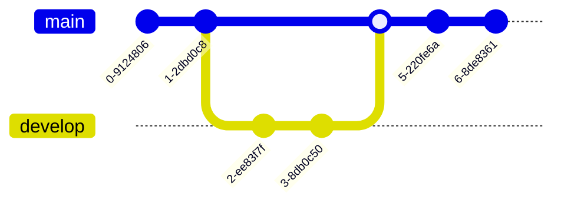

# Curso de Git y GitHub Platzi

**Publicado el 25 de octubre de 2024**  
**Nivel Básico** | 42 clases | 6 horas de contenido | 18 horas de práctica

Gestiona versiones, colabora en equipo y publica proyectos usando Git y GitHub. Controla ramas, pull requests, releases, seguridad y automatizaciones con herramientas clave de la industria.

## 1. Fundamentos de Git y control de versiones

### 1.1 Control de Versiones con Git y GitHub: De Básico a Avanzado

**Resumen**

Imagina guardar un archivo como "versión final", luego "versión final, final" y después "versión final, final, ahora sí". Ese caos, multiplicado por un equipo completo de personas, se convierte rápidamente en un desastre. Para resolver este problema existe Git, un software que ha transformado la forma en que se desarrolla software en todo el mundo.

**¿Qué es Git y por qué revolucionó el desarrollo de software?**

Git es un software de control de versiones. En lugar de guardar copias completas de cada archivo, Git registra únicamente los cambios realizados en cada uno. Esto lo hace extremadamente eficiente. Además, permite coordinar modificaciones entre múltiples personas, facilitando la colaboración en equipo de manera ordenada.

Antes de Git, los desarrolladores gestionaban versiones de archivos de forma manual, un proceso ineficiente y muy propenso a errores. Cuando Git apareció, su sencillez provocó una adopción casi inmediata, estableciéndose como el estándar en la industria para programadores y programadoras.

Un dato curioso: el creador de Git es Linus Torvalds, la misma persona detrás del kernel de Linux. Lo desarrolló para resolver sus propios problemas de control de versión. Git es además open source, lo que significa que cualquier persona puede ver su código fuente e incluso contribuir a sus mejoras.

**¿Por qué aprender Git es fundamental para tu carrera?**

Desde el momento en que escribes tu primer "Hola, mundo", necesitas una manera eficiente de gestionar tu código. Aprender un control de versiones como Git es clave para tu crecimiento profesional por varias razones:

- Te permite colaborar en proyectos con otros developers dentro de una empresa.
- Te ayuda a publicar tu trabajo individual.
- Facilita contribuir a proyectos de terceros.

En la industria del software, casi ningún producto es creado por una sola persona. Siempre se trata de equipos trabajando juntos, y Git es la herramienta que hace posible esa coordinación.

**¿Cómo funciona Git en la práctica?**

Git opera en tu máquina local a través de la terminal o editores como Visual Studio Code. Utiliza comandos específicos como merge, pull, commit, push, entre muchos otros. Cada uno cumple una función dentro del flujo de trabajo para gestionar cambios en el código.

**¿Qué papel juega GitHub en este ecosistema?**

Cuando quieres colaborar con otras personas, entra en juego GitHub, una plataforma web donde puedes guardar tu código en la nube junto con sus cambios y cada una de sus versiones. GitHub ha crecido enormemente en los últimos años, incorporando funcionalidades que van mucho más allá de Git y que aumentan la productividad de quienes lo usan.

**¿Qué habilidades dominarás con Git y GitHub?**

El aprendizaje se divide en dos grandes bloques.

**Primero, en el ámbito local:**
- Configurar Git en tu computadora.
- Crear repositorios locales.
- Modificar archivos y registrar cambios.
- Crear ramas y fusionarlas.
- Dominar el flujo de trabajo con Git.

**Después, en el ámbito remoto con GitHub:**
- Crear un repositorio remoto.
- Integrar a otros programadores en tu proyecto.
- Revisar aportes y fusionarlos con tu rama principal.
- Arreglar errores y conflictos.
- Entender un flujo de trabajo profesional.

Muchas personas dicen saber Git, pero solo conocen lo básico. La diferencia está en dominar herramientas avanzadas como ramas, merge, Codespaces, seguimiento de proyectos y automatizaciones que realmente marcan la diferencia en la industria.

Para comenzar, los prerrequisitos son sencillos: conocer lo esencial de una terminal (crear directorios, archivos y moverse entre ellos) y tener nociones básicas de cualquier lenguaje de programación. Con eso, ya tienes todo lo necesario para dar el siguiente paso.

🔗 https://git-scm.com/

---

### 1.2 Fundamentos de Git: Configuración y Comandos Básicos

**Resumen**

Trabajar con Git en la terminal permite a los desarrolladores gestionar sus proyectos de manera eficiente. A continuación, revisamos cómo instalar, configurar y utilizar Git en Linux, Mac y WSL de Windows, junto con algunas recomendaciones prácticas para dominar los comandos iniciales de esta herramienta.

**¿Cómo confirmar que Git está instalado en tu sistema?**

Para verificar la instalación de Git:

1. Abre la terminal y escribe el comando `git --version`.
2. Si el comando devuelve un número de versión, Git está listo para usarse.
3. Si no aparece la versión, revisa los recursos adjuntos donde se explican las instalaciones para cada sistema operativo.

**¿Cómo crear y preparar el primer proyecto con Git?**

El primer paso para crear un proyecto en Git es:

1. Limpia la terminal para evitar confusión visual.
2. Crea una carpeta para el proyecto con `mkdir nombre_del_proyecto`.
3. Navega a la carpeta con `cd nombre_del_proyecto`.

**¿Cómo inicializar un repositorio en Git?**

Al estar dentro de la carpeta de tu proyecto, inicia el repositorio con:

```bash
git init
```

```

Esto crea la rama inicial "master" por defecto. Si prefieres la rama principal como "main":

1. Cambia la configuración global escribiendo:
   ```bash
   git config --global init.defaultBranch main
   ```
2. Actualiza la rama en el proyecto actual con:
   ```bash
   git branch -m main
   ```

**¿Cómo personalizar tu configuración de usuario en Git?**

Configura el nombre de usuario y correo electrónico de Git, que identificará todas tus contribuciones:

1. Usa `git config --global user.name "Tu Nombre o Apodo"`.
2. Configura el correo electrónico con `git config --global user.email "tu.email@example.com"`.

**Tip:** Si necesitas corregir algún error en el comando, puedes usar la tecla de flecha hacia arriba para recuperar y editar el último comando escrito.

**¿Cómo confirmar la configuración de Git?**

Para revisar tu configuración, ejecuta:

```bash
git config --list
```

Aquí verás los datos de usuario y el nombre de la rama principal. Esta configuración se aplicará a todos los repositorios que crees en adelante.

**¿Qué hacer si olvidas un comando?**

Git incluye un recurso rápido y útil para recordar la sintaxis de comandos:

- Escribe `git help` en la terminal.
- Navega la lista de comandos disponibles y consulta la documentación oficial de cada uno cuando sea necesario.

---

### 1.3 Control de Versiones con Git: Comandos Básicos y Flujo de Trabajo

**Resumen**

Dominar el flujo de trabajo básico de Git es el primer paso para gestionar cualquier proyecto de software con confianza. Aquí se explica cómo crear archivos, pasarlos al área de staging y registrarlos con un commit, todo desde la terminal y con ejemplos prácticos.

**¿Qué es la carpeta .git y por qué es importante?**

Cuando ejecutas `git init` en una carpeta, se crea un directorio oculto llamado `.git`. Para visualizarlo puedes usar el comando `ls -a`. Esta carpeta es el corazón del control de versiones: funciona como una bitácora que almacena un registro detallado de todos los cambios realizados en tus archivos. Sin ella, Git simplemente no existe dentro de tu proyecto.

Una vez inicializado el repositorio, cualquier archivo que crees dentro de esa carpeta puede ser rastreado. Por ejemplo, al escribir `nano testing.txt` y agregar contenido, ese archivo queda listo para ser gestionado por Git.

**¿Cómo funciona el área de staging en Git?**

El área de staging (también llamada stage) es un estado intermedio entre la creación de un archivo y su registro definitivo en el historial. Es un "limbo" donde los archivos esperan a ser confirmados o descartados.

**¿Qué hace git status?**

El comando `git status` muestra el estado actual de tus archivos. Indica:

- Si estás en la rama main.
- Si hay archivos nuevos, modificados o eliminados.
- Si esos archivos ya fueron agregados al stage o no.

El cambio de color es el mejor indicativo: los archivos en rojo aún no están en stage, mientras que los verdes ya fueron agregados y esperan un commit.

**¿Cómo agregar y quitar archivos del stage?**

Para mover un archivo al área de staging se usa `git add` seguido del nombre del archivo, por ejemplo:

```bash
git add testing.txt
```

También es posible agregar todos los archivos pendientes de golpe con `git add .`

Si necesitas sacar un archivo del stage y regresarlo a su estado original, el comando es:

```bash
git rm --cache testing.txt
```

Esto no elimina el archivo, solo lo retira del área de preparación. Este mecanismo te permite decidir qué archivos sí y cuáles no quieres incluir en tu próximo registro de cambios.

**¿Cómo hacer tu primer commit y registrar cambios?**

Una vez que los archivos están en stage, el siguiente paso es ejecutar:

```bash
git commit -m "mensaje"
```

El parámetro `-m` indica que vas a escribir un mensaje descriptivo entre comillas, explicando qué cambios realizaste. Por ejemplo:

```bash
git commit -m "nuevo archivo de testing"
```

Al presionar Enter, Git confirma la rama en la que trabajas, el mensaje del commit y un resumen de los cambios: archivos modificados, inserciones y eliminaciones.

**¿Qué pasa cuando modificas un archivo ya registrado?**

Si actualizas el contenido de un archivo que ya fue commiteado, al ejecutar `git status` la leyenda cambia de "creado" a "modificado". El proceso para registrar esa actualización es exactamente el mismo:

- `git add .` para pasarlo al stage.
- `git commit -m "primer archivo modificado"` para registrarlo.

Git distingue tres estados posibles para un archivo: creado, modificado o eliminado. Independientemente del estado, el flujo siempre sigue la misma secuencia.

**¿Cómo verificar el historial de cambios?**

El comando `git log` muestra la bitácora completa de commits realizados. Cada entrada incluye el autor, la fecha y el mensaje asociado, lo que facilita rastrear la evolución del proyecto.

Para confirmar que no quedan cambios pendientes, basta con ejecutar `git status` y verificar que el mensaje indique que el árbol de trabajo está limpio.

Es importante señalar que este flujo aplica a cualquier tipo de archivo: no importa si son `.txt`, `.php`, `.go`, `.js` o incluso imágenes. Git los gestiona de la misma forma al hacer add y commit, sin importar la extensión.

Si ya completaste tu primer commit, comparte en los comentarios qué mensaje le pusiste y cómo te fue con el proceso.

---

### 1.4 Gestión de ramas en Git: creación, fusión y eliminación eficiente

**Resumen**

Trabajar con ramas en Git es la forma más segura de desarrollar funcionalidades sin afectar el código principal de un proyecto. Cuando dominas este flujo —crear una rama, hacer cambios, fusionar y limpiar— tu productividad y la de tu equipo crecen de manera notable.

**¿Qué son las ramas y por qué existen?**

Las ramas fueron diseñadas para que cada persona pueda trabajar de manera aislada sin obstaculizar al resto del equipo. Si algo sale mal, simplemente eliminas tu rama, vuelves a empezar y retomas el trabajo pendiente. Cada actividad dentro de un proyecto puede vivir en una o varias ramas, lo que brinda flexibilidad total.

**¿Cómo saber en qué rama te encuentras?**

El comando `git branch` muestra todas las ramas existentes en tu repositorio local. Un asterisco aparece junto a la rama activa, indicando exactamente dónde estás posicionado. Conforme el proyecto crece y las ramas se multiplican, ese asterisco será tu referencia principal.

**¿Cómo crear una nueva rama y moverte a ella?**

Para crear una rama y cambiar a ella en un solo paso, se utiliza `git checkout -b` seguido del nombre de la rama:

```bash
git checkout -b admin
```

Git confirma que te moviste a la nueva rama. Si ejecutas `git branch` de nuevo, verás que el asterisco ahora apunta a admin mientras que main sigue enlistada sin estar activa.

**¿Cómo trabajar dentro de una rama aislada?**

Dentro de la rama recién creada puedes realizar cambios con total libertad. En el ejemplo práctico se crea un archivo con el editor Nano:

```bash
nano testing_admin.txt
```

Después de guardar el archivo, el flujo habitual continúa:

- Ejecutar `git status` para verificar los cambios pendientes.
- Agregar los archivos al staging area con `git add .`
- Confirmar los cambios con `git commit -m "nuevo archivo creado"`

Lo fundamental aquí es que estos cambios solo existen en la rama admin, no en main. Nadie más puede ver lo que acabas de hacer hasta que decidas fusionar.

**¿Qué es fusionar ramas con git merge?**

Cuando todos los cambios están listos en tu rama individual, es momento de fusionarlos con la rama principal para que todo el equipo acceda a ellos. El proceso requiere dos pasos:

- Regresar a la rama principal con `git checkout main` o `git switch main`
- Ejecutar `git merge admin` para unificar los cambios

El resultado en la terminal muestra un fast-forward, que es un método de unificación donde Git simplemente avanza el puntero de main hasta el último commit de la rama fusionada. En este caso se reporta un archivo cambiado y una nueva inserción.

Un dato útil: `git switch` es el comando más moderno para cambiar de ramas y cumple exactamente la misma función que `git checkout`. Puedes usar cualquiera de los dos.

**¿Por qué eliminar una rama después de fusionarla?**

Una vez que la rama cumplió su propósito y sus cambios ya viven en main, la buena práctica es eliminarla. El comando para hacerlo es:

```bash
git branch -D admin
```

Eliminar ramas evita acumulación innecesaria de nombres como admin, admin1, admin2, que terminan generando confusión y posibles conflictos. La regla es clara: una rama existe para un propósito específico y, una vez cumplido, se elimina.

Para confirmar que todo quedó integrado, puedes ejecutar `git log` y verificar que el commit aparece en el historial de la rama principal.

Si ya utilizas ramas en tus proyectos o tienes alguna estrategia diferente para organizarlas, comparte tu experiencia en los comentarios.

---

### 1.5 Git Reset vs Git Revert: Manejo de Historial y Corrección de Errores

**Lecturas recomendadas**

- [Git - git-reset Documentation](https://git-scm.com/docs/git-reset)
- [Git - git-revert Documentation](https://git-scm.com/docs/git-revert)

**Resumen**

Para quienes se inician en el manejo de versiones con Git, comandos como `git reset` y `git revert` se vuelven herramientas indispensables, ya que permiten deshacer errores y ajustar el historial de cambios sin complicaciones. Aunque al avanzar en la experiencia puedan dejarse de lado, dominar su uso resulta clave para un control de versiones eficiente.

**¿Cuál es la diferencia entre Git Reset y Git Revert?**

- **Git Reset:** mueve el puntero de los commits a uno anterior, permitiendo "volver en el tiempo" y explorar el historial de cambios. Es útil para deshacer actualizaciones recientes o revisar lo que se hizo en cada commit.

- **Git Revert:** crea un nuevo commit que revierte los cambios de un commit específico, permitiendo conservar el historial original sin eliminaciones. Es ideal para regresar a un estado anterior sin afectar los commits de otros usuarios.

**¿Cómo se utiliza Git Reset?**

1. Ejecuta `git log` para identificar el historial de commits. El commit actual se marca con `HEAD` apuntando a `main`.
2. Si quieres eliminar cambios recientes:
   - Crea un archivo temporal (ejemplo: `error.txt`) y realiza un commit.
   - Verifica el historial con `git log` y localiza el hash del commit que deseas restablecer.
3. Para revertir a un estado anterior:
   - Usa `git reset` con parámetros:
     - `--soft`: solo elimina el archivo del área de staging.
     - `--mixed`: remueve los archivos de staging, manteniendo el historial de commits.
     - `--hard`: elimina los archivos y el historial hasta el commit seleccionado.
   - Este último parámetro debe ser una última opción debido a su impacto irreversible en el historial.

**¿Cómo funciona Git Revert?**

1. **Identificación del commit:** usa `git log` para encontrar el commit a revertir.
2. **Ejecuta `git revert`** seguido del hash del commit: crea un nuevo commit inverso, preservando el historial.
3. **Editar el mensaje de commit:** permite dejar claro el motivo de la reversión, ideal en equipos colaborativos para mantener claridad.

**¿Cuándo es recomendable utilizar Git Reset o Git Revert?**

Ambos comandos resultan útiles en diversas situaciones:

- **Corrección de errores:** si has subido un archivo incorrecto, `git revert` es rápido y seguro para deshacer el cambio sin afectar el historial.
- **Limpieza del historial:** en proyectos sólidos, puede que quieras simplificar el historial de commits; `git reset` ayuda a limpiar entradas innecesarias.
- **Manejo de conflictos:** en casos extremos de conflicto de archivos, `git reset` es útil, aunque puede ser mejor optar por resolver conflictos manualmente.

**¿Cómo aseguras una correcta comunicación en el uso de estos comandos?**

- Utiliza estos comandos en sincronización con el equipo.
- Evita el uso de `git reset --hard` sin coordinación para prevenir la pérdida de trabajo ajeno.
- Documenta cada reversión con un mensaje claro para asegurar el seguimiento de cambios.

---

### 1.6 Uso de Git Tag y Git Checkout para Gestión de Versiones y Revisión

**Lecturas recomendadas**

- [Git - git-tag Documentation](https://git-scm.com/docs/git-tag)
- [Git - git-checkout Documentation](https://git-scm.com/docs/git-checkout)

**Resumen**

Git facilita el control de versiones y organización de proyectos, y los comandos `git tag` y `git checkout` son piezas clave para una gestión eficiente y ordenada de los cambios en el código. Ambos comandos ayudan a crear puntos de referencia y explorar cambios sin afectar el desarrollo principal, ofreciendo opciones robustas para pruebas y organización.

**¿Cómo se utiliza `git tag` para organizar versiones?**

El comando `git tag` permite marcar un commit con una etiqueta descriptiva, ideal para señalar versiones estables o hitos importantes en el proyecto. Esto resulta útil en proyectos donde el equipo necesita identificar fácilmente puntos clave de avance. Al etiquetar, se añade una nota visible en el historial, lo cual facilita encontrar versiones específicas en un flujo de trabajo con muchos commits.

Para crear un tag:

```bash
git tag -a v1.0 -m "primera versión estable"
```

Al consultar `git log`, se verá el tag junto al commit en el historial. Además, `git show <tag>` muestra detalles de la etiqueta, quién la creó, el mensaje de la versión y los cambios asociados a ese commit. Esto es especialmente útil cuando el historial es extenso, ya que permite regresar a puntos específicos sin necesidad de revisar cada commit en el log completo.

Para eliminar un tag:

```bash
git tag -d v1.0
```

Esto remueve el tag sin afectar el historial ni los archivos. Es conveniente si el nombre del tag necesita ser corregido o ajustado.

**¿Qué permite `git checkout` al explorar el historial?**

El comando `git checkout` tiene usos más amplios que solo cambiar entre ramas. También permite revisar commits previos para explorar o probar cambios sin alterar la rama principal. Al usar `git checkout <hash_del_commit>`, puedes regresar a un punto específico en el historial y evaluar cómo afectaban los cambios al proyecto en ese momento.

Por ejemplo:

1. Cambia a un commit específico con `git checkout <hash>`.
2. Realiza pruebas o modificaciones. Esto te permite simular cambios o ver el estado del proyecto en esa versión.
3. Para regresar a la rama principal, escribe `git checkout main`.

Esto restaura el proyecto al estado actual y evita que los cambios temporales afecten el historial o la estructura del proyecto. Al navegar entre commits y regresar a `main`, es importante notar que no se crean ramas adicionales, ni se modifican commits previos, lo cual asegura la integridad del historial y la rama principal.

**¿Cómo integran `git tag` y `git checkout` una experiencia de desarrollo ordenada?**

Ambos comandos permiten explorar y organizar sin interferir en el flujo principal del trabajo. `Git tag` marca versiones y puntos importantes, actuando como separadores en el historial, mientras que `git checkout` permite regresar a esos puntos y probar sin comprometer la rama actual. Esto proporciona una estructura en la que el equipo puede trabajar con libertad para realizar pruebas, versionar cambios y retornar al estado actual en cualquier momento sin temor a alterar el trabajo original.

---

### 1.7 Resolución de Conflictos de Ramas en Git paso a paso

**Lecturas recomendadas**

- [Git - git-branch Documentation](https://git-scm.com/docs/git-branch)
- [Git - git-merge Documentation](https://git-scm.com/docs/git-merge)

**Resumen**

Cuando trabajamos en equipo, el manejo de conflictos de ramas en Git es esencial para evitar problemas y asegurar una integración fluida de cambios en los archivos compartidos. Aquí te mostramos cómo se genera un conflicto de ramas y la forma efectiva de resolverlo paso a paso.

**¿Qué es un conflicto de ramas en Git?**

En un entorno colaborativo, es común que varias personas realicen modificaciones en archivos compartidos. Esto puede llevar a conflictos de ramas cuando intentamos fusionar cambios y estos alteran las modificaciones previas realizadas por otro colaborador. En estos casos, se debe elegir qué cambios se mantendrán en la rama principal.

**¿Cómo crear un conflicto de ramas para aprender a resolverlo?**

Para experimentar y entender cómo resolver un conflicto, podemos crear uno intencionalmente. Aquí están los pasos básicos:

1. Verifica tu rama actual con `git branch`. Si solo tienes la rama `main`, estás listo para iniciar.
2. Crea un archivo, por ejemplo, `conflict.txt`, añade contenido inicial (e.g., "línea original") y realiza un commit:

```bash
git add conflict.txt
git commit -m "Archivo de conflicto creado"
```

3. Crea una nueva rama con `git checkout -b developer` y modifica el archivo con nuevos cambios, como "cambios desde la rama dev", realiza un commit.
4. Vuelve a la rama `main` con `git checkout main` y modifica el mismo archivo en esta rama, por ejemplo, añadiendo "segundo cambio desde main", y realiza otro commit.

Al regresar a `main` y realizar la fusión de `developer`, verás el conflicto.

**¿Cómo resolver un conflicto de ramas en Git?**

Cuando Git detecta un conflicto, te indicará las diferencias entre las ramas con etiquetas que facilitan la identificación de cambios:

1. Abre el archivo en conflicto. Verás secciones como `<<<<< HEAD` y `>>>>>`, que marcan los cambios en `main` y en la rama que intentas fusionar (`developer`).
2. Edita el archivo eliminando las líneas de marcación y decide cuáles cambios deseas conservar, combinar o incluso reescribir.
3. Guarda el archivo sin las señalizaciones de conflicto y realiza un commit para registrar la resolución:

```bash
git add conflict.txt
git commit -m "Conflicto resuelto"
```

**¿Qué hacer después de resolver un conflicto?**

Una vez resuelto el conflicto y unificada la versión final en `main`, considera eliminar la rama `developer` para evitar conflictos futuros. Esto ayuda a mantener el historial de cambios limpio y reduce la posibilidad de cometer errores en el futuro.

---

### 1.8 Uso de Git en Visual Studio Code

**Lecturas recomendadas**

- [Visual Studio Code - Code Editing. Redefined](https://code.visualstudio.com/)

**Resumen**

Visual Studio Code ofrece una interfaz visual y eficiente para gestionar versiones con Git, simplificando muchas tareas complejas y ahorrando tiempo a los desarrolladores. Integrar VS Code en nuestro flujo de trabajo diario puede facilitar considerablemente el manejo de ramas, commits y conflictos sin depender tanto de comandos en la terminal.

**¿Cómo abrir VS Code desde la terminal?**

- Inicia VS Code en la ubicación del proyecto con `code .`
- Esto abre una instancia de VS Code en el directorio actual, incluyendo todos los archivos versionados con Git.

**¿Cómo visualizar y gestionar ramas en VS Code?**

- Dentro de VS Code, identifica tu rama activa en la sección de control de versiones.
- Selecciona la rama para ver las opciones de cambio, como alternar entre ramas o crear nuevas.
- Los cambios en las ramas se presentan en una gráfica visual, diferenciando fusiones y ramas en colores, una ventaja significativa sobre `git log`.

**¿Cómo hacer un commit de cambios en VS Code?**

- Al editar un archivo, el ícono de control de versiones muestra un indicador de cambio.
- En lugar de usar `git commit -m "mensaje"`, puedes simplemente añadir un mensaje y presionar commit en la interfaz de VS Code.

**¿Cómo crear y alternar entre ramas en VS Code?**

1. Haz clic en "Create New Branch" y nómbrala, por ejemplo, "VS Code Dev".
2. VS Code marca esta nueva rama como activa, heredando los cambios de la rama principal.
3. Al editar archivos en esta rama, puedes realizar commits directamente en la interfaz.

**¿Cómo resolver conflictos de fusión en VS Code?**

- Selecciona la rama con la que deseas fusionar (por ejemplo, VS Code Dev con Main) usando el menú de Branch > Merge.
- Cuando ocurre un conflicto, VS Code despliega opciones de resolución con colores para cada cambio, simplificando la selección entre el cambio actual, el entrante o ambos.
- Puedes optar por "Merge Editor" para una vista más visual y confirmar la fusión con un "Complete Merge" al finalizar.

**¿Cómo iniciar un nuevo repositorio en VS Code?**

1. Crea un nuevo directorio y abre VS Code en esa ubicación.
2. Al no haber archivos, selecciona "Inicializar repositorio" para configurar un nuevo repositorio.
3. Esto ejecuta `git init`, crea la rama principal (main) y permite añadir nuevas ramas y hacer commits sin usar comandos.

---

## 2. Introducción a GitHub

### 2.1 Uso de GitHub para Colaboración y Desarrollo Seguro

**Lecturas recomendadas**

- [GitHub: Let's build from here · GitHub](https://github.com/)

**Resumen**

La colaboración en proyectos de software depende de sistemas de control de versiones, y Git es una herramienta central para lograrlo. Usar GitHub, una plataforma en la nube basada en Git, permite que los desarrolladores compartan sus proyectos, trabajen en equipo y accedan a herramientas avanzadas para asegurar y escalar sus desarrollos. Con un enfoque en inteligencia artificial (IA), colaboración, productividad, seguridad y escalabilidad, GitHub ha pasado de ser una red social de programadores a una herramienta integral que optimiza el desarrollo de software moderno.

**¿Qué opciones existen para hospedar proyectos en Git?**

- **GitHub:** la plataforma más destacada, adquirida por Microsoft en 2018, ofrece amplias herramientas de colaboración y desarrollo.
- **Bitbucket (Atlassian), GitLab, Azure DevOps (Microsoft), CodeCommit (Amazon), y Cloud Source (Google):** todas permiten el control de versiones en la nube.
- **Servidores propios de Git:** para quienes prefieren un ambiente privado y controlado.

**¿Cómo ha evolucionado GitHub desde su lanzamiento?**

Inicialmente, GitHub era un simple repositorio de código en la nube; sin embargo, ha evolucionado hasta ofrecer una plataforma avanzada que incluye una interfaz web, herramientas de línea de comandos y flujos de trabajo colaborativos. En lugar de limitarse a compartir proyectos, permite a los usuarios colaborar en tiempo real, automatizar tareas y utilizar inteligencia artificial para mejorar la seguridad y productividad del código.

**¿Qué funcionalidades destacan en GitHub actualmente?**

GitHub ahora integra IA y facilita procesos clave en el desarrollo de software mediante:

- **Colaboración eficiente:** herramientas para trabajo en equipo, seguimiento de cambios y mejoras en el flujo de trabajo.
- **Automatización y productividad:** automatiza tareas repetitivas, permitiendo a los desarrolladores enfocarse en resolver problemas complejos.
- **Seguridad integrada:** herramientas avanzadas de seguridad que aseguran el código desde el inicio, minimizando riesgos.
- **Escalabilidad:** una infraestructura robusta que permite gestionar millones de repositorios y usuarios globalmente.

**¿Qué oportunidades brinda GitHub para los desarrolladores?**

Con GitHub, cualquier desarrollador puede contribuir a proyectos relevantes, como mejoras en lenguajes de programación o incluso en el kernel de Linux. Esta capacidad de colaboración global eleva el nivel de la ingeniería de software, fomentando el trabajo en equipo entre profesionales de todo el mundo.

**¿Cómo puede ayudarte GitHub en el desarrollo profesional?**

Además de ser una herramienta de colaboración y desarrollo, GitHub ofrece la GitHub Foundation Certification, una certificación ideal para validar habilidades en GitHub y dar un primer paso hacia un perfil profesional sólido en desarrollo colaborativo.

---

### 2.2 Creación y configuración de cuenta GitHub paso a paso

**Lecturas recomendadas**

- [GitHub · Build and ship software on a single, collaborative platform · GitHub](https://github.com)

**Resumen**

Tener una cuenta de GitHub correctamente configurada y protegida es el primer paso para trabajar con repositorios, colaborar en equipo y aprovechar todas las herramientas que esta plataforma ofrece. A continuación se desglosa el proceso completo, desde el registro hasta la activación de la verificación en dos pasos, para que tu cuenta quede lista de forma profesional y segura.

**¿Cómo registrar tu cuenta en GitHub desde cero?**

El proceso comienza en github.com, donde debes seleccionar el botón "Sign up" ubicado en la esquina superior derecha. GitHub te guiará por un formulario secuencial donde necesitas completar estos campos:

- **Email:** ingresa el correo electrónico que prefieras, ya sea personal o corporativo.
- **Password:** debe cumplir con un nivel mínimo de seguridad que la plataforma establece.
- **Username:** elige un nombre de usuario único. GitHub te confirmará si está disponible antes de continuar.
- **Preferencias de comunicación:** puedes optar por recibir o no información sobre productos de GitHub.

Después de completar estos datos, GitHub presenta un acertijo de verificación para confirmar que no eres un robot. Este reto puede repetirse hasta tres veces. Una vez superado, recibirás un código de verificación en tu correo electrónico que debes ingresar para activar la cuenta.

**¿Qué ocurre tras el primer inicio de sesión?**

Al ingresar por primera vez con tu usuario y contraseña, GitHub despliega un cuestionario de perfil. Te pregunta si eres estudiante, profesor u otro tipo de usuario, cuántas personas conforman tu equipo y en qué áreas tienes interés. Estas respuestas permiten que la plataforma personalice tu experiencia.

Finalmente, debes elegir entre el plan gratuito y el plan de equipo. El plan gratuito es suficiente para comenzar y acceder a la mayoría de funcionalidades.

**¿Cómo personalizar tu perfil de GitHub?**

Una vez dentro del home de tu cuenta, dirígete a tu foto de perfil en la esquina superior derecha y selecciona "Settings". Desde esta sección puedes configurar varios elementos:

- **Nombre público:** un nombre más legible que tu username.
- **Correo electrónico visible:** el que aparecerá en tu perfil público.
- **Biografía:** una descripción breve sobre ti.
- **URL de sitio web y redes sociales:** enlaces que complementan tu presencia profesional.
- **Compañía:** puedes escribir el nombre e incluso vincularla con una arroba si tiene perfil en GitHub.

Después de realizar cualquier cambio, es fundamental presionar el botón verde "Update profile", ya que de lo contrario los cambios se perderán al refrescar la página. También puedes actualizar tu foto de perfil seleccionando "Edit", subiendo una imagen y ajustando el área visible.

**¿Por qué es crítico activar la verificación en dos pasos?**

La seguridad de tu cuenta merece atención especial. Tu perfil de GitHub puede contener repositorios individuales y también repositorios privados compartidos con equipos de trabajo. Si alguien accede sin autorización, podría ver código confidencial que no debería estar expuesto.

Por esta razón, se recomienda habilitar la autenticación en dos pasos (two-factor authentication), pero con una advertencia importante: **nunca utilices la verificación por SMS**. El método preferido es la aplicación GitHub Mobile, disponible para iOS y Android.

**¿Cómo configurar GitHub Mobile como método de verificación?**

1. Descarga la aplicación en tu dispositivo móvil e inicia sesión con tu usuario y contraseña.
2. La app solicitará autorización para vincularse con tu cuenta. Una vez autorizada, verás tus repositorios y organizaciones directamente desde el teléfono.
3. De vuelta en el navegador, ve a Settings > Password and authentication.
4. En la sección de autenticación en dos pasos encontrarás un código QR que debes escanear con una aplicación de autenticación como 1Password, Authy o Microsoft Authenticator.
5. Ingresa el código generado por la app para validar la configuración.

**¿Qué son los códigos de recuperación y por qué guardarlos?**

Tras activar la verificación, GitHub genera códigos de recuperación de cuenta. Estos códigos son tu respaldo en caso de perder acceso a tu dispositivo móvil. Descárgalos y guárdalos en un lugar seguro: un disco duro externo, una cuenta en la nube o cualquier medio que consideres confiable.

Con la configuración completada, GitHub establece GitHub Mobile como método de verificación preferido por defecto. Esta configuración puede variar si tu empresa define políticas de seguridad específicas, pero para uso personal es la opción más recomendable.

Ahora que tu cuenta está creada, personalizada y protegida, el siguiente paso es comprender cómo interactúan Git y GitHub en el flujo de trabajo diario. ¿Ya configuraste tu verificación en dos pasos? Comparte tu experiencia en los comentarios.

---

### 2.3 Proceso de Trabajo con Git y GitHub: Creación y Revisión de Repositorios

**Lecturas recomendadas**

- [Póngase en marcha - Documentación de GitHub](https://docs.github.com/es/get-started)

**Resumen**

Para entender cómo Git y GitHub funcionan en conjunto en un flujo de trabajo profesional, debemos recordar que Git es una herramienta de control de versiones basada en comandos, mientras que GitHub facilita su implementación al ofrecer una plataforma que permite manejar proyectos de Git de forma colaborativa y accesible en la nube.

**¿Cuál es la relación entre Git y GitHub?**

Aunque Git y GitHub son complementarios, no fueron creados por los mismos desarrolladores ni comparten una dependencia directa. Git es el sistema de control de versiones en sí mismo, mientras que GitHub es un servicio que permite alojar repositorios Git en la nube, facilitando el trabajo colaborativo. La única conexión entre ambos es que GitHub permite gestionar proyectos que usan Git para el control de versiones.

**¿Cómo se inicia el flujo de trabajo en GitHub?**

Para trabajar en un proyecto en GitHub, en lugar de comenzar con `git init` en tu máquina local, creas un repositorio en GitHub. Este repositorio vacío se descarga al equipo y, desde ahí, se pueden hacer cambios locales. La estructura básica del flujo de trabajo incluye los siguientes pasos:

- **Crear un commit:** Guardar los cambios realizados localmente.
- **Subir cambios a GitHub:** Una vez los cambios estén listos, se suben a una rama separada en el repositorio remoto.

**¿Por qué es importante trabajar en ramas?**

Trabajar en una rama separada permite mantener el código principal estable mientras trabajas en nuevas características. Al subir la rama a GitHub, el proceso de Code Review comienza. Otros compañeros revisarán y aprobarán los cambios antes de integrarlos en la rama principal.

**¿Qué reglas se pueden seguir para crear tareas?**

Para facilitar la revisión de código y evitar conflictos, es ideal mantener las tareas pequeñas y con un solo objetivo. Esto hace que:

- El proceso de revisión sea sencillo.
- Los cambios sean menos propensos a conflictos al integrarse al proyecto principal.

Algunos equipos imponen reglas como limitar el número de archivos modificados o la cantidad de líneas de código en una tarea, aunque una recomendación básica es "una tarea, un objetivo".

---

### 2.4 Creación y colaboración en repositorios de GitHub

**Lecturas recomendadas**

- [GitHub - platzi/git-github: Repositorio del Curso de Git y GitHub](https://github.com/platzi/git-github)

**Resumen**

Crear y gestionar un repositorio en GitHub es una habilidad esencial para colaborar y mantener proyectos de software de forma ordenada. Aquí aprenderás cómo crear, configurar, invitar colaboradores y clonar un repositorio de manera efectiva.

**¿Cómo crear un repositorio en GitHub?**

Para empezar, accede a la pantalla principal de tu perfil en GitHub y selecciona el símbolo de "+". Aquí, selecciona la opción "Nuevo repositorio", lo que abrirá un formulario para configurarlo:

- **Propietario:** Elige tu usuario actual como propietario del repositorio.
- **Nombre del repositorio:** Puedes asignarle un nombre como "mi-primer-repo". Este nombre puede adaptarse a tu usuario, permitiendo reutilizar nombres similares.
- **Descripción:** Añade una breve descripción del proyecto para facilitar su identificación.
- **Visibilidad:** Decide si el repositorio será público o privado según las necesidades del proyecto.
- **Inicialización:** Puedes agregar un archivo README para documentar el repositorio desde el inicio. Aunque opcional, es una buena práctica.

Finalmente, selecciona el botón verde de "Crear repositorio" para completar este proceso. Al hacerlo, tendrás acceso directo a tu repositorio con el archivo README visible.

**¿Cómo agregar un colaborador a un repositorio en GitHub?**

Para trabajar en equipo, es fundamental añadir colaboradores. Esto se hace desde la sección de "Settings" del repositorio:

1. Dirígete a "Colaboradores" en la configuración.
2. Asegúrate de que el colaborador tenga una cuenta de GitHub.
3. Selecciona la opción de agregar usuarios y elige a quien quieras invitar.

Una vez enviada la invitación, deberás esperar que el colaborador la acepte para que pueda acceder al repositorio y trabajar en él.

**¿Cómo clonar un repositorio en tu máquina local?**

Clonar el repositorio te permite trabajar desde tu entorno local y sincronizar cambios con GitHub. Para ello:

1. Ve a la sección de "Code" dentro de tu repositorio.
2. Selecciona la opción HTTPS y copia la URL del repositorio.
3. En tu terminal, escribe `git clone` seguido de la URL copiada y presiona "enter".

Este comando descargará el repositorio en tu máquina. Podrás ver todos los archivos en una carpeta con el nombre del repositorio y comenzar a trabajar de manera local.

**¿Cómo integrar Git y GitHub para un flujo de trabajo colaborativo?**

Una vez que el repositorio está clonado en tu entorno local, puedes editar archivos, guardar cambios y subirlos de nuevo a GitHub mediante Git. Al hacer esto, permites que todos los colaboradores se mantengan sincronizados y al día con el desarrollo del proyecto.

---

### 2.5 Precios y Planes de Productos de GitHub

**Productos de GitHub: Precios, planes y apps**

Ahora que ya vimos cómo poder crear un repositorio en GitHub y usar sus repositorios, es momento de hablar acerca de los diferentes productos que veremos durante todo el curso y sus consideraciones, principalmente los costos de cada uno de los servicios que vamos a utilizar.

Recuerda que esta sección es de gran importancia porque como programadores podemos ver todos estos servicios como una variedad de opciones en donde podemos jugar como niños chiquitos en la arena; sin embargo, como parte de alguna organización debemos tener presente que los costos derivados de ello pueden jugar en nuestra contra si no sabemos cómo hacer para obtener un beneficio de todo esto. Ten siempre presente la regla más importante de cualquier servicio que contrates:

> **Si un servicio o herramienta que estás utilizando no está ayudando a tu organización, entonces la está perjudicando.**

Bueno, hora de dejar la clase de negocio y comenzar a ver el costo de los diferentes productos.

**Repositorios**

Los repositorios de GitHub ya sean públicos o privados son gratuitos y sin un límite en específico en la cantidad de cuántos puedes tener. Es decir, sin importar si se trata de una cuenta de pago o gratuita podrás crear tantos repositorios como gustes. Así que por este tema no es necesario preocuparte, esta no es una diferencia entre todos los planes, tanto gratuitos como de pago.

**Codespaces**

¡Huy! Aquí la cosa se pone buena. Codespaces es una herramienta que vamos a utilizar muchísimo en este curso y que es muy importante tener presente que es de costo. ¿Quieres un adelanto? Te recordaré todo el tiempo jugar con esta herramienta y luego apagarla. Pero bueno, es momento de ver los costos.

| Núcleos | Costo por hora | Tiempo de uso gratuito |
|---------|----------------|------------------------|
| 2 núcleos | $0.18 USD por hora | 60 horas gratuitas |
| 4 núcleos | $0.36 USD por hora | 30 horas gratuitas |
| 8 núcleos | $0.72 USD por hora | 15 horas gratuitas |
| 16 núcleos | $1.44 USD por hora | No aplica |
| 32 núcleos | $2.88 USD por hora | No aplica |

En cuanto a almacenamiento también hay un costo asociado a ello.

| Categoría | Costo | Datos gratuitos |
|-----------|-------|-----------------|
| Almacenamiento | $0.07 USD por mes | 15 GB gratuitos mensuales |

Lo único que te puedo decir en esta categoría es que esas 30 horas de uso con 4 núcleos van a ser mucho más que suficientes para este curso y jugar un rato más. Además, recuerda que cada mes se renuevan estos datos, así que si algo sucede simplemente tocará esperar.

**GitHub web editor**

¡Buenas noticias aquí! Al igual que los repositorios, esta característica está presente en todos los planes de todos los niveles, sin costo en ningún escenario y sin límite de uso. Esencialmente se trata de una característica que podemos aprovechar y aprender a utilizar mucho sin preocuparnos por el costo.

**GitHub Actions**

GitHub Actions es un tema de lo más complicado. El costo de las Actions depende mucho del sistema operativo, la capacidad del agente, obviamente el hardware y muchas cosas más. Sin embargo, para los principiantes (y me incluyo en esta categoría porque ni de broma recuerdo todas las configuraciones) la mejor manera de evaluar y de guiarte es por medio del consumo por minutos. En la siguiente tabla podrás ver una buena referencia de los planes.

| Plan | Consumo de minutos |
|------|-------------------|
| Gratuito | 2,000 minutos de ejecución |
| Team | 3,000 minutos de ejecución |
| Enterprise | 50,000 minutos de ejecución |

La verdad es que hay mucho que considerar en el tema de costos y beneficios de todas las herramientas y lo mejor es que dediques un tiempo a esto para saber cómo aprovechar al máximo los beneficios. Aquí solo mencionamos los productos que usaremos en el curso. Sin embargo, hay muchas más consideraciones. Lo ideal es que comiences por la página de referencia por excelencia para aprender de todo lo necesario acerca de esto.

---

### 2.6 Configuración de SSH en GitHub para Windows, Linux y Mac

**Lecturas recomendadas**

- [Conectar a GitHub con SSH - Documentación de GitHub](https://docs.github.com/es/authentication/connecting-to-github-with-ssh)
- [GitHub - platzi/git-github: Repositorio del Curso de Git y GitHub](https://github.com/platzi/git-github)

**Resumen**

Usar SSH para interactuar con GitHub es una excelente forma de aumentar la seguridad y mejorar la comodidad en el manejo de repositorios. A continuación, te explicamos el paso a paso para generar y configurar tus llaves SSH en distintos sistemas operativos y cómo integrarlas en tu perfil de GitHub para mejorar la experiencia de clonación y autenticación.

**¿Por qué es mejor usar SSH en lugar de HTTPS para GitHub?**

- **Seguridad adicional:** SSH permite autenticar la computadora específica que accede a los repositorios sin necesidad de ingresar una contraseña cada vez.
- **Comodidad:** Evita la necesidad de escribir tu contraseña en cada operación con GitHub, agilizando el flujo de trabajo.

**¿Cómo generar una llave SSH en Windows y Linux?**

1. Instalar WSL si estás en Windows (opcional si usas Linux nativo).
2. Verificar que no tienes llaves previas: Ve al menú de "Code" en GitHub y verifica que la opción de SSH no tenga llaves configuradas.
3. Generar la llave SSH: En la terminal, usa el comando:

```bash
ssh-keygen -t ed25519 -C "tu_correo@example.com"
```

- `-t ed25519` establece el nivel de encriptación.
- `-C` añade un comentario con tu correo, útil para identificar la llave en GitHub.

4. Guardar y proteger la llave:
   - Usa el nombre por defecto y añade una contraseña segura.
   - La llave pública se guarda en el directorio `.ssh`, generalmente nombrada `id_ed25519.pub`.

5. Configurar el agente SSH: Activa el agente de SSH y añade la llave privada:

```bash
eval "$(ssh-agent -s)"
ssh-add ~/.ssh/id_ed25519
```

**¿Cómo añadir la llave SSH a GitHub?**

1. Abrir el archivo de la llave pública (`id_ed25519.pub`) y copia el contenido.
2. En GitHub, ve a Settings > SSH and GPG keys > New SSH key y pega la llave.
3. Nombra la llave de acuerdo a la computadora en la que estás configurándola.

**¿Qué pasos adicionales seguir en Mac?**

1. Crear el archivo de configuración SSH: Abre o crea el archivo `config` dentro del directorio `.ssh`.
2. Agregar parámetros específicos de Mac: Añade la configuración para integrar SSH con el sistema Keychain:

```
Host github.com
   AddKeysToAgent yes
   UseKeychain yes
   IdentityFile ~/.ssh/id_ed25519
```

3. Añadir la llave al agente SSH con Keychain: Usa el comando:

```bash
ssh-add --apple-use-keychain ~/.ssh/id_ed25519
```

**¿Cómo verificar la conexión con GitHub?**

1. Comprobar autenticación: En la terminal, ejecuta el comando:

```bash
ssh -T git@github.com
```

- Escribe "yes" para confirmar la conexión.
- Aparecerá un mensaje de GitHub que confirma la autenticidad.

**¿Cómo clonar un repositorio usando SSH?**

1. En GitHub, selecciona el repositorio deseado, elige la opción de clonación por SSH y copia la URL.
2. En la terminal, ejecuta:

```bash
git clone git@github.com:usuario/repositorio.git
```

3. Esto clona el repositorio sin solicitar contraseña, aprovechando la autenticación SSH.

---

### 2.7 Uso de Forks y Estrellas en Repositorios de GitHub

**Lecturas recomendadas**

- [Conectar a GitHub con SSH - Documentación de GitHub](https://docs.github.com/es/authentication/connecting-to-github-with-ssh)
- [GitHub - platzi/git-github: Repositorio del Curso de Git y GitHub](https://github.com/platzi/git-github)

**Resumen**

Entender el uso de forks y estrellas en GitHub optimiza la gestión de proyectos y recursos al trabajar en esta plataforma. Aquí exploraremos cómo funcionan estos elementos y cómo pueden ayudarte a organizar tus repositorios en función de tus necesidades.

**¿Qué es un fork y cómo se utiliza?**

Un fork en GitHub es una copia de un repositorio alojado en la cuenta de otra persona y que puedes transferir a tu propia cuenta. Este proceso crea una réplica del repositorio en su estado actual, sin reflejar futuros cambios del original a menos que se sincronice manualmente. Esto permite:

- Trabajar de manera independiente en un proyecto sin afectar el repositorio original.
- Personalizar el contenido según tus necesidades sin modificar el repositorio fuente.
- Crear una base para hacer contribuciones posteriores al repositorio original.

Para crear un fork, debes abrir el repositorio, seleccionar el botón de Fork y seguir los pasos para copiarlo en tu cuenta. Así, GitHub duplicará el repositorio, manteniendo el nombre y descripción del original. Puedes optar por copiar solo la rama principal (main) o todo el proyecto. Luego, desde tu cuenta, podrás modificar el contenido sin interferir con el repositorio original.

**¿Qué beneficios aporta usar estrellas en GitHub?**

Las estrellas en GitHub funcionan como un sistema de marcado para resaltar los repositorios que deseas tener a mano como referencia o favoritos. Son útiles para:

- Crear un índice de repositorios de referencia o inspiración.
- Acceder rápidamente a recursos clave desde tu perfil.
- Seguir el desarrollo de proyectos importantes para tus intereses.

Al seleccionar la estrella en un repositorio, ésta se ilumina para indicar que has marcado este recurso. Puedes acceder a todos tus repositorios marcados desde la sección de "tus estrellas" en tu perfil. Aquí se listan los proyectos que has destacado, ayudándote a centralizar tus fuentes de consulta.

**¿Cómo clonar un repositorio forkeado?**

Después de realizar un fork, puedes clonar este repositorio a tu entorno local para trabajar de forma directa en tu equipo. Para hacerlo:

1. Ve a tu repositorio forkeado.
2. Selecciona el botón Code y copia la URL del proyecto en formato SSH.
3. Abre la terminal y usa el comando `git clone <URL>`.

De esta manera, tendrás una versión local del repositorio en la que podrás modificar y gestionar el código. Esta técnica de fork y clonación es útil para personalizar proyectos o experimentar sin afectar el original, ofreciendo flexibilidad para hacer cambios sin alterar el repositorio fuente.

**¿Por qué usar forks en lugar de clonar directamente el repositorio original?**

Hacer un fork en lugar de una clonación directa del repositorio original permite que trabajes de manera independiente. Puedes hacer ajustes sin el riesgo de cambiar el repositorio base, especialmente útil cuando el original es de terceros o si planeas realizar cambios extensivos. Además, el fork es una base ideal para hacer contribuciones futuras, ya que se puede sincronizar y enviar cambios al proyecto original a través de un proceso estructurado.

---

### 2.8 Uso de git pull, git push y git fetch en repositorios GitHub

**Lecturas recomendadas**

- [Git - git-fetch Documentation](https://git-scm.com/docs/git-fetch)
- [Git - git-push Documentation](https://git-scm.com/docs/git-push)
- [Git - git-pull Documentation](https://git-scm.com/docs/git-pull)
- [GitHub - platzi/git-github: Repositorio del Curso de Git y GitHub](https://github.com/platzi/git-github)

**Resumen**

La gestión de repositorios es una habilidad esencial en el desarrollo de software moderno. Git y GitHub permiten a los desarrolladores colaborar y sincronizar cambios de manera eficiente. Aquí te explicaremos cómo los comandos `git pull`, `git push` y `git fetch` juegan un papel crucial en este proceso, ayudándote a entender cuándo y cómo utilizarlos para mantener tus repositorios actualizados.

**¿Cómo usar git pull y git push para mantener tus repositorios sincronizados?**

El comando `git pull` se utiliza para actualizar tu repositorio local con los cambios que se han producido en la nube, específicamente en GitHub. Esta acción es esencial cuando deseas asegurarte de que tu entorno local refleje las últimas modificaciones realizadas en el repositorio compartido.

Por otro lado, `git push` tiene la función opuesta: permite subir tus cambios locales al repositorio en la nube. Esto es fundamental para colaborar con otros desarrolladores, garantizando que todos los cambios se integren en el proyecto general.

**Script de ejemplo para git pull y git push**

```bash
# Para verificar la rama activa y actualizar el repositorio local
git branch                # Verifica la rama activa
git pull origin main      # Jala los últimos cambios de la rama main en GitHub

# Para subir cambios desde el repositorio local a la nube
git add .                 # Prepara los archivos para el commit
git commit -m "Descripción del cambio" # Realiza el commit
git push origin main      # Sube los cambios a GitHub
```

**¿Qué es y cómo utilizar git fetch?**

El comando `git fetch` es útil cuando deseas descargar los cambios sin aplicarlos inmediatamente. Difiere de `git pull`, ya que te permite evaluar primero los cambios antes de fusionarlos con tu rama local. Este enfoque resulta valioso cuando se espera una revisión antes de integrar los cambios en el entorno local.

**Ejemplo práctico de git fetch**

```bash
# Descargar cambios sin aplicarlos de inmediato
git fetch origin                # Jala los cambios de la rama origen

# Comparar y evaluar diferencias entre ramas
git log main..origin/main       # Compara las diferencias entre la rama local y la remota

# Una vez evaluados, fusionar cambios en la rama local
git merge origin/main           # Fusiona los cambios evaluados
```

**¿Cómo elegir entre git pull y git fetch?**

- **git pull:** Rápido y directo, ideal cuando se confía en los cambios remotos y se necesita una actualización inmediata de la rama local.
- **git fetch:** Más cauteloso, ofrece una etapa de evaluación antes de integrar los cambios, evitando sincronizaciones no deseadas.

Elige el comando que mejor se adapte a tu situación y flujo de trabajo. Recuerda siempre sincronizar tus cambios entre local y remoto para mantener la integridad del proyecto y facilitar la colaboración. Con estos comandos como parte de tu arsenal, tendrás la habilidad de mantener tus proyectos bien organizados y listos para la colaboración. Sigue explorando y practicando en diferentes escenarios para reforzar estas habilidades esenciales en el manejo de Git y GitHub. ¡Adelante, y sigue aprendiendo!

---

### 2.9 Creación de Plantillas de Issues en GitHub

**Lecturas recomendadas**

- [Acerca de las propuestas - Documentación de GitHub](https://docs.github.com/es/issues/tracking-your-work-with-issues/about-issues)
- [GitHub - platzi/git-github: Repositorio del Curso de Git y GitHub](https://github.com/platzi/git-github)

**Resumen**

Los issues de GitHub son una de las funcionalidades más poderosas para gestionar mejoras, reportar errores y facilitar la colaboración en cualquier repositorio. Saber cómo usarlos correctamente y cómo crear plantillas personalizadas marca la diferencia entre un proyecto desorganizado y uno que invita a contribuir de forma clara y eficiente.

**¿Qué son los issues en GitHub y para qué sirven?**

Un issue permite señalar un defecto o área de mejora dentro de un repositorio. Estos defectos pueden ir desde algo tan simple como un error tipográfico en la documentación, como un acento o signo de puntuación faltante, hasta problemas complejos donde la solución no funciona de la manera esperada.

Gracias a los issues, cualquier persona puede hacerle saber al autor del repositorio que existe un problema que puede ser solucionado. Quien reporta puede decidir si desea contribuir activamente a la solución o simplemente señalar que algo no está funcionando como debería.

**¿Cómo se crea un issue en un repositorio?**

Dentro de tu repositorio en GitHub, selecciona la pestaña de Issues y haz clic en el botón de nuevo issue. El formulario solicita dos campos fundamentales:

- **Título:** una descripción breve del problema.
- **Descripción:** los detalles de lo que está sucediendo.

Además de estos campos, existe un panel lateral donde puedes asignar la tarea a alguien, agregar etiquetas y otros elementos adicionales. Una vez enviado, el issue aparece con un número identificador y se convierte en un espacio de conversación donde se puede discutir el problema reportado.

**¿Por qué es importante que otros levanten issues en tu repositorio?**

Lo ideal no es que tú mismo reportes problemas, sino que otras personas identifiquen qué puedes mejorar. Para facilitarles ese proceso, puedes crear plantillas de issues que funcionen como formularios estructurados, guiando a los usuarios para que expliquen con claridad qué fue lo que encontraron.

**¿Cómo crear una plantilla de issue en GitHub?**

El proceso requiere trabajar directamente con la estructura de archivos del repositorio. Desde tu terminal, abre el repositorio con Visual Studio Code usando el comando `code .`. Los pasos son los siguientes:

- Crea una carpeta llamada `.github` en la raíz del proyecto. El punto al inicio es obligatorio para que GitHub la reconozca.
- Dentro de `.github`, crea otra carpeta llamada `ISSUE_TEMPLATE` en mayúsculas.
- En esa segunda carpeta, crea un archivo llamado `bug_report.md`. La extensión `.md` indica que es un archivo Markdown, el mismo formato del README.

Dentro de este archivo se coloca el contenido de la plantilla, que incluye secciones para describir el problema, los pasos para reproducirlo y cualquier información relevante que necesites para entender el error. Estas secciones le dan al usuario una guía clara de qué información aportar al momento de levantar un issue.

**¿Cómo subir la plantilla a GitHub desde Visual Studio Code?**

Una vez guardados los cambios, Visual Studio Code muestra los archivos nuevos en color verde, indicando que hay cambios pendientes en el control de versiones. En la sección de source control:

- Escribe un mensaje de commit como "Bug Report agregado".
- Haz clic en commit.
- Selecciona el botón de sincronizar cambios con la flecha hacia arriba, que indica que los cambios se subirán a la nube de GitHub.
- La primera vez aparecerá una ventana configurando los comandos de pull y push. Selecciona OK y espera la sincronización.

Al regresar a GitHub y visitar la sección de code, verás la carpeta `.github` con el issue template ya disponible.

**¿Qué cambia en la experiencia del usuario al usar plantillas?**

Cuando alguien quiera levantar un nuevo issue, ahora verá la opción de Bug Report como tipo de reporte disponible. Al seleccionarla, la plantilla aparece prellenada con las secciones que definiste, solicitando un título, una descripción breve y toda la información necesaria para reproducir el error con claridad.

Esto transforma la experiencia de contribución: en lugar de recibir reportes vagos, obtienes información estructurada que te permite actuar con rapidez. Puedes crear múltiples plantillas para distintos escenarios, como reportes de documentación o mejores prácticas.

¿Ya tienes ideas para las plantillas que podrías agregar a tus repositorios? Comparte en los comentarios qué tipos de issues te resultan más útiles.

---

### 2.10 Uso de Pull Requests en GitHub para Colaboración Efectiva

**Lecturas recomendadas**

- [Acerca de las solicitudes de incorporación de cambios - Documentación de GitHub](https://docs.github.com/es/pull-requests/collaborating-with-pull-requests/proposing-changes-to-your-work-with-pull-requests/about-pull-requests)
- [Documentación de solicitudes de incorporación de cambios - Documentación de GitHub](https://docs.github.com/es/pull-requests)
- [GitHub - platzi/git-github: Repositorio del Curso de Git y GitHub](https://github.com/platzi/git-github)

**Resumen**

Colaborar en GitHub requiere evitar modificar directamente la rama principal, lo que podría causar conflictos con el trabajo de otros compañeros. En su lugar, trabajar en ramas individuales y fusionarlas mediante Pull Requests (PR) es clave para un flujo de trabajo colaborativo y seguro.

**¿Por qué evitar cambios directos en la rama principal?**

Realizar cambios directamente en la rama principal (main) puede sobrescribir el trabajo no sincronizado de otros colaboradores. Este error común se evita al:

- Crear una rama separada para cada contribuyente.
- Fusionar cambios mediante una revisión en el Pull Request, antes de unirlos a la rama principal.

**¿Cómo funciona un Pull Request?**

1. **Crear una Rama Nueva:** Al iniciar cambios, crea una rama local específica. Por ejemplo, `developer01`.
2. **Subir la Rama a GitHub:** Usa `git push -u origin <rama>` para subir tu rama.
3. **Notificar al Equipo:** Al crear un Pull Request, notificas al equipo sobre tus cambios, lo que permite una revisión colaborativa (Code Review).

**¿Qué papel juega la revisión de código?**

El Code Review en los Pull Requests permite:

- Evaluar y comentar los cambios antes de fusionarlos.
- Aumentar la calidad y la visibilidad de los cambios propuestos.

Aunque puede ser intimidante al principio, esta práctica asegura transparencia y mejora continua en el equipo.

**¿Cómo se fusiona un Pull Request?**

1. **Comparación y Revisión:** Una vez que el equipo revisa los cambios y los aprueba, GitHub facilita la fusión con la rama principal.
2. **Resolver Conflictos:** GitHub verifica automáticamente conflictos potenciales, mostrando una marca verde si está listo para fusionarse sin problemas.
3. **Eliminar la Rama:** Tras la fusión, se elimina la rama para mantener el repositorio ordenado y listo para nuevas tareas.

**¿Cómo puedo practicar Pull Requests de forma efectiva?**

Para mejorar, colabora con un amigo o colega, practicando la creación y revisión de Pull Requests. Esta interacción entre ramas te ayudará a familiarizarte y a fluir con confianza en el proceso de colaboración en GitHub.

---

## 3. Herramientas de colaboración en GitHub

### 3.1 Gestión de Proyectos con GitHub Projects: Planificación Colaborativa

**Lecturas recomendadas**

- [Acerca de Projects - Documentación de GitHub](https://docs.github.com/es/issues/planning-and-tracking-with-projects/learning-about-projects/about-projects)
- [GitHub - platzi/git-github: Repositorio del Curso de Git y GitHub](https://github.com/platzi/git-github)

**Resumen**

Organizar el trabajo en equipo dentro de un repositorio puede convertirse en un caos si dependes solo de correos o mensajes. GitHub Projects resuelve ese problema al centralizar la planificación, asignación y seguimiento de actividades directamente en la plataforma, sin salir de tu flujo de trabajo habitual.

**¿Qué es GitHub Projects y por qué deberías usarlo?**

GitHub nació como un gran repositorio de versiones, pero con el tiempo ha incorporado herramientas colaborativas que hacen el trabajo en equipo mucho más fluido y organizado. GitHub Projects es una de esas herramientas: un tablero de gestión de actividades que permite saber qué le toca hacer a cada integrante del equipo, en qué repositorio y con qué plazos.

Para acceder, solo necesitas ir a tu perfil de GitHub y seleccionar la pestaña de Projects. Desde ahí puedes ver todos tus proyectos activos o crear uno nuevo con el botón New Project.

GitHub ofrece varias plantillas predefinidas: Kanban, seguimiento de bugs, lanzamiento de características y más. La opción recomendada para comenzar es Team Planning o planeación en equipo, que organiza las actividades en tres columnas: por hacer, en progreso y hechas.

**¿Cómo crear y organizar actividades dentro del tablero?**

Una vez creado el proyecto, puedes agregar ítems directamente en la columna de actividades por hacer. Por ejemplo, al escribir "Actualizar mi proyecto HTML" y presionar Enter, la tarea queda registrada de inmediato.

Desde la pestaña de Team Capacity puedes gestionar al equipo completo y asignar prioridades a cada actividad. Los campos disponibles incluyen:

- **Tamaño de la tarea:** se puede medir con cartas de póker o tallas de playeras, siguiendo prácticas de metodologías ágiles.
- **Estimación en horas:** define cuánto tiempo tomará completar la actividad.
- **Fechas de inicio y final:** para controlar los plazos de entrega dentro de cada iteración.

Entre más información agregues, mejor podrá tu equipo medir qué se puede entregar en cada ciclo de trabajo.

**¿Cómo vincular actividades con repositorios e issues?**

Cuando creas una actividad dentro del tablero, esta aparece marcada como draft, lo que significa que no está vinculada a ningún repositorio. Para conectarla, selecciona los tres puntos de la actividad y elige la opción convertir a un issue. Ahí podrás elegir el repositorio donde debe vivir esa tarea.

Al vincularla, el ítem recibe un número identificador (por ejemplo, el número tres). Este número es clave porque te permite nombrar la rama de trabajo con una convención clara, como `admin/3`, asociando directamente la rama con la actividad del proyecto. Es una práctica excelente que permite a todo el equipo saber no solo qué estás haciendo, sino a qué tarea te refieres.

**¿Cómo enfocarte solo en tus tareas con My Items?**

Cuando el tablero se llena con actividades de todo el equipo, la pestaña My Items filtra únicamente las tareas asignadas a ti. Esto te ayuda a concentrarte sin distraerte con lo que hacen los demás.

Desde el repositorio también puedes verificar que el issue fue creado correctamente al ir a la pestaña de Issues. Lo más valioso es que el issue creado desde el proyecto queda vinculado automáticamente, y puedes verlo en la categoría de proyectos dentro del propio issue.

GitHub Projects trabaja con múltiples repositorios a la vez. Si eres freelance, puedes gestionar toda tu actividad individual desde un solo tablero. Si trabajas en una compañía, puedes enfocarte en un repositorio específico sin perder visibilidad del resto.

**¿Por qué practicar la estimación de tiempos es fundamental?**

Desde la sección de Development dentro del issue, puedes crear una rama directamente para comenzar a trabajar en tu entorno local. Esto cierra el ciclo completo: planificación, asignación, creación de rama y desarrollo.

Uno de los consejos más valiosos es practicar la estimación de tareas. Al principio es común asignar tres horas a algo que toma diez, o viceversa. Aprender a medir tu tiempo y energía es una de las habilidades más importantes para los desarrolladores que trabajan en equipo, porque evita interrumpir el flujo de los demás durante el trabajo colaborativo.

¿Ya has probado GitHub Projects con tu equipo? Comparte tu experiencia y cómo organizas tus actividades en los comentarios.

---

### 3.2 Automatización de flujos de trabajo en GitHub Projects

**Lecturas recomendadas**

- [GitHub - platzi/git-github: Repositorio del Curso de Git y GitHub](https://github.com/platzi/git-github)
- [Planning and tracking with Projects - GitHub Docs](https://docs.github.com/en/issues/planning-and-tracking-with-projects)
- [GitHub Issues · Project planning for developers · GitHub](https://github.com/features/issues)

**Resumen**

Automatizar el flujo de trabajo dentro de GitHub Projects permite ahorrar tiempo, eliminar pasos manuales y mantener actualizado el estado de cada tarea sin depender de la memoria del equipo. Cuando vinculas repositorios, issues y pull requests de forma inteligente, el proyecto se gestiona prácticamente solo mientras tú te concentras en lo que más importa: escribir código.

**¿Cómo vincular un repositorio con un proyecto en GitHub?**

El primer paso es conectar tu repositorio con un proyecto existente. Dentro de tu repositorio, encontrarás la categoría de Projects. Al acceder, verás que no hay ningún proyecto vinculado. Para solucionarlo, selecciona la opción "Enlaza un proyecto" y elige el proyecto correspondiente.

Antes de vincular, es buena práctica darle un nombre descriptivo al proyecto. Desde tu perfil, accede a la sección de proyectos, selecciona el ícono de editar y asigna un nombre claro como "Mi proyecto individual". También puedes agregar una descripción y un readme que explique las actividades principales. No olvides presionar "Guardar cambios" antes de continuar.

Una vez nombrado correctamente, regresa al repositorio, enlaza el proyecto y verás la palomita de confirmación. A partir de ese momento, puedes vincular actividades y gestionarlas desde el tablero del proyecto.

**¿Qué son los Insights y cómo miden el avance del equipo?**

Con las tareas organizadas en distintos estatus —pendientes, en progreso y hechas— puedes acceder a la sección de Insights, ubicada en la parte superior derecha del proyecto. Esta herramienta genera una gráfica de estatus que muestra cuántas actividades se encuentran en cada fase.

La gráfica resulta muy útil para:
- Medir la eficacia del equipo en tiempo real.
- Identificar quién olvida actualizar el estatus de sus tareas.
- Tomar decisiones basadas en datos concretos sobre el progreso.

Sin embargo, depender de que cada persona actualice manualmente el estado genera inconsistencias. Aquí es donde entran los workflows automatizados.

**¿Cómo configurar workflows para automatizar el cambio de estatus?**

Dentro de tu proyecto, selecciona los tres puntos y accede a la categoría de Workflows. Aquí encontrarás flujos predefinidos que responden a eventos específicos.

**¿Qué ocurre cuando se cierra un issue o pull request?**

El flujo de item cerrado cambia automáticamente el estatus de la actividad a "hecho" cuando un issue o un pull request se cierra. Puedes editar este comportamiento para que, en lugar de marcarlo como hecho, lo mantenga en progreso o cualquier otro estado que necesites.

**¿Cómo funciona el flujo de code review aprobado?**

El flujo de code review aprobado representa la antesala de fusionar un pull request. Cuando alguien aprueba la revisión de código, el estatus de la tarea puede cambiar automáticamente a "hecho". Solo necesitas editar el flujo, seleccionar el estatus deseado y guardar.

**¿Cómo verificar la automatización con un flujo completo?**

Para probar que todo funciona, convierte una actividad del proyecto en un issue seleccionando los tres puntos sobre la tarea y eligiendo "Conviértelo en un issue". Asocia el issue al repositorio correspondiente.

Después, crea una nueva rama desde la sección de ramas del repositorio. Realiza los cambios necesarios —por ejemplo, agregar un archivo `style.css`— y haz commit verificando que estás en la rama correcta.

Al crear el pull request, escribe en la descripción la palabra clave `closes` seguida del símbolo `#` y el número del issue. Esta palabra mágica vincula directamente el pull request con el issue, y cuando el pull request se fusione, el issue se cerrará automáticamente.

```
closes #17
```

Una vez que el pull request es aprobado y fusionado, ocurren tres cosas de forma automática:
- El pull request se marca como cerrado.
- El issue asociado también se cierra.
- La actividad en el proyecto pasa de in progress a done.

Todo sin intervención manual.

**¿Qué más se puede automatizar con workflows?**

Los workflows de GitHub Projects son solo el punto de partida. Existen extensiones que permiten enviar notificaciones cuando un pull request se cierra, ya sea a Slack, Microsoft Teams o por correo electrónico. De esta forma, todo el equipo se entera de que una actividad fue completada sin necesidad de revisar el tablero constantemente.

También es importante recordar que, aunque en un entorno de aprendizaje resulta práctico hacer todo desde la interfaz web de GitHub, en un escenario real la gestión de ramas y cambios se realiza desde la terminal o desde VSCode.

¿Ya has automatizado algún flujo en tus proyectos de GitHub? Comparte tu experiencia y cuéntanos qué workflows te han resultado más útiles.

---

### 3.3 Recursos Esenciales de Markdown para Documentación Efectiva

**Herramientas útiles para documentación con Markdown**

En las clases anteriores has visto la relevancia de trabajar con Markdown y lo mucho que este lenguaje te puede ayudar para crear una gran documentación. En esta clase lo que veremos son algunos de los muchísimos recursos que puedes utilizar para poder escribir de una gran manera utilizando Markdown de la mejor manera posible. ¡Comencemos!

**Documentación de Markdown**

Simplemente, la mejor referencia para conocer todo lo que se puede hacer con Markdown dentro de los documentos. Mi primera sugerencia es irte a la opción de Cheat Sheet, en esta sección podrás encontrar todo lo que puedes hacer, desde la sintaxis básica hasta la extendida. Lo mejor que puedes hacer es comenzar a practicar aquí con esto. La verdad es que si sabes usar estas características ya estás dominando el 90% de todo el trabajo.

También considera que Markdown es compatible con algunas funciones de HTML como `</img>`, lo que te permitiría jugar un poco más con el diseño de tu documento.

Si tienes un poco más de tiempo libre estaría fenomenal visitar la sección de Get Started en donde el sitio explica cómo funciona Markdown, lo que es una lectura muy buena para aprender un poco más. ¡Dale un vistazo!

**Extensión de Markdown para VS Code**

Ya que conoces lo que Markdown puede hacer y su sintaxis, lo mejor que puedes hacer es instalar la extensión de Markdown dentro de VS Code. Esto te puede llevar a un nivel mucho más avanzado de documentación porque te puede ayudar con la estructura del proyecto mostrándote las reglas que es recomendable no dejar en el documento.

Una vez que lo hayas instalado entonces es momento de ponerla en prueba y para ello debes simplemente cometer un par de errores al momento de escribir tu documento. Podrás ver las líneas amarillas en cada línea por corregir.

¿Quieres lo mejor? Solo basta que te coloques encima de las líneas para que puedas conocer el error que puedes corregir. Solo es cosa de que veas la regla y la modifiques. Te debo confesar que esta extensión me ha hecho aprender a redactar de manera más eficiente mis documentos. ¡Me encantaría recordar quién me la enseñó para poder agradecerle por el gran tip!

**Previsualización de Markdown**

Dentro de VS Code puedes previsualizar todos los documentos Markdown antes de colocarlos en un control de versiones. Solo es necesario que te ubiques en la esquina superior derecha para encontrar un ícono con una lupa que te permite previsualizar el documento.

Al hacerlo podrás ver una división entre el documento que estás editando y su presentación final, dándote no solo una vista previa, sino que también podrá mostrar cualquier error como una ruta de imágenes mal direccionada o cosas por el estilo.

Usar esta vista es un recurso que puedes utilizar para muchas opciones, como evitar un commit que repare los errores de uno anterior. Lo importante es que si usas el monitor de una laptop podrá ser un poco complicado y es aquí donde podrás ansiar tener un monitor ultra wide para trabajar con total felicidad (¡yo quiero uno de esos!).

**Diagramas Mermaid**

Dejando de lado la funcionalidad básica de lo que puedes hacer con los Markdown y VS Code, podemos dar un paso adelante y utilizar una herramienta que te hará hacer documentos de otro nivel con los diagramas Mermaid. Estos diagramas te permiten diseñar gráficas de muchos niveles y personalizarlas con la complejidad que deseas.

Por ejemplo, gracias a un código similar al siguiente podrás representar el flujo de interacción entre diferentes ramas, muy acorde a nuestro curso ¿no?



Al insertar el código en tu documento podrás ver el resultado luciendo como una gráfica de flujo. Hacer diagramas así es muy útil para representar flujos de trabajo de una manera visual y mucho más cómodos de entender. Además, una ventaja adicional es que no se requiere ninguna instalación o configuración adicional, simplemente agregas el diagrama y todo aparece de maravilla.

Para poder jugar más con el código Mermaid en tus documentos, lo mejor es visitar el visualizador de diagramas de Mermaid. Ojalá te animes a usar todas estas herramientas para hacer lo que todo desarrollador de software debe hacer: ¡una gran documentación!

---

### 3.4 Creación de una Portada de Perfil en GitHub con Markdown

**Lecturas recomendadas**

- [Sintaxis de escritura y formato básicos - Documentación de GitHub](https://docs.github.com/es/get-started/writing-on-github/getting-started-with-writing-and-formatting-on-github/basic-writing-and-formatting-syntax)
- [Static Badge | Shields.io](https://shields.io/badges/static-badge)
- [GitHub - platzi/git-github: Repositorio del Curso de Git y GitHub](https://github.com/platzi/git-github)

**Resumen**

Documentar es una de las tareas que más cuesta a los programadores, pero Markdown lo simplifica de forma notable. Este lenguaje de marcado permite crear portadas atractivas para tu perfil de GitHub, agregar badges con estadísticas de actividad y presentar tu información profesional de manera clara. A continuación se explica paso a paso cómo lograrlo.

**¿Cómo crear el repositorio especial para tu portada de GitHub?**

Para que tu perfil de GitHub muestre una portada personalizada, necesitas crear un repositorio cuyo nombre sea exactamente igual a tu nombre de usuario. Este es el detalle más importante de todo el proceso. Cuando lo haces correctamente, GitHub despliega una leyenda confirmando que se trata de un repositorio especial cuyo archivo README aparecerá en tu perfil público.

Los pasos para configurarlo son:
- Ir a la sección de repositorios y crear uno nuevo.
- Escribir tu nombre de usuario como nombre del repositorio.
- Marcarlo como público.
- Activar la opción de agregar el archivo README.
- Crear el repositorio.

Una vez creado, puedes clonarlo en tu máquina local usando `git clone` con la URL que obtienes del botón code. Si estás en un perfil nuevo, puedes usar HTTPS, aunque la mejor práctica de seguridad es configurar SSH.

**¿Qué contenido puedes agregar al README de tu perfil?**

Al abrir el archivo README en Visual Studio Code, encontrarás un header y comentarios con sugerencias que puedes eliminar. Dentro de los recursos de la clase se comparte un texto base que puedes personalizar.

El contenido típico incluye:
- Emojis descriptivos entre dos puntos, como íconos de computadora o lápiz.
- Una breve descripción profesional, por ejemplo: ingeniero de software, generador de contenido.
- Títulos con tres signos numerales (`###`) para organizar secciones como vías de contacto.

Visual Studio Code permite previsualizar los cambios de Markdown en tiempo real presionando el ícono de Open Preview en la parte superior derecha. Aunque VSCode no renderiza todos los emojis, estos sí se despliegan correctamente dentro de GitHub.

**¿Qué son los badges y cómo agregarlos a tu perfil?**

Los badges o medallas son pequeños recuadros visuales que muestran información dinámica sobre tu perfil o repositorios. Se generan a partir del sitio shields.io/badges, donde encontrarás una amplia variedad de categorías disponibles.

Para agregar un badge en Markdown se usa la sintaxis de enlace con imagen: entre corchetes el texto alternativo y entre paréntesis la URL del badge. Por ejemplo, puedes crear uno de tipo Website ingresando la URL de tu sitio web en shields.io y ejecutando la generación.

**¿Cómo mostrar tu actividad de commits con un badge?**

Una opción muy útil es el badge de GitHub Commit Activity, disponible en la categoría Activity de shields.io. Este badge muestra cuántos commits has realizado en un repositorio específico durante un periodo determinado:
- **W (weekly):** actividad semanal.
- **M (monthly):** actividad mensual.
- **Y (yearly):** actividad anual.
- **T (total):** actividad total.

Una vez generado, seleccionas el formato Markdown, copias el código y lo pegas en tu README. Puedes repetir esto con varios repositorios para mostrar tu desempeño. Si algún repositorio no tiene actividad relevante, simplemente eliminas esa línea y el badge desaparece.

**¿Qué extensiones de VSCode facilitan escribir Markdown?**

Para trabajar de forma más cómoda con Markdown, puedes instalar extensiones desde el panel de extensiones de VSCode. Una recomendación es Markdown Lint, que ofrece tips en tiempo real sobre buenas prácticas del lenguaje, como evitar líneas múltiples en blanco.

Cuando termines de editar tu portada, el flujo de publicación es sencillo:
- `git status` para verificar los cambios.
- `git add .` para agregar todos los archivos.
- `git commit -m "portada actualizada"` para confirmar.
- `git push` para subir los cambios a GitHub.

Al actualizar tu perfil en el navegador, verás los badges y la descripción con emojis reflejados de inmediato.

Un consejo valioso para aprender más Markdown es visitar repositorios con buena documentación, como el de Azure OpenAI, y seleccionar la opción raw en su archivo README. Esto te muestra el código Markdown en crudo, permitiéndote entender cómo se construyen imágenes, enlaces, títulos y badges. Cuanto más explores portadas de otros perfiles y documentación de proyectos, más experiencia ganarás con este lenguaje.

Comparte tu portada personalizada en los comentarios para que todos puedan conocer tu perfil de GitHub.

---

### 3.5 Creación y Gestión de Wikis en GitHub

**Uso de Wikis**

En las clases hemos visto cómo utilizar el archivo README.md para mostrar la documentación del proyecto. Con el tiempo esta práctica ha ganado cada vez más adopción por su sencillez, pero esa no es la única manera de crear documentación. Para ello existe dentro de GitHub la opción de crear una Wiki en donde puedes generar un nivel más estructurado de documentación.

Puedes ver la sección de Wiki en tus proyectos en la sección superior del portal de GitHub. Si seleccionas esta opción entonces podrás ver un botón que te invita a crear tu primera página. Hazlo, presiónalo.

El formulario te da la opción de crear una nueva página a la que llama Home, lo que es una gran opción. Puedes usar esta página para mostrar la documentación inicial, pero también la puedes usar como un índice para poder llevar a tu lector a diferentes secciones, y eso es lo que vamos a hacer. Escribe lo siguiente en tu formulario:

```markdown
# ¡Bienvenido a la wiki!

Aquí podrás encontrar todas las secciones para poder implementar tu proyecto de manera rápida y simple.

## Índice de navegación

[Explicación del proyecto](/proyecto.md)
```

Si presionas el botón de guardar los cambios, el resultado de esta primera edición es igual al de una página con el título y el enlace.

Repite la misma operación, ahora con una nueva página llamada Proyecto. En su descripción puedes agregar cualquier contenido. Comienza a crear algunas páginas. No te diré cuántas ni con qué nombres para que te diviertas.

Ahora vuelve a tu página Home en donde agregaste un poco de texto y además un enlace. En la esquina superior derecha hay un botón con el que puedes editarla. En el código Markdown de aquí abajo podrás ver una manera fácil en la que puedes navegar entre secciones.

```markdown
# ¡Bienvenido a la wiki!

Aquí podrás encontrar todas las secciones para poder implementar tu proyecto de manera rápida y simple.

## Índice de navegación

[Explicación del proyecto](./Proyecto)

[Arquitectura](./Arquitectura)

[Documentación](./Documentación)
```

Con este índice es fácil que tus usuarios puedan navegar entre las secciones de una manera cómoda. Lo que estaría fenomenal es que ahora les facilites a tus usuarios volver a la sección principal en cada una de tus secciones para que la navegación se vuelva cíclica y así les sea muy fácil moverse entre todas las secciones. ¿Cómo harías eso?

Volvamos a la pantalla principal de la wiki y observa que debajo del menú de páginas está una sección que te permite crear una barra lateral personalizada. Selecciona esta opción.

Al hacerlo notarás un formulario idéntico a los anteriores, solo que con un título diferente en donde podrás personalizar todos los detalles de la barra lateral. Intenta copiar y pegar aquí el mismo Markdown que acabamos de usar en la página Home. ¡Oh! Cierto, no cambies el título. La palabra `_Sidebar` es lo que permite que GitHub sepa que estamos hablando de una barra lateral y no de otra sección más.

Guarda tus cambios y disfruta de tu nueva barra de navegación.

Una característica superinteresante es que puedes clonar esta wiki dentro de tu entorno local sin mayor problema. Observa que hacer esto significa que solo vas a clonar todos estos documentos y no vas a hacer lo mismo con el repositorio, lo que se me hace superinteresante porque puede ser que el portal de GitHub sea fantástico, pero no tanto como para pasar ahí horas leyendo documentos, por lo que de esta manera puedes hacerlo desde tu lector de documentos Markdown favorito.

¡Invierte tiempo en tus wikis! Visita las de otros proyectos y toma muchas ideas de ahí. Practica mucho con tu documentación aprendiendo a usar el lenguaje Markdown y cuando tengas una wiki fantástica no olvides compartirla con todos nosotros.

---

### 3.6 Uso de GitHub Gist para Compartir y Revisar Código Colaborativo

**Lecturas recomendadas**

- [Discover gists · GitHub](https://gist.github.com/discover)
- [Crear gists - Documentación de GitHub](https://docs.github.com/es/get-started/writing-on-github/editing-and-sharing-content-with-gists/creating-gists)
- [GitHub - platzi/git-github: Repositorio del Curso de Git y GitHub](https://github.com/platzi/git-github)

**Resumen**

GitHub Gist permite compartir y discutir fragmentos de código de forma sencilla, sin necesidad de crear un repositorio completo. Esta herramienta es ideal para obtener retroalimentación rápida y colaborativa sin comprometer los cambios en un proyecto principal.

**¿Qué es GitHub Gist y cómo se utiliza?**

GitHub Gist es una funcionalidad de GitHub diseñada para almacenar y compartir pequeños fragmentos de código. A diferencia de un repositorio tradicional, un Gist no se vincula a un proyecto completo, sino que permite discutir una pieza de código de manera aislada, ideal para colaboración rápida.

- **Crear un Gist:** Ingresa a gist.github.com, pega el fragmento de código y añade una descripción breve.
- **Compartir el enlace:** Copia la URL generada y compártela con tus colaboradores para abrir la discusión.
- **Feedback en tiempo real:** Los colaboradores pueden comentar directamente en el Gist, permitiendo iteraciones y mejoras rápidas.

**¿Cómo se usa GitHub Gist para colaboración?**

La simplicidad de los Gists facilita el trabajo en equipo al ofrecer un espacio directo de intercambio de ideas y mejoras sin alterar el proyecto base.

- **Conversación activa:** Puedes recibir y responder comentarios sobre el fragmento de código.
- **Actualización en tiempo real:** Si el colaborador sugiere cambios, puedes editar el Gist y mejorar el código sin necesidad de crear nuevas ramas.
- **Ventajas en pair programming:** Un Gist puede ser usado como base en sesiones de pair programming, manteniendo el enfoque en mejoras puntuales y rápidas.

**¿Cómo se gestionan los Gists en GitHub?**

GitHub permite gestionar y organizar fácilmente los Gists en tu perfil, lo que facilita tener una colección de snippets reutilizables.

- **Acceso rápido:** Los Gists se encuentran en tu perfil y pueden organizarse en una colección para referencias futuras.
- **Eliminar Gists innecesarios:** Si un Gist ya no es útil, puede eliminarse sin afectar otros proyectos.
- **Edición y actualización:** Los Gists pueden editarse directamente para mantener el código actualizado según las necesidades del proyecto.

**¿Qué beneficios adicionales ofrece GitHub Gist?**

Además de la colaboración, los Gists son útiles para mantener una biblioteca personal de snippets de código, mejorando la eficiencia en nuevos proyectos.

- **Biblioteca personal:** Guarda configuraciones iniciales o fragmentos reutilizables para evitar escribir código repetitivo.
- **Probar ideas antes de integrarlas:** Permite experimentar con variantes de código antes de incorporarlas oficialmente.
- **Ahorro de tiempo:** Facilita el acceso y reutilización de código en proyectos similares, optimizando el flujo de trabajo.

---

### 3.7 Creación y Publicación de Sitios Web con GitHub Pages

**Lecturas recomendadas**

- [GitHub Pages | Websites for you and your projects, hosted directly from your GitHub repository. Just edit, push, and your changes are live.](https://pages.github.com/)
- [Guía de inicio rápido para GitHub Pages - Documentación de GitHub](https://docs.github.com/es/pages/quickstart)
- [GitHub - platzi/git-github: Repositorio del Curso de Git y GitHub](https://github.com/platzi/git-github)

**Resumen**

Si te interesa el desarrollo front end, existe una funcionalidad dentro de GitHub que te permite publicar sitios web de forma gratuita y accesible para cualquier persona en el mundo. GitHub Pages convierte un repositorio en un servidor de alojamiento web, sin importar si tu sitio es estático o dinámico, y todo funciona integrado con el flujo de trabajo habitual de Git.

**¿Cómo funciona GitHub Pages y por qué es tan útil?**

GitHub Pages no es un entorno aislado. Trabajas directamente sobre un repositorio de GitHub, lo que significa que cada cambio que hagas en tu código se refleja de manera casi inmediata en tu sitio publicado. Esto lo convierte en una herramienta ideal para portafolios, páginas personales o proyectos de práctica.

Un dato importante: por defecto, todas las GitHub Pages son públicas. La única forma de mantener una página privada es mediante planes empresariales. Para la mayoría de casos de uso personal o educativo, el repositorio público funciona perfectamente.

**¿Qué pasos seguir para crear tu repositorio de GitHub Pages?**

El proceso comienza en la página pages.github.com, donde encontrarás un tutorial básico. La regla fundamental es que el repositorio debe llamarse exactamente con el formato `username.github.io`. Es decir, tu nombre de usuario seguido de `.github.io`.

- Crea un nuevo repositorio con el nombre `tunombredeusuario.github.io`.
- Hazlo público y agrega un archivo README.
- Copia la dirección SSH desde el botón code del repositorio.
- Clona el repositorio en tu entorno local con `git clone`.

**¿Cómo agregar contenido y la carpeta docs?**

Una vez clonado el repositorio, ábrelo en Visual Studio Code con el comando `code .`. Lo siguiente es colocar los archivos de tu sitio web dentro de una carpeta con un nombre específico: `docs`. Esta palabra es obligatoria, ya que GitHub Pages la reconoce como la fuente del contenido a desplegar.

Puedes usar cualquier archivo HTML que desees. En el ejemplo se utiliza una plantilla con un `index.html` y una carpeta de assets. Lo valioso es que puedes personalizar completamente el contenido: agregar tus redes sociales, tu imagen y cualquier información que quieras compartir.

**¿Cómo subir los cambios y configurar el despliegue?**

Con la carpeta docs lista, el siguiente paso es subir los cambios al repositorio remoto. Desde la terminal ejecuta los siguientes comandos:

```bash
git add .
git commit -m "plantilla HTML"
git push
```

Una vez que los cambios estén en GitHub, dirígete a Settings del repositorio. En la columna izquierda selecciona la categoría Pages. El asistente te preguntará desde dónde desplegar la información:

- Selecciona Deploy from a branch en lugar de GitHub Actions.
- Elige la rama Main como fuente.
- Selecciona la carpeta /docs como directorio raíz del sitio.
- Guarda los cambios.

Cuando aparezca el mensaje "GitHub Pages Source Saved", regresa a la página principal y luego vuelve a entrar a Settings > Pages. Verás un nuevo mensaje indicando que tu sitio está en vivo junto con la URL pública.

**¿Qué son los dominios personalizados en GitHub Pages?**

Dentro de la configuración de Pages existe una sección llamada Custom Domain. Esta funcionalidad te permite asociar un dominio propio, como `tunombre.com`, a tu GitHub Page. De esta forma, la URL deja de ser larga y pasa a corresponder con un nombre de dominio personalizado, lo cual es ideal si quieres darle un aspecto más profesional a tu presencia en línea.

Cada modificación que realices en la plantilla HTML dentro de la carpeta docs se verá reflejada de forma casi inmediata en tu página publicada. Esto hace que el ciclo de desarrollo y despliegue sea extremadamente ágil.

Si ya creaste tu GitHub Page, compártela para que otros puedan ver el resultado de tu trabajo y te den retroalimentación sobre el diseño y contenido que elegiste.

---

## 4. GitHub Codespaces

### 4.1 Creación y Gestión de GitHub Codespaces en la Nube

**Lecturas recomendadas**

- [Codespaces documentation - GitHub Docs](https://docs.github.com/en/codespaces)
- [Codespaces · GitHub](https://github.com/features/codespaces)
- [GitHub - platzi/git-github: Repositorio del Curso de Git y GitHub](https://github.com/platzi/git-github)

**Resumen**

GitHub Codespaces es una herramienta poderosa que permite crear y gestionar entornos de desarrollo en la nube, aumentando la flexibilidad y productividad para desarrolladores en cualquier lugar. Con una interfaz similar a Visual Studio Code, Codespaces permite desarrollar proyectos desde cualquier dispositivo, sin importar si está instalado el entorno completo en la máquina local.

**¿Qué es GitHub Codespaces y cómo funciona?**

GitHub Codespaces ofrece entornos de desarrollo alojados en máquinas virtuales en la nube. Esto permite a los desarrolladores trabajar desde cualquier dispositivo, como una tableta o teléfono, en proyectos alojados en repositorios de GitHub. Con acceso a herramientas de compilación y despliegue, se puede trabajar con múltiples lenguajes de programación sin necesidad de instalarlos localmente.

**¿Cómo se crea un Codespace?**

Para iniciar un Codespace:
- Selecciona "New Codespace" en el menú.
- Escoge el repositorio en el que vas a trabajar.
- Elige la rama y región que prefieras.
- Configura el tipo de máquina virtual, seleccionando entre diferentes núcleos y memoria RAM según la necesidad del proyecto.

Una vez creado, se abre una interfaz de desarrollo completa, que incluye explorador de archivos, terminal integrada y control de versiones.

**¿Cuáles son las características clave de Codespaces?**

Algunas funcionalidades destacadas incluyen:
- **Explorador de archivos y extensiones:** permite administrar archivos y añadir extensiones, igual que en VS Code.
- **Terminal integrada:** facilita ejecutar comandos sin salir del entorno.
- **Preconfiguración de entornos:** lenguajes como Node, Python y .NET ya están instalados, permitiendo trabajar sin configurarlos en la máquina local.

**¿Cómo se gestiona un proyecto en Codespaces?**

Puedes crear y gestionar proyectos en múltiples lenguajes. Por ejemplo, para un proyecto en .NET:
- Crea una carpeta para el proyecto en la rama del repositorio.
- Usa comandos como `dotnet new console` para iniciar el proyecto, sin preocuparte por tener .NET instalado localmente.
- La terminal permite ejecutar el proyecto con `dotnet run` y hacer ajustes sobre la marcha.

**¿Cómo hacer commit y sincronizar cambios?**

Al realizar cambios en el proyecto, estos se pueden ver en la sección de control de versiones:

1. Añade un mensaje de commit que describa los cambios.
2. Sincroniza los cambios para reflejarlos en el repositorio de GitHub.

Esta integración asegura que cada modificación quede guardada y reflejada en GitHub, como si se hubiese hecho en un entorno local.

**¿Por qué es importante eliminar Codespaces al terminar?**

Cada Codespace utiliza recursos de GitHub y, en cuentas gratuitas, existe un límite de 120 horas de uso al mes. Al completar una tarea:
- Elimina el Codespace para evitar cargos adicionales.
- Desde "My Codespaces", selecciona el Codespace y elige "delete" para confirmar la eliminación.

Este proceso garantiza que solo uses el tiempo necesario y no excedas el límite de la cuenta gratuita.

---

### 4.2 Uso de Codespaces y plantillas en GitHub para proyectos con Django

**Lecturas recomendadas**

- [Ciclo de vida de un codespace - Documentación de GitHub](https://docs.github.com/es/codespaces/getting-started/understanding-the-codespace-lifecycle)
- [Codespaces · GitHub](https://github.com/features/codespaces)
- [GitHub - platzi/git-github: Repositorio del Curso de Git y GitHub](https://github.com/platzi/git-github)

**Resumen**

Trabajar con entornos de desarrollo preconfigurados directamente desde el navegador o desde Visual Studio Code es una de las ventajas más potentes de GitHub Codespaces. Más allá de crear un codespace desde un repositorio, las plantillas permiten iniciar proyectos desde cero con tecnologías como Django, Node, PHP o .NET, sin necesidad de configurar nada en tu computadora local.

**¿Cómo crear un codespace desde una plantilla?**

Desde `github.com/codespaces` puedes ver todos los codespaces que tienes creados. En lugar de vincularlo a un repositorio existente, puedes seleccionar la opción de plantillas en el panel derecho. Al hacer clic en "ver todas", aparecen múltiples opciones preconfiguradas para distintas tecnologías.

Al elegir una plantilla como Django con Python, el entorno se crea directamente sin pasar por el cuestionario de configuración que aparece al trabajar desde un repositorio. Simplemente se genera el codespace y queda listo para usarse.

**¿Es posible ver cambios en tiempo real con Django?**

Una vez creado el codespace, el proyecto queda expuesto al internet a través de una URL pública. Esto significa que puedes compartir esa dirección con cualquier persona para mostrar tus avances sin configuraciones adicionales.

Gracias a que Python es un lenguaje interpretado y no necesita compilación, los cambios se reflejan prácticamente en tiempo real. Por ejemplo, al modificar el archivo `index.html` en la línea correspondiente, basta con refrescar la página para ver la actualización. Incluso algunos cambios se aplican con un simple refresco automático sin reiniciar el servidor de Django.

**¿Qué es el archivo devcontainer.json?**

Dentro del proyecto existe una carpeta llamada `.devcontainer` con un archivo `devcontainer.json`. Este archivo es el corazón de la configuración del codespace. Lo que hace es empaquetar todos los archivos y la configuración necesaria dentro de un contenedor, algo similar a una máquina virtual muy ligera.

- Define la configuración del lenguaje, como Python.
- Especifica las extensiones de Visual Studio Code que se instalan automáticamente.
- Permite agregar nuevas extensiones de forma permanente.

Por ejemplo, si instalas la extensión Live Share dentro del codespace, esta no se conserva por defecto al reiniciar. Para que persista, debes agregarla al `devcontainer.json` usando la opción "add to devcontainer.json" desde el engrane de la extensión. Así, el contenedor recordará que la plantilla necesita tanto la extensión de Python como Live Share.

**¿Cómo abrir un codespace en Visual Studio Code de escritorio?**

Trabajar desde el navegador es funcional, pero también es posible abrir el codespace en Visual Studio Code Desktop. Desde el menú de tres líneas horizontales, seleccionas la opción correspondiente y el entorno se abre directamente en tu editor local.

Si es la primera vez, VSCode te pedirá instalar la extensión GitHub Codespaces. Una vez instalada, el proyecto se carga y la URL se vuelve local.

**¿Qué hacer si aparece un error de puerto en uso?**

Un detalle importante: al ejecutar la aplicación desde VSCode Desktop, puede aparecer un error indicando que el puerto ya está en uso. Esto ocurre porque tanto el navegador como VSCode apuntan a la misma máquina virtual. La solución es sencilla:

- Regresa al navegador y detén el servidor con `Ctrl + C`.
- Vuelve a VSCode Desktop y ejecuta el servidor desde ahí.
- Los cambios realizados en cualquiera de los dos entornos llegan al mismo repositorio.

**¿Qué otras plantillas están disponibles en Codespaces?**

Las plantillas cubren una amplia variedad de tecnologías:
- **Jupyter:** ideal para explorar ciencia de datos y aprender Python orientado a análisis.
- **Node.js:** para proyectos de JavaScript del lado del servidor.
- **PHP:** entornos web clásicos.
- **.NET:** aplicaciones compiladas de Microsoft.

La ventaja principal es que puedes experimentar con cualquier tecnología y, al terminar, simplemente eliminar el codespace sin haber modificado nada en tu computadora. También puedes estudiar cómo está configurado el `devcontainer.json` de cada plantilla para aprender a personalizar tus propios entornos.

¿Ya probaste alguna plantilla de Codespaces? Comparte cuál fue tu experiencia y qué tecnología exploraste.

---

### 4.3 Programación Colaborativa con Live Share en VS Code

**Lecturas recomendadas**

- [GitHub - platzi/git-github: Repositorio del Curso de Git y GitHub](https://github.com/platzi/git-github)
- [Live Share - Visual Studio](https://visualstudio.microsoft.com/es/services/live-share/)

**Resumen**

Trabajar de forma colaborativa en la nube sin que nadie acceda a tu equipo personal es una de las grandes ventajas de combinar GitHub Codespaces con la extensión Live Share de Visual Studio Code. Esta combinación permite que dos o más personas editen código en tiempo real, sugieran cambios y unifiquen su trabajo antes de hacer un commit, todo dentro de un entorno virtual aislado.

**¿Cómo iniciar una sesión de Live Share en Codespaces?**

Con el proyecto de Django ya configurado y el Codespace en línea, lo primero es verificar que la extensión Live Share esté instalada. Desde la sección de extensiones en VSCode, se puede buscar "Live Share" y confirmar que aparece entre las extensiones del Codespace.

Sin embargo, existe un atajo más rápido: basta con desplazarse hasta la parte inferior del explorador de archivos, donde aparece la sección de Live Share. Al presionar esa sección, se genera un enlace de invitación que se copia automáticamente al clipboard. Ese enlace es lo único que necesitas enviar a tu colaborador para que se una a la sesión.

**¿Qué ve el invitado al conectarse?**

Cuando el invitado abre el enlace, tiene dos opciones:
- Abrir la sesión directamente en Visual Studio Code de escritorio.
- Continuar en la versión web del editor.

Lo recomendable es que el invitado use VSCode de escritorio para optimizar recursos. Al conectarse, el invitado puede mantenerse como anónimo o registrarse con un nombre de usuario. Una vez dentro, verá el cursor del anfitrión y podrá seguir su actividad en tiempo real.

**¿Cómo funciona la edición en tiempo real?**

La experiencia de pair programming o programación en pareja es completamente interactiva. Ambas partes pueden ver las modificaciones del otro en tiempo real o semirreal. El anfitrión puede:
- Seguir la actividad del invitado y ver su cursor.
- Observar las ediciones que el colaborador sugiere.
- Mantenerse pasivo mientras el otro realiza cambios.

En la demostración, el colaborador Miguel corrigió detalles como la capitalización de la "H" en GitHub Codespace, mostrando cómo las sugerencias se reflejan de inmediato en el código del anfitrión.

**¿Quién recibe el crédito de los cambios en Live Share?**

Un detalle importante: todas las ediciones que el invitado realice quedan dentro del entorno del anfitrión. Esto significa que al hacer un commit, el crédito principal será del dueño del Codespace. Sin embargo, Visual Studio Code añade un mensaje indicando que el trabajo fue hecho en colaboración con el otro participante, reconociendo parcialmente la contribución.

Esta dinámica es relevante al trabajar en equipos donde la trazabilidad de las contribuciones importa. El trabajo de todos se puede unificar en un solo commit una vez que la sesión colaborativa ha concluido.

**¿Qué considerar al finalizar la sesión colaborativa?**

Al tratarse de un entorno virtual, existen aspectos críticos que no debes olvidar:
- Si cierras el Codespace, la sesión de todos los colaboradores se cierra automáticamente.
- Si la extensión Live Share no está registrada en el archivo devcontainer.json, podrías necesitar reinstalarla al reabrir el Codespace.
- Para finalizar la colaboración sin cerrar el Codespace, selecciona la opción "Stop Collaboration Session".

La principal ventaja de este flujo es el aislamiento: nadie accede a tu equipo físico ni a tu entorno de desarrollo personal. Todo se ejecuta en la nube, lo que brinda seguridad y comodidad tanto si usas VSCode de escritorio como la versión web.

Una vez concluidas todas las actividades, es fundamental regresar a github.com/codespaces, ubicar tu plantilla y eliminar el Codespace desde los tres puntos del menú. Esto evita consumo innecesario de recursos en la nube.

¿Ya probaste hacer pair programming con alguien de tu equipo usando esta herramienta? Comparte tu experiencia y cuéntanos cómo te fue colaborando en tiempo real desde la nube.

---

### 4.4 Uso del Editor Web de GitHub para Edición Rápida de Archivos

**Lecturas recomendadas**

- [El editor basado en web de github.dev - Documentación de GitHub](https://docs.github.com/es/codespaces/the-githubdev-web-based-editor)
- [GitHub - platzi/git-github: Repositorio del Curso de Git y GitHub](https://github.com/platzi/git-github)

**Resumen**

Dentro de cualquier repositorio de GitHub existe un editor de texto integrado al que puedes acceder con solo presionar un punto (".") en tu teclado. Esta herramienta, conocida como GitHub Dev Editor, ofrece una interfaz visual muy similar a Visual Studio Code directamente en el navegador, sin necesidad de instalar nada ni consumir recursos en la nube. Aunque puede pasar desapercibida durante años, resulta extremadamente útil para correcciones rápidas.

**¿Cómo se accede al GitHub Dev Editor?**

Desde la portada de cualquier repositorio o cualquier ubicación dentro de él, basta con presionar la tecla punto (".") para que GitHub redirija automáticamente a un editor web. En cuestión de segundos, el entorno carga todos los archivos del proyecto con una interfaz familiar: explorador de archivos a la izquierda, editor con números de línea al centro y preview de archivos como el readme.

Una vez dentro, puedes:
- Editar cualquier archivo del proyecto, no solo el readme.
- Ver los cambios reflejados en el ícono de control de versiones.
- Realizar un commit y push directamente desde el editor con un mensaje descriptivo.

El flujo es simple: abres el editor, haces la modificación, cierras la pestaña del archivo para guardar y luego ejecutas el commit. Para regresar al repositorio original, puedes ir al menú de tres líneas horizontales y seleccionar "Go to repository", lo que abre una nueva pestaña donde confirmas que los cambios ya están aplicados.

**¿Cuál es la diferencia entre el Dev Editor y un CodeSpace?**

Aunque la interfaz del Dev Editor se parece mucho a la de un GitHub CodeSpace, la diferencia es fundamental: el Dev Editor es únicamente un editor de texto. No cuenta con terminal integrada ni permite compilar, ejecutar o probar código. Si intentas abrir una terminal, el propio editor te sugiere migrar a un CodeSpace.

En cambio, un CodeSpace es una instancia completa en la nube que funciona como un entorno de desarrollo remoto. Incluye terminal, extensiones, compiladores y todo lo necesario para ejecutar un proyecto de principio a fin.

**¿Cuándo conviene usar cada herramienta?**

La decisión depende de dos factores: la complejidad de la tarea y el costo.

- **Dev Editor:** ideal para corregir errores ortográficos en la documentación, eliminar código comentado que se dejó por error o modificar unas pocas líneas. Es gratuito y no consume recursos.
- **CodeSpace:** necesario cuando requieres compilar, ejecutar pruebas o trabajar con un entorno de desarrollo completo. Tiene un costo asociado que se genera en tu cuenta una vez que superas las horas gratuitas mensuales incluidas en tu plan.

**¿Para qué casos prácticos resulta más útil el Dev Editor?**

El GitHub Dev Editor brilla en situaciones cotidianas donde abrir un entorno completo sería excesivo:
- Corregir un comentario adicional que quedó en el código.
- Arreglar un error ortográfico en la documentación del proyecto.
- Editar archivos de configuración con cambios menores.
- Revisar visualmente la estructura de varios archivos sin descargar el repositorio.

En lugar de editar el archivo "en crudo" usando el pequeño ícono de lápiz que GitHub ofrece por defecto, el Dev Editor proporciona una experiencia visual mucho más cómoda con resaltado de sintaxis y navegación entre archivos.

El balance entre estas dos herramientas —edición rápida gratuita con el Dev Editor y entorno de desarrollo remoto con CodeSpaces— representa el cierre natural del trabajo colaborativo en GitHub. Si ya conocías el editor de lápiz pero no este atajo, pruébalo en tu próximo repositorio y comparte qué tan útil te resulta para tus flujos de trabajo diarios.

---

## 5. Seguridad y buenas prácticas en GitHub

### 5.1 Gestión de GitHub Tokens para Acceso Seguro a Repositorios

**Lecturas recomendadas**

- [GitHub - platzi/git-github: Repositorio del Curso de Git y GitHub](https://github.com/platzi/git-github)
- [Sign in to GitHub · GitHub](https://github.com/login)

**Resumen**

Cuando trabajas con repositorios privados en GitHub, tarde o temprano necesitarás otorgar acceso temporal a otra persona o a una aplicación sin convertirla en colaborador permanente. Los GitHub Tokens o Personal Access Tokens resuelven exactamente este problema: funcionan como llaves temporales con privilegios controlados que tú defines, garantizando que quien los reciba solo pueda hacer lo que tú autorices y únicamente donde tú lo permitas.

**¿Cómo se crea un repositorio privado para usar con tokens?**

El primer paso es contar con un repositorio privado. Desde GitHub, selecciona el signo de más y elige la opción de nuevo repositorio. Asigna un nombre, marca la opción privado y agrega un README junto con un archivo .gitignore según el lenguaje que prefieras.

Una vez creado, tú como propietario puedes clonarlo fácilmente con HTTPS o SSH, pero cualquier otra persona necesitará credenciales específicas para acceder.

Para generar esas credenciales, ve a tu foto de perfil en la esquina superior derecha, selecciona Settings y busca la última opción en el menú izquierdo: Developer settings. Aquí encontrarás tres secciones principales: aplicaciones con acceso autorizado, aplicaciones validadas mediante autenticaciones y, la más relevante, los tokens.

**¿Cuál es la diferencia entre tokens clásicos y tokens detallados?**

GitHub ofrece dos tipos de tokens con características muy distintas.

**¿Qué permite un token clásico?**

Los tokens clásicos te permiten asignar permisos por categoría general. Al generar uno, defines:
- Un nombre identificativo, como "Token Admin 02", idealmente con el nombre de la persona o aplicación que lo usará.
- Una fecha de expiración, que puede ser desde siete días hasta "sin expiración" (aunque esta última opción no es segura).
- Privilegios como acceso a repositorios, escritura de paquetes (NuGet, NPM, PIP), Gists y notificaciones.

Una vez generado, GitHub muestra el código del token una sola vez. Si no lo copias antes de salir de la página, tendrás que eliminar ese token y crear uno nuevo. No hay forma de recuperarlo después.

**¿Por qué elegir un token detallado o fine-grained?**

Los tokens detallados representan una evolución significativa en seguridad. Sus diferencias principales son:
- La expiración máxima es de noventa días y no existe la opción de "sin expiración".
- Puedes seleccionar el propietario de los recursos: tu cuenta personal o cualquier organización que administres.
- El alcance se puede limitar a repositorios específicos, no solo por tipo (público o privado). Por ejemplo, puedes restringir el token para que solo acceda a un repositorio en particular.
- Los permisos son extremadamente granulares: GitHub ofrece decenas de opciones para definir exactamente qué puede leer y escribir el token.

Al finalizar la configuración, un overview te muestra un resumen con la cantidad de permisos habilitados y la fecha de expiración. El token generado comienza con el prefijo `github_pat_` y es considerablemente más largo que un token clásico.

**¿Cómo se usa un token para clonar un repositorio privado?**

El flujo en la terminal es idéntico al que ya conoces con `git clone`, pero con un paso adicional de autenticación. Al ejecutar el comando con la URL HTTPS del repositorio, la terminal solicita tu nombre de usuario de GitHub y luego un password.

Aquí está el detalle clave: **no puedes usar la contraseña de tu cuenta si tienes habilitada la verificación en dos pasos**. En su lugar, debes pegar el Personal Access Token que generaste. Linux, por ejemplo, no muestra el texto al pegarlo, pero el proceso funciona correctamente.

Después de autenticarte, la descarga del repositorio ocurre de manera normal. Este mismo proceso aplica tanto si estás en un equipo ajeno sin tus credenciales como en tu propia máquina que aún no tiene configuración de GitHub.

Los usos prácticos de los tokens van mucho más allá de clonar repositorios. Sirven para automatizar tareas con GitHub Actions, crear workflows personalizados o ejecutar scripts que realicen commits automáticos en intervalos regulares.

Lo fundamental es mantener siempre la seguridad como prioridad: que los tokens expiren en un plazo razonable, que tengan acceso exclusivamente a lo necesario y que cumplan únicamente la función para la que fueron creados.

¿Ya has utilizado tokens en tus proyectos? Comparte tu experiencia y cuéntanos qué casos de uso te han resultado más útiles.

---

### 5.2 Gestión de Seguridad de Paquetes con Dependabot en Proyectos .NET

**Lecturas recomendadas**

- [GitHub - platzi/git-github: Repositorio del Curso de Git y GitHub](https://github.com/platzi/git-github)
- [Dependabot · GitHub](https://github.com/dependabot)
- [NuGet Gallery | Newtonsoft.Json 13.0.3](https://www.nuget.org/packages/Newtonsoft.Json)

**Resumen**

Cada aplicación moderna depende de paquetes de terceros para funcionar: Flask en Python, librerías de NPM en Node o paquetes de NuGet en .NET. Esta dependencia, aunque acelera el desarrollo, abre brechas de seguridad cuando esos paquetes no están actualizados. Aquí es donde Dependabot se convierte en una herramienta esencial dentro de GitHub, capaz de detectar vulnerabilidades, contener el problema y generar soluciones automáticas mediante pull requests.

**¿Por qué los paquetes desactualizados son un riesgo de seguridad?**

Cuando construyes una aplicación y quieres leer un archivo JSON, conectar una API con Flask o dar formato con colores en Node, necesitas paquetes externos. Estas dependencias de terceros hacen tu trabajo más sencillo, pero si no se mantienen al día, pueden contener vulnerabilidades conocidas que un atacante podría explotar.

El problema crece conforme tu proyecto se hace más grande. Entre más paquetes agregas, más difícil resulta recordar cuáles necesitan actualización. Dependabot resuelve exactamente esto: monitorea tus dependencias de forma continua y te alerta en cuanto detecta una versión con problemas de seguridad.

**¿Cómo se habilita Dependabot en un repositorio de GitHub?**

Para activar Dependabot, puedes ir a la sección de Settings del repositorio o directamente desde la pestaña de Security. Ambas rutas llevan al mismo lugar: Code Security and Analysis. Una vez ahí, los pasos son los siguientes:

- Habilitar las alertas de Dependabot para recibir notificaciones sobre vulnerabilidades.
- Activar las actualizaciones de seguridad para que Dependabot proponga correcciones automáticas.
- Habilitar las actualizaciones de seguridad agrupadas para organizar mejor los cambios.
- Activar Dependabot Version Updates, que es la funcionalidad más importante.

Al habilitar Version Updates, GitHub genera automáticamente un archivo `dependabot.yml` dentro de la carpeta `.github` del repositorio. Este archivo YAML define el intervalo de verificación que Dependabot seguirá. Por defecto viene configurado como semanal (weekly), pero puede cambiarse a diario (daily) para un monitoreo más frecuente.

**¿Qué contiene el archivo dependabot.yml?**

El archivo `dependabot.yml` es la configuración central de Dependabot. Define qué ecosistema de paquetes monitorear y con qué frecuencia revisar nuevas versiones. Se almacena junto a otros archivos de configuración del repositorio, como los issue templates.

**¿Cómo funciona Dependabot con un paquete vulnerable en la práctica?**

Para demostrar el flujo completo, se agregó intencionalmente el paquete Newtonsoft.Json en su versión 12.0.3 a un proyecto de .NET. Este paquete, probablemente el más utilizado en el ecosistema .NET, tiene su versión estable más reciente en 13.0.3. Sin embargo, la versión 12.0.3 presenta al menos una vulnerabilidad conocida, señalada con un signo de exclamación en NuGet.

El paquete se instaló desde la terminal con el comando:

```bash
dotnet add package Newtonsoft.Json --version 12.0.3
```

Después de hacer commit y push al repositorio, ocurrió un detalle importante: como el archivo `dependabot.yml` se había creado directamente en GitHub, fue necesario ejecutar un `git pull` antes del `git push` para sincronizar los cambios remotos con los locales.

**¿Qué sucede cuando Dependabot detecta la vulnerabilidad?**

En cuestión de segundos, Dependabot identificó el problema y clasificó la alerta como de alta prioridad. A diferencia de Secret Scanning, que solo notifica, Dependabot fue un paso más allá: creó automáticamente un pull request con la actualización del paquete a la versión segura.

El pull request generado por Dependabot incluye:
- La explicación del problema y por qué es necesario actualizar.
- La versión actual frente a la versión recomendada.
- Un análisis de compatibilidad entre versiones, indicando las diferencias funcionales.

Al hacer merge de ese pull request, el archivo `.csproj` del proyecto se actualizó automáticamente a la versión 13.0.1, la más estable disponible. Incluso la rama temporal creada por Dependabot se eliminó sola después de la fusión.

**¿Cuál es la mayor ventaja de usar Dependabot?**

La fortaleza principal de Dependabot es que no solo identifica el problema, sino que lo contiene y propone una solución mediante un pull request listo para fusionar. Esto permite que cualquier miembro del equipo pueda revisar y aprobar la corrección sin necesidad de investigar manualmente cada paquete.

Además, Dependabot trabaja de forma continua: cada vez que se publique una nueva versión de cualquier paquete que uses, generará un pull request para mantenerte siempre con las versiones más estables y seguras. Esto resulta especialmente valioso en proyectos grandes con decenas de dependencias, donde es fácil olvidar una actualización crítica.

¿Ya habías configurado Dependabot en tus repositorios? Comparte tu experiencia y cuéntanos cuántas alertas te encontraste la primera vez que lo activaste.

---

### 5.3 Configuración de Repositorios Privados en GitHub

**Lecturas recomendadas**

- [GitHub - github/gitignore: A collection of useful .gitignore templates](https://github.com/github/gitignore)
- [Ignoring files - GitHub Docs](https://docs.github.com/en/get-started/getting-started-with-git/ignoring-files)
- [Curso de GitHub Copilot - Platzi](https://platzi.com/cursos/github-copilot/)

**Resumen**

Cuando creas un repositorio en Git, es crucial asegurarte de que esté configurado correctamente desde el principio. Saber cómo mantener ciertas configuraciones básicas te ayudará a proteger tu trabajo y a evitar problemas en el futuro. Aquí te muestro algunos pasos clave para un proceso de configuración efectivo y eficiente.

**¿Cómo se hace privado un repositorio?**

Primero, crear un repositorio privado es vital para mantener la confidencialidad de tu proyecto. Esto garantiza que solo las personas a las que les has dado acceso puedan ver y modificar tus archivos. Para establecer tu repositorio como privado, sigue estos pasos:

1. Ve a la sección "Settings" de tu repositorio.
2. Busca la categoría relacionada con la privacidad del repositorio y selecciona la opción para hacerlo privado.
3. Recuerda que este ajuste puede requerir permisos administrativos, dependiendo del entorno donde trabajes.

**¿Qué es un archivo .gitignore y por qué es importante?**

El archivo `.gitignore` es esencial para omitir archivos innecesarios o sensibles que no necesitan ser rastreados por Git. Esto puede incluir archivos temporales generados por tu entorno de desarrollo, configuraciones locales o archivos de gran tamaño que no deberían estar en tu repositorio.

**Creación de un archivo .gitignore:**

1. Antes de crear tu repositorio, busca ejemplos de `.gitignore` que se adapten a tus necesidades específicas de desarrollo (por ejemplo, para Visual Studio, Node o Python).
2. Añade estas configuraciones a tu archivo `.gitignore` para asegurarte de que se excluyan los archivos que no deseas en el control de versiones.
3. Si utilizas Visual Studio, puedes buscar específicamente el archivo `VisualStudio.gitignore` para simplificar este proceso.

**¿Cuál es el beneficio de configurar correctamente el archivo inicial de tu proyecto?**

Configurar apropiadamente el archivo inicial de tu proyecto no solo previene la inclusión de archivos innecesarios, sino que también facilita la colaboración con otros desarrolladores. A continuación, algunos beneficios:

- **Organización y limpieza:** Ayuda a mantener un entorno de desarrollo organizado y limpio al excluir archivos que no son relevantes para todos los colaboradores.
- **Rendimiento:** Mejora el rendimiento reduciendo el tamaño del repositorio eliminando archivos grandes o inservibles.
- **Protección de información sensible:** Previene la inclusión accidental de información sensible o confidencial, como claves API o contraseñas, en el repositorio.

Crear un archivo inicial bien configurado y establecer tu repositorio como privado son pasos críticos que construyen una base sólida para el desarrollo de software colaborativo y seguro. Recuerda revisar regularmente estas configuraciones conforme tu proyecto evoluciona y adoptar buenas prácticas para un desarrollo eficaz.

Al seguir estas directrices puedes asegurarte de que tu repositorio esté adecuado para el trabajo en equipo y la colaboración, mientras proteges tu información confidencial y mantienes tu código organizado. ¡El camino al éxito en el desarrollo de software comienza con una sólida configuración inicial!

---

### 5.4 Mitigación de Brechas de Seguridad en Repositorios GitHub

**Lecturas recomendadas**

- [Managing your personal access tokens - GitHub Docs](https://docs.github.com/en/authentication/keeping-your-account-and-data-secure/managing-your-personal-access-tokens)

**Resumen**

Cometer errores al subir información sensible a un repositorio es más común de lo que parece. Aunque el archivo `.gitignore` es la primera línea de defensa, una llave de API o una cadena de conexión pueden terminar expuestas en el historial de commits por un simple descuido. Conocer las herramientas que GitHub ofrece para detectar estas filtraciones, y sobre todo entender sus limitaciones, marca la diferencia entre un proyecto seguro y uno vulnerable.

**¿Qué tipo de información sensible puede filtrarse en un repositorio?**

Dentro del código fuente o los archivos de configuración de un proyecto pueden aparecer datos que nunca deberían ser públicos:

- Llaves de acceso a una API (como una Stripe API Key).
- Cadenas de conexión a bases de datos.
- Credenciales de servicios de terceros.

El problema no termina con borrar la línea comprometida. Cada commit queda registrado en el historial de Git, por lo que cualquier persona con acceso al repositorio podría recuperar ese dato incluso después de eliminarlo del código actual.

**¿Cómo activar Code Scanning y Secret Scanning en GitHub?**

Para habilitar estas herramientas es necesario que el repositorio sea público (en repositorios privados estas opciones pueden no estar disponibles en planes gratuitos). El proceso para configurarlas es el siguiente:

- Ir a Settings del repositorio.
- Buscar la sección Code Security and Analysis.
- Dentro de Code Scanning, seleccionar la herramienta CodeQL Analysis y dejar la configuración por defecto. GitHub detecta automáticamente el lenguaje principal del proyecto.
- En el panel de seguridad aparecen tres categorías de alertas: Dependabot, Code Scanning y Secret Scanning.

Cuando Secret Scanning detecta un secreto activo, genera una alerta indicando el tipo de credencial expuesta y ofrece recomendaciones claras para mitigar el daño.

**¿Qué hacer cuando se filtra un secreto?**

GitHub propone cuatro pasos esenciales ante cualquier filtración:

1. **Rotar la credencial:** acudir al servicio de terceros y solicitar nuevas llaves de acceso. Las anteriores deben quedar invalidadas de inmediato.
2. **Modificar el código:** eliminar el secreto del archivo fuente.
3. **Prevenir futuras filtraciones:** utilizar archivos de variables de entorno (`.env`, `appsettings.json`) y agregarlos al `.gitignore`.
4. **Revisar el historial:** verificar que no existan otros commits con información comprometida.

Simplemente borrar la línea no es suficiente. La rotación de credenciales es el paso más crítico porque el secreto ya quedó expuesto en el historial de cambios.

**¿Es infalible Secret Scanning de GitHub?**

La respuesta directa es no. Durante la demostración se comprobó que patrones reconocidos, como una Stripe API Key, son detectados rápidamente. Sin embargo, al agregar una cadena de conexión a SQL con un nombre genérico como `testing_connection`, el escaneo no generó ninguna alerta nueva incluso después de varios minutos.

Esto demuestra que GitHub identifica patrones conocidos pero no puede detectar todas las variantes de información sensible. Si el nombre de la variable o el formato de la cadena no coincide con los patrones predefinidos, la filtración pasa desapercibida.

**¿Cuál es la mejor estrategia para proteger secretos en tus proyectos?**

La prevención siempre será más efectiva que la corrección. Las variables de entorno almacenadas en archivos como `.env` o `appsettings.json` permiten mantener las credenciales fuera del código fuente. Al incluir estos archivos en el `.gitignore`, se evita que lleguen al repositorio.

Rotar llaves de acceso o cadenas de conexión después de una filtración es un proceso complejo, especialmente cuando múltiples productos o servicios dependen de las mismas credenciales.

Las mejores prácticas se resumen en:
- Usar archivos de variables de ambiente para toda información sensible.
- Configurar `.gitignore` antes del primer commit del proyecto.
- Activar Code Scanning y Secret Scanning como red de seguridad adicional.
- Nunca confiar exclusivamente en las herramientas automatizadas.

Si adoptas estas prácticas desde el inicio, lo ideal es que las alertas de seguridad de GitHub permanezcan siempre en cero.

¿Has tenido alguna experiencia con filtraciones de credenciales en tus repositorios? Comparte cómo lo resolviste.

---

## 6. Administración de GitHub

### 6.1 Creación y gestión de repositorios en GitHub

**Lecturas recomendadas**

- [Comunidad Platzi · GitHub](https://github.com/platzi)

**Resumen**

Agrupar proyectos bajo un mismo techo es una de las ventajas más potentes que ofrece GitHub más allá de los repositorios individuales. Las organizaciones permiten reunir múltiples repositorios, gestionar colaboradores y presentar una identidad profesional ante la comunidad, sin importar si eres una gran empresa o un grupo de amigos apasionados por la tecnología.

**¿Qué es una organización en GitHub y por qué crearla?**

Una organización en GitHub es un nivel superior de agrupación que contiene repositorios, equipos y configuraciones compartidas. Compañías como Microsoft, Google y Meta tienen sus propias organizaciones donde agrupan todos los repositorios con los que contribuyen: documentación, proyectos de código abierto y muchos otros escenarios.

No necesitas ser un gran corporativo para crear una. Si eres emprendedor, estudiante universitario o tienes un grupo de amigos con un meetup de tecnología, puedes crear algo como "Amigos de Python" y agrupar diferentes repositorios bajo esa identidad.

**¿Cómo se crea una organización paso a paso?**

Desde el home de tu perfil, busca el botón de más (+) y selecciona nueva organización. GitHub presenta tres planes:
- **Gratuito:** cero dólares por usuario al mes, ideal para proyectos pequeños o sin ánimo de lucro.
- **Team:** con funcionalidades adicionales para equipos medianos.
- **Enterprise:** pensado para grandes compañías, a veintiún dólares por usuario al mes.

El nombre de la organización debe ser único. Si intentas usar "Google", ese nombre ya está reservado. Después debes indicar un correo de contacto y responder una pregunta clave: ¿la organización pertenece a tu cuenta personal o a un negocio o institución? Si eliges negocio, el formulario cambia para prevenir fraude y exige certificación.

**¿Cómo configurar permisos y colaboradores?**

Una vez creada la organización, puedes invitar colaboradores directamente desde la configuración. Cada miembro recibe por defecto solo capacidad de lectura, pero puedes asignar niveles como:
- Sin permisos.
- Escritura.
- Administrador.

Además, puedes definir si los miembros pueden crear repositorios públicos o privados, hacer fork de repositorios privados o participar en discusiones. Estos alcances se configuran de forma general y después pueden filtrarse según las necesidades de cada colaborador.

Un detalle importante es la opción de habilitar GitHub Copilot para los usuarios de la organización, aunque esto tiene un costo adicional de diecinueve dólares mensuales por usuario.

**¿Qué es el repositorio .github y el profile README?**

GitHub sugiere crear un repositorio público especial llamado `.github`. Dentro de la ruta `profile/README.md`, puedes escribir una carta de presentación que aparecerá en el perfil público de tu organización. Funciona de manera similar al README de portada que se crea con el repositorio personal.

Como ejemplo real, al visitar `github.com/platzi` puedes ver una organización verificada con su ícono, título personalizado como "Comunidad Platzi", y sus repositorios más populares ordenados por estrellas y forks. Platzi cuenta con cuatrocientos veintiún repositorios y doscientas dieciocho personas colaborando.

**¿Cómo gestionar pull requests, issues y automatizaciones?**

El tutorial integrado de GitHub propone seis pasos para configurar tu organización. Entre ellos está crear un pull request con el archivo README base, lo que permite practicar el flujo de merge y eliminación de ramas.

Otro paso relevante involucra GitHub Actions: un archivo YAML dentro de `.github/workflows` que automatiza la asignación de issues. Por ejemplo, puedes configurar que cada nuevo issue sea asignado automáticamente a un miembro específico del equipo.

**¿Cómo mantener tu perfil organizacional actualizado?**

Las organizaciones a las que perteneces aparecen en tu perfil personal, debajo de tu imagen y logros. Cada una muestra su ícono y un enlace directo. Tu categoría puede ser miembro, propietario o colaborador externo.

Si ya no perteneces a una organización y esta no te ha eliminado, lo más responsable es retirarte tú mismo desde `Settings > Organizaciones`. Esto garantiza que no tengas acceso a recursos que ya no te corresponden.

Crea tu propia organización, invita a compañeros y amigos, y experimenta con la gestión de repositorios en equipo. La creatividad para mantener esos proyectos activos es lo que hará crecer tu comunidad.

---

### 6.2 Automatización de GitHub Actions para Actualizar Perfil

**Lecturas recomendadas**

- [Curso de GitHub Actions - Platzi](https://platzi.com/cursos/github-actions/)

**Resumen**

Personalizar tu perfil de GitHub va más allá de agregar íconos y enlaces sociales. Existe una forma de mantener tu portada siempre actualizada de manera automática, mostrando tu actividad más reciente sin mover un solo dedo. Esto es posible gracias a GitHub Actions, la herramienta de automatización integrada en GitHub que permite ejecutar flujos de trabajo programados directamente desde tus repositorios.

**¿Cómo funcionan las GitHub Actions para actualizar tu perfil?**

Las GitHub Actions permiten automatizar procesos dentro de un repositorio. Ya sea que se trate de revisiones de dependencias con Dependabot, compilaciones o despliegues, estas acciones se configuran mediante archivos YAML ubicados en una ruta específica del repositorio.

En este caso, el objetivo es crear una acción que jale la actividad más reciente de GitHub y la inserte automáticamente en el README de tu repositorio de portada. Ese repositorio especial lleva el mismo nombre que tu usuario y funciona como la página principal de tu perfil.

Para comenzar, necesitas editar el archivo README de tu repositorio de portada e insertar un bloque de comentarios en formato HTML que funciona como marcador. Este marcador indica dónde se colocará la actividad reciente. El fragmento incluye un título con emoji y la etiqueta `recent activity`, que la acción buscará para insertar el contenido dinámico.

**¿Qué es un archivo YAML y cómo se configura el flujo de trabajo?**

Dentro de la pestaña Actions del repositorio, puedes crear un nuevo flujo de trabajo seleccionando un simple workflow como plantilla base. El archivo generado se llama por defecto `blank.yaml` y debe estar ubicado en la carpeta `.github/workflows/` para que GitHub lo reconozca y ejecute correctamente.

El archivo YAML contiene varias secciones importantes:
- **name:** define el nombre de la acción, por ejemplo "Actualizar README".
- **schedule:** utiliza el formato cron para agendar la ejecución periódica. Un valor como `*/12` en el campo de horas indica que la tarea se ejecutará cada doce horas.
- **jobs:** especifica los pasos que correrán dentro de un agente, en este caso una máquina virtual con Ubuntu.
- **steps:** contiene las instrucciones concretas que el agente ejecutará.

El primer paso es un checkout, que permite al agente acceder a los archivos del repositorio. El segundo paso utiliza una acción del Marketplace llamada README Workflows Recent Activity, una tarea preconstruida que extrae tu actividad reciente y la inyecta en el README.

**¿Qué es el Marketplace de GitHub Actions?**

El Marketplace es un catálogo donde encuentras tareas ya construidas por la comunidad. Desde compilar aplicaciones en Java, agregar paquetes de .NET, hasta desplegar contenedores de Docker. Solo necesitas referenciar la acción en tu archivo YAML para integrarla a tu flujo.

**¿Qué papel juegan las variables de ambiente?**

La acción utiliza una sección llamada ENV, similar a los archivos `.env` de Node, Python o Java. Estas variables de ambiente almacenan configuraciones sensibles. En este caso, se requiere un `GITHUB_TOKEN` que, al estar la acción dentro de tu propia cuenta, se genera automáticamente sin configuración adicional.

**¿Cómo ejecutar y depurar la GitHub Action?**

Una vez renombrado el archivo a algo descriptivo como `update-read-me.yml` y hecho el commit directamente a la rama main, puedes ir a la sección de Actions y ejecutar el flujo manualmente con el botón Run Workflow.

Si algo falla, GitHub Actions muestra los errores con gran detalle. Cada paso aparece en la interfaz y el que falla se marca en color rojo. En el ejemplo, el error fue que la acción no encontró el comentario marcador dentro del README porque el texto copiado tenía caracteres incorrectos. Tras corregir el marcador a `recent activity` sin espacios extra, la segunda ejecución fue exitosa en apenas cinco segundos.

**Datos importantes sobre la ejecución:**
- La primera vez debes ejecutar la acción manualmente.
- A partir de la primera ejecución exitosa, se repite automáticamente según el intervalo configurado.
- El concepto de CI/CD (Continuous Integration / Continuous Deployment) es el marco más amplio donde viven las GitHub Actions, un tema que merece estudio dedicado.

Además de la actividad reciente, puedes integrar otras fuentes como tus últimos videos de YouTube o estadísticas personalizadas. Existen portadas de perfil muy creativas que sirven de inspiración. Prueba distintas configuraciones, personaliza tu portada y comparte tus resultados en los comentarios.

---

### 6.3 Uso de GitHub CLI: instalación y comandos básicos

**Lecturas recomendadas**

- [GitHub CLI | Take GitHub to the command line](https://cli.github.com/)
- [gh - Manual GitHub CLI](https://cli.github.com/manual/)

**Resumen**

GitHub CLI es una herramienta poderosa y versátil que ofrece GitHub para interactuar no solo con los comandos habituales de Git como `commit` o `push`, sino también para gestionar desde la terminal características del propio GitHub como pull requests, issues y mucho más. Su propósito es simplificar y automatizar las tareas que normalmente realizaríamos en el sitio web de GitHub. Con GitHub CLI, puedes optimizar tu flujo de trabajo y centrarte en el desarrollo.

**¿Cómo instalar GitHub CLI?**

Para comenzar a usar GitHub CLI, lo primero es instalarlo en tu máquina. La instalación varía según el sistema operativo, pero el proceso es bastante simple y similar entre ellos. Aquí te dejo los pasos esenciales:

1. **Descargar la Herramienta:**
   - Dirígete al repositorio de GitHub CLI para acceder a la documentación y los recursos de instalación.
   - Selecciona tu sistema operativo (Windows, Mac o Linux) para obtener las instrucciones precisas.

2. **Instalación en Consola:**
   - Si estás en Linux, por ejemplo, puedes copiar el comando de instalación proporcionado y ejecutarlo en tu terminal.
   - Una vez completado, verifica que la instalación sea exitosa utilizando el comando `gh --version`.

**¿Cómo iniciar sesión en GitHub CLI?**

Después de la instalación, el siguiente paso es iniciar sesión, lo cual te permitirá autenticarte y usar todas las funciones disponibles:

1. **Autenticación Inicial:**
   - Escribe el comando `gh auth login` en la terminal.
   - El asistente te pedirá que elijas entre `github.com` o `github-enterprise`.

2. **Configuración del Protocolo y Llave SSH:**
   - Selecciona el protocolo preferido, generalmente SSH.
   - El sistema te permitirá crear una nueva llave SSH para esta aplicación específica.

3. **Autenticación mediante Browser o Token:**
   - Puedes autenticarte a través de un navegador web o usando un token de autenticación, y luego seguir las instrucciones en pantalla para finalizar la conexión.

**¿Cómo crear un repositorio usando GitHub CLI?**

Una de las funcionalidades más útiles de GitHub CLI es la capacidad de crear repositorios desde la línea de comandos. Puedes emplear un asistente interactivo o ejecutar comandos detallados:

1. **Crear Repositorio con Asistente:**
   - Utiliza `gh repo create` y sigue las indicaciones para elegir opciones como nombre del repositorio, visibilidad, adición de README y gitignore.

2. **Modos para Detallar la Creación:**
   - También puedes especificar parámetros desde el inicio, como:

```bash
gh repo create mi-nuevo-repo --public --description "Repo desde CLI" --clone
```

3. **Clonación Automática:**
   - Una vez creado, GitHub CLI te pregunta si deseas clonar automáticamente el repositorio recién creado, simplificando aún más el esquema.

**¿Cómo gestionar issues y pull requests con GitHub CLI?**

GitHub CLI facilita la administración de issues y pull requests directamente desde la terminal, maximizando el control sobre tus proyectos sin dejar la línea de comandos:

1. **Creación de Issues:**
   - Usa `gh issue create` para abrir un nuevo issue en un repositorio determinado. Puedes añadir título y descripción si deseas.

2. **Estado de Issues y Pull Requests:**
   - Con `gh issue status` puedes revisar los issues asignados, abiertos y mencionados, facilitando el seguimiento de tareas y pendientes.
   - De manera similar, también puedes administrar pull requests con comandos como `gh pr create`.

**¿Por qué usar GitHub CLI?**

GitHub CLI mejora el flujo de trabajo del desarrollador, permitiéndote personalizar y automatizar cada aspecto de tu interacción con GitHub. Es una herramienta ergonómica y flexible que puede orientarse para necesidades específicas mediante scripts que automatizan tareas rutinarias, como:

- **Automatización de Creación de Repositorios:** Scripts programados para crear y configurar nuevas estructuras de repositorios diarios.
- **Monitoreo Eficiente:** Acceso directo al estado de tus proyectos y fuentes a través de GitHub Actions y más.

En conclusión, GitHub CLI es una herramienta crucial en el arsenal de todo desarrollador que busca eficiencia y personalización en su flujo de trabajo, animando a explorar sus funcionalidades y a integrar esta potente herramienta en proyectos futuros.

---

## 7. Gestión de Cambios con Pull Requests

### 7.1 Configuración de Proyectos de Software con Git y GitHub

**Lecturas recomendadas**

- [Creating a pull request - GitHub Docs](https://docs.github.com/en/pull-requests/collaborating-with-pull-requests/proposing-changes-to-your-work-with-pull-requests/creating-a-pull-request)

**Resumen**

El mundo del desarrollo de software se enriquece con herramientas colaborativas que facilitan el trabajo en equipo y la gestión de proyectos. Git y GitHub son dos de estos recursos esenciales que, cuando se integran correctamente, facilitan la colaboración y aseguran un flujo de trabajo eficiente. Aquí exploraremos cómo aprovechar al máximo estas herramientas y unirlas en un proyecto real.

**¿Cómo crear un repositorio en GitHub y clonarlo de manera local?**

Para comenzar, necesitas crear un repositorio en GitHub y clonarlo en tu entorno local. Asegúrate de contar con un `README.md` para documentar tu proyecto desde el inicio. Una vez en tu máquina local, abre el repositorio en un editor de código como Visual Studio Code. Este será el punto de partida para organizar tu desarrollo.

1. Crear el directorio `.github`: Usa este directorio para almacenar plantillas y otras configuraciones.
2. Agregar plantillas: Añade un archivo como `pull-request-template.md` para formalizar los procesos colaborativos y asegurarte de que todos los miembros del equipo siguen las mismas pautas al crear un pull request.

```bash
mkdir .github
touch .github/pull-request-template.md
```

**¿Cómo gestionar ramas y commits de manera efectiva?**

En Git, siempre es recomendable trabajar en ramas diferentes al `main` para evitar conflictos y mantener el código base seguro. Crea una nueva rama para cada característica o tarea que estés desarrollando.

1. **Crear una nueva rama:**
   - Siempre asegúrate de estar fuera de la rama principal cuando desarrolles nuevas características.
   - Usa un nombre descriptivo para la rama que refleje la tarea que estás realizando.

```bash
git checkout -b mi-nueva-rama
```

2. **Realizar commits:** Asegúrate de que cada commit describa claramente los cambios realizados.

```bash
git add .
git commit -m "Implementación de nueva API"
```

**¿Cómo desarrollar y probar una API en Python?**

Hemos hablado sobre la configuración del entorno de desarrollo; ahora, toca desarrollar una simple API en Python.

1. **Configurar la estructura del proyecto:**
   - Crea una carpeta dedicada para tu API, por ejemplo, `api`.
   - Añade un archivo `app.py` y `requirements.txt` en la raíz de tu carpeta de API.

2. **Instalar las dependencias necesarias:**
   - Asegúrate de que `requirements.txt` contenga todos los paquetes necesarios.

```bash
pip3 install -r requirements.txt
```

3. **Desplegar la API:**
   - Usa herramientas como `uvicorn` para lanzar tu servidor y verificar que todo funcione correctamente.

```bash
uvicorn app:app --reload
```

**¿Cómo efectuar un pull request en GitHub?**

Al finalizar tus cambios y haberlos probado adecuadamente, es hora de subirlos a GitHub y abrir un pull request. Esto no solo integra tus cambios al repositorio principal, sino que también permite revisiones de tus compañeros de equipo.

1. **Subir cambios a GitHub:**
   - Asegúrate de estar en la rama correcta y empuja tus cambios.

```bash
git push -u origin mi-nueva-rama
```

2. **Crear un pull request:**
   - Utiliza el archivo `pull-request-template.md` para seguir una guía estructurada en el momento de realizar el pull request.

Compartir una base común, usando las plantillas y el flujo de trabajo explicados, asegura que todos los miembros del equipo estén alineados y que el proyecto avance sin contratiempos.

**Consejos adicionales**

- **Nunca trabajes directamente en main:** Esto protege la integridad del proyecto principal y permite un flujo de desarrollo más organizado.
- **Utiliza plantillas:** Tanto para issues como para pull requests, asegurando que toda la comunicación sea clara y relevante.
- **Revisión de código colaborativo:** Anima a tus compañeros a revisar el código antes de fusionarlo en el `main`, esto ayuda a detectar errores más temprano y aprender de los diferentes enfoques en el equipo.

Este proceso asegura no solo una correcta integración de herramientas, sino que también fomenta un ambiente de trabajo colaborativo y organizado, esencial en todo proyecto de software.

---

### 7.2 Creación y Gestión de Branches y Pull Requests en GitHub

**Lecturas recomendadas**

- [Git - git-merge Documentation](https://git-scm.com/docs/git-merge)
- [Git - git-rebase Documentation](https://git-scm.com/docs/git-rebase)

**Resumen**

La gestión correcta de los pull requests es fundamental para el flujo de trabajo en un proyecto de desarrollo colaborativo. Iniciamos cada día revisando los pull requests activos. Es vital revisar cambios, como espacios ajustados o el código en verde que indica adiciones y en rojo que marca eliminaciones. Así, garantizamos que el código está limpio y bien organizado.

**¿Cuál es la importancia de revisar y aprobar cambios?**

La revisión minuciosa y aprobación de cambios en el código asegura que todo esté en orden antes de fusionar con la rama principal. Este proceso no solo depende de un colega, sino que compartimos esta responsabilidad. Una vez aprobado, fusionamos y eliminamos la rama si ya no es necesaria para mantener el repositorio organizado.

**¿Cómo agregar nuevos métodos a una API existente?**

Cuando se necesita añadir un nuevo método, como el método "Cursos Platzi" a la API, es crucial seguir ciertos pasos. Primero, abres una nueva rama y verificas estar en ella con `git branch`. Posteriormente, realizas los cambios en tu entorno de trabajo, por ejemplo, Visual Studio Code, asegurándote de seguir las convenciones del lenguaje, como dejar dos espacios entre métodos en Python.

**¿Cómo realizar los commits y cambios en la API?**

A continuación, ejecutas los siguientes comandos para realizar el commit de tus cambios:

```bash
git add .
git commit -m "método de platzi agregado"
```

Luego, haces un push de los cambios para que puedan ser revisados.

**¿Cuál es el proceso para manejar conflictos de código?**

Sin embargo, antes de subir cambios es prudente asegurarte de que tu rama esté alineada con la rama principal para evitar conflictos. Esto implica realizar un `git pull` en la rama `main`, aplicar los cambios de la rama a tu nueva rama a través de `git merge main`, y resolver cualquier conflicto que surja en herramientas como Visual Studio Code.

**¿Cómo resolver conflictos en Visual Studio Code?**

En caso de conflictos, Visual Studio te permite seleccionar qué cambios conservar o combinar. Al resolverlos, haces un commit que confirma que has integrado tanto tus contribuciones como las de tus colegas.

**¿Qué sigue después de resolver conflictos y fusionar cambios?**

Finalmente, una vez certeros de que todos los cambios están fusionados y en orden, regresas a GitHub, creas un nuevo pull request pidiendo la aprobación de tus colegas. Este ciclo se repite, permitiendo una colaboración efectiva y un código base limpio y funcional.

La interacción regular con pull requests no solo fomenta el trabajo en equipo, sino que también mantiene la calidad del código. Aunque al inicio parezca complejo, con práctica se convierte en un proceso casi automático, asegurando que todos los desarrolladores involucrados estén coordinados.

---

### 7.3 Estrategias de Fusión de Ramas en Git

**Las diferentes estrategias de fusión de ramas**

Ahora que hemos estado trabajando de manera más activa con ramas y con Pull Requests para poder procesar la información, lo ideal es que puedas integrar tus cambios y tus ramas de manera normal. Sin embargo, cuando las cosas suceden de manera diferente, puede suceder que un conflicto aparezca y cuando eso sucede por primera vez en un repositorio puede suceder que git te permita seleccionar la estrategia adecuada, una estrategia que quizá puede ser confusa si no estamos listos para ello.

Git ofrece tres opciones para poder hacer la fusión entre las ramas:

**`git config pull.rebase false`:** Esta estrategia es la que git utilizará por defecto, la que git sugiere siempre. Se encargará de fusionar la rama local y la remota. Lo ideal es usarla para mantener el historial de cambios y francamente es la más sencilla.

**`git config pull.rebase true`:** Esta opción hará que Git intente hacer un rebase que es exactamente como suena: la rama remota va a rebasar a las locales sobrescribiendo sus cambios, haciendo que si la rama local quiere subir sus cambios entonces deberá hacerlos de nuevo. Con una buena constancia de cambios, esta estrategia es la más práctica.

**`git config pull.ff only`:** Esta opción se refiere a un fast-forward. Esto ocurre cuando la rama local está por detrás en los cambios de la rama remota y los commits de esta última rama pueden aplicarse sin crear un commit de fusión. En otras palabras, se trata de poner los cambios de la rama local por encima de los de la remota, lo que no es la mejor idea porque podría afectar los cambios de otros miembros del equipo.

Como puedes ver, cada estrategia es diferente y se adapta perfectamente a diferentes escenarios.

**Tip final:** Si tu equipo no tiene una política acerca de esto, lo ideal es que consideren usar la mecánica por defecto para así adaptarse a lo que ya sabrán que va a suceder en todos los casos.

---

## 8. GitHub Releases

### 8.1 Creación de Releases en GitHub para Desarrolladores de Software

**Lecturas recomendadas**

- [express - npm](https://www.npmjs.com/package/express)
- [Flask-API · PyPI](https://pypi.org/project/Flask-API/)
- [GitHub - flask-api/flask-api: Browsable web APIs for Flask.](https://github.com/flask-api/flask-api)
- [Administrar lanzamientos en un repositorio - Documentación de GitHub](https://docs.github.com/es/repositories/releasing-projects-on-github/managing-releases-in-a-repository)
- [Managing releases in a repository - GitHub Docs](https://docs.github.com/en/repositories/releasing-projects-on-github/managing-releases-in-a-repository)

**Resumen**

Para todo desarrollador de software, GitHub Releases son una herramienta fundamental no solo para el uso diario, sino también para entender cómo funcionan los proyectos en los que trabajamos. Los releases en GitHub permiten empaquetar y gestionar distintas versiones del software, facilitando así el acceso y la implementación de las nuevas funcionalidades o correcciones de errores.

**¿Cómo se exploran los repositorios populares y sus releases?**

Uno de los ejemplos más comunes es el paquete `express` en npm, con 24 millones de descargas semanales. Explorar un repositorio popular como el de `express` en GitHub nos permite ver cómo se estructura y gestiona este tipo de proyectos. Al ingresar a la parte de Releases, podemos visualizar todas las versiones lanzadas, entender su evolución, y ver cuáles son las más estables.

Algo similar sucede con `Flask`, un framework muy utilizado para construir aplicaciones web en Python. Este repositorio también permite explorar sus lanzamientos, brindando una vista clara de su línea de tiempo de desarrollo y las versiones más estables.

**¿Cómo se crea un repositorio para un nuevo release en GitHub?**

Para comenzar a crear un release, es importante tener un repositorio. El proceso es sencillo:

1. Crear un nuevo repositorio: Debe ser público para compartir las versiones con la comunidad.
2. Añadir un README: Para proporcionar información básica sobre el proyecto.
3. Clonar el repositorio: Usando la terminal y el comando `gh repo clone <nombre-repo>`.

**¿Cómo se configura un `setup.py`?**

El archivo `setup.py` es esencial para crear cualquier paquete en Python. Es el archivo que contiene la configuración y metadatos del paquete. Aquí te mostramos cómo configurarlo:

```python
from setuptools import setup, find_packages

setup(
    name='tercer_repo',
    version='0.1',
    packages=find_packages(),
    author='Tu Nombre',
    author_email='tu.correo@ejemplo.com',
    url='https://github.com/TuUsuario/tercer_repo',
)
```

Asegúrate de actualizar la información del autor y la URL con tus datos personales y de tu repositorio.

**¿Por qué es crucial la consistencia de nombres en el proyecto?**

Es importante mantener la coherencia en el nombre del paquete y el repositorio para evitar confusiones. Si el repositorio se llama `tercer_repo`, el paquete debería seguir la misma nomenclatura.

**¿Cómo se crean los archivos necesarios para el paquete pip?**

Una vez creado y configurado el archivo `setup.py`, necesitas crear una carpeta con el mismo nombre del paquete. Dentro de esta carpeta, un archivo `__init__.py` que contiene el código principal del paquete:

```python
def saludar(nombre):
    return f"Hola, {nombre}. Este es mi primer paquete pip."
```

**¿Qué pasos seguir para compilar el paquete?**

Para compilar el paquete y prepararlo para su distribución:

1. Ejecuta el comando: `python3 setup.py bdist_wheel sdist`.
2. Observa los archivos creados: Los archivos compilados `.whl` y comprimidos `.tar.gz` aparecerán en directorios específicos como `dist` y `build`.

**¿Cómo hacer un commit y push del paquete a GitHub?**

Al asegurar que todos los archivos están listos:

1. Haz un commit: `git commit -m "Lanzamiento del primer paquete"`.
2. Sube los cambios: Con `git push`, envía el código nuevo a GitHub.

**¿Qué consideraciones tener con el archivo `.gitignore`?**

El archivo `.gitignore` podría prevenir la subida de archivos importantes. Asegúrate de no incluir archivos críticos como los compilados y scripts de configuraciones esenciales.

**¿Cuál es el siguiente paso después de tener todo listo?**

Con el setup preparado, el siguiente paso es crear el release en GitHub y hacer que esté disponible para que otros desarrolladores lo utilicen. Esta es la culminación de una parte crucial del ciclo de vida del software, permitiendo compartir y colaborar eficientemente.

---

### 8.2 Creación y Uso de Paquetes PIP en Python desde GitHub

**Lecturas recomendadas**

- [Administrar lanzamientos en un repositorio - Documentación de GitHub](https://docs.github.com/es/repositories/releasing-projects-on-github/managing-releases-in-a-repository)

**Resumen**

Publicar un paquete propio en PyPI para utilizarlo como dependencia es un hito emocionante en el desarrollo de software. En esta guía, veremos el paso a paso para lanzar un release en GitHub, crear una aplicación en Python que consuma este paquete, y los consejos para compartir tus desarrollos en plataformas como Nuget y NPM.

**¿Cómo crear un release en GitHub?**

1. **Navegar a Releases:** En tu repositorio, selecciona la opción de releases y elige crear un nuevo release.
2. **Definir el tag:** Elige la versión adecuada, por ejemplo, `v0.1.0` para versiones preliminares. Asegúrate de que el tag coincida con la rama desde la que quieres lanzar el release, generalmente `main`.
3. **Completar título y descripción:** Utiliza el mismo tag en el título del release para mantener coherencia.
4. **Subir binarios:** Agrega archivos binarios, como `.tar.gz` o `.whl`, ubicados en la carpeta `dist` de tu proyecto. Esto garantiza que los usuarios puedan instalar el paquete con facilidad.
5. **Publicar release:** Una vez que hayas verificado los detalles, selecciona publicar release.

**¿Cómo instalar el paquete desde GitHub?**

Para instalar el paquete en un nuevo proyecto:

1. **Copiar el link del archivo .whl:** Navega hasta el archivo `.whl` en GitHub, copia la URL.
2. **Instalar el paquete:** En la terminal de tu proyecto, ejecuta `pip3 install <URL_del_archivo_whl>`. Esto descargará e instalará el paquete.
3. **Verificar instalación:** Utiliza `pip3 list` para confirmar que el paquete aparece en la lista de dependencias instaladas.

**¿Cómo consumir el paquete en una aplicación de Python?**

1. **Preparar la estructura de carpetas:** Crea una carpeta `app` en la raíz de tu repositorio y dentro de ella un archivo `app.py`.
2. **Importar y usar el paquete:** Dentro de `app.py`, usa `from <nombre_del_paquete> import <método>`, y escribe un código sencillo que ejecute este método, por ejemplo, `print(saludo("Platzi"))`.
3. **Ejecutar la aplicación:** Desde la terminal, navega hasta la carpeta `app` y ejecuta `python3 app.py` para ver el resultado en consola.

**¿Cómo extender esta práctica a otros entornos?**

- **Paquetes NuGet en .NET:** Crea y distribuye librerías en .NET usando el sistema de paquetes NuGet.
- **Paquetes NPM en Node.js:** Desarrolla y distribuye paquetes reutilizables para Node.
- **Contribución comunitaria:** Comparte tus paquetes y anima a otros a utilizarlos y mejorarlos.

---

### 8.3 Tips Avanzados para Mejorar tu Flujo de Trabajo en GitHub

**Resumen**

Conocer las funciones principales de GitHub es fundamental, pero dominar sus pequeñas joyas ocultas marca la diferencia entre un usuario promedio y uno verdaderamente productivo. Estos trucos, aunque no son imprescindibles, agilizan la forma en que trabajas con repositorios, compartes código y colaboras con tu equipo.

**¿Cómo usar la vista de árbol para explorar archivos más rápido?**

Cuando trabajas dentro de un repositorio con múltiples carpetas, regresar nivel por nivel puede ser tedioso. GitHub ofrece una vista de árbol (tree view) que puedes activar desde un ícono ubicado arriba a la izquierda cuando estás dentro de cualquier carpeta. Al expandirla, todos los folders de tu proyecto se despliegan en una barra lateral, permitiéndote seleccionar cualquier archivo directamente sin retroceder al nivel anterior. Esta funcionalidad es especialmente útil en proyectos grandes donde la estructura de directorios tiene varios niveles de profundidad.

**¿Cómo revisar el historial de commits de forma organizada?**

Desde la portada de tu repositorio, puedes hacer clic en el contador de commits para acceder al historial completo. Allí aparecen todos los cambios realizados, organizados por fecha, incluyendo los generados por herramientas automáticas como Dependabot. Si necesitas encontrar un archivo o una funcionalidad que hayas perdido, solo selecciona el commit correspondiente para ver la secuencia exacta de archivos modificados.

**¿Qué es un permalink y cómo compartir líneas específicas de código?**

Dentro de cualquier archivo, al presionar el número de una línea aparece un botón con tres puntos. La opción copiar permalink genera un enlace directo a ese archivo con la línea exacta señalizada. Cuando otra persona abra ese enlace, llegará directamente al repositorio, al archivo y a la línea que tú marcaste. Funciona como un atajo preciso para que un colaborador observe un cambio específico sin buscar manualmente.

**¿Cómo funcionan las menciones y notificaciones en GitHub?**

Igual que en las redes sociales, puedes mencionar usuarios usando el símbolo arroba (@) dentro de pull requests, commits o conversaciones. Al escribir el arroba, GitHub sugiere los colaboradores del repositorio. Cuando publicas el comentario, el usuario mencionado recibe una notificación directa.

- Las notificaciones aparecen en el ícono de campana, arriba a la derecha de tu perfil.
- Un circulito indica que tienes notificaciones pendientes.
- Puedes ver el historial completo de colaboración y los participantes de cada actividad.

**¿Qué trucos de formato y visualización ofrece GitHub?**

GitHub incluye funcionalidades de formato poco conocidas pero muy prácticas para mejorar la presentación de tus archivos y agilizar la revisión de cambios.

**¿Cómo simular botones de teclado en markdown?**

Dentro de un archivo README, puedes usar la etiqueta HTML `<kbd>` para mostrar letras como si fueran teclas físicas. Por ejemplo, las letras W, S, A, D se renderizan como botones en lugar de texto normal. Es un detalle muy útil cuando necesitas indicar secuencias de teclas a tus usuarios.

**¿Para qué sirven los formatos .patch y .diff en pull requests?**

Al agregar `.patch` al final de la URL de un pull request cerrado, el navegador muestra toda la información del pull request en texto plano. Si en cambio escribes `.diff`, obtienes únicamente los cambios del commit realizado.

- **.diff:** muestra solo las diferencias de código.
- **.patch:** incluye las diferencias más la información del repositorio y del pull request.

Estos formatos son perfectos para:
- Enviar correos electrónicos de status sin capturas de pantalla.
- Compartir cambios vía Slack, Teams o cualquier herramienta de mensajería.
- Mantener una bitácora de cambios en texto plano.

**¿Dónde encontrar los pro tips de GitHub?**

Cada sección de GitHub incluye un pro tip en la parte inferior de la página. Estos consejos cambian según la sección en la que te encuentres: pull requests, issues u otras áreas. Son pequeñas recomendaciones contextuales que puedes implementar en tus proyectos para ser más productivo. Vale la pena prestar atención a esa leyenda cada vez que explores una nueva sección.

Si conoces algún otro truco de GitHub que uses en tu día a día, compártelo en los comentarios para que toda la comunidad pueda aprovecharlo.