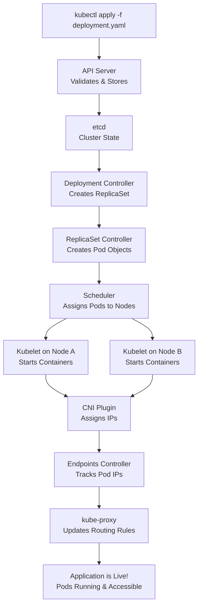

Kubernetes (K8s) architecture follows a proven pattern for running containerized applications at scale. Think of it like a well-organized shipping port: there's a central control tower that manages operations, and multiple cargo ships that carry the actual containers .

The system is divided into two main parts: the **Control Plane** (the brains) and the **Worker Nodes** (the muscle). The Control Plane manages the cluster and makes global decisions, while Worker Nodes run your application workloads. Every node runs a container runtime (like containerd or CRI-O) plus Kubernetes-specific agents .

### 🧠 Control Plane Components

| Component | Description |
| :--- | :--- |
| **kube-apiserver** | The front door to the cluster. All administrative tasks and component communications go through this API . |
| **etcd** | A distributed key-value store that holds the entire cluster state. It's the source of truth . |
| **kube-scheduler** | Watches for new pods and assigns them to healthy worker nodes based on resource needs and policies . |
| **kube-controller-manager** | Runs controller processes that handle tasks like node recovery, pod replication, and endpoint management . |
| **cloud-controller-manager** | Optional component that integrates with cloud provider APIs for services like load balancers and storage . |

For production environments, you can set up high availability with multiple control plane nodes. The official Kubernetes documentation describes two approaches :

- **Stacked etcd topology**: etcd runs alongside control plane components on the same nodes. This is simpler but if a node fails, you lose both a control plane instance and an etcd member.
- **External etcd topology**: etcd runs on separate nodes, decoupling the data store from the control plane. This provides better isolation but requires more infrastructure.

### ⚙️ Worker Node Components

Worker nodes are where your applications actually run. Each node runs three essential services :

| Component | Description |
| :--- | :--- |
| **kubelet** | The primary node agent that communicates with the API server. It ensures containers are running as defined in pod specifications and reports node status back to the control plane . |
| **kube-proxy** | Maintains network rules on each node. It handles service discovery and load balancing by forwarding traffic to appropriate pods across the cluster . |
| **Container Runtime** | The software that actually runs containers (containerd, CRI-O, etc.). It pulls images and manages container lifecycles based on kubelet instructions . |

### 📦 Pods: The Basic Building Block

Pods are the smallest deployable units in Kubernetes. A pod represents a single instance of your application and can contain one or more containers .

Key pod characteristics :

- **Shared networking**: Containers in the same pod share an IP address and can communicate via localhost
- **Shared storage**: Pods can mount volumes that all containers can access
- **Co-location**: Containers in a pod are always scheduled together on the same node
- **Ephemeral nature**: Pods are designed to be disposable and can be replaced at any time

To scale your application, you create new pods rather than adding containers to existing ones. This design keeps things clean and predictable .

### 🌐 Key Architectural Principles

The beauty of Kubernetes lies in its design philosophy :

- **Declarative configuration**: You describe the desired state, and Kubernetes makes it happen
- **Self-healing**: Failed containers restart, unhealthy nodes get cordoned, and unresponsive pods get rescheduled
- **Horizontal scaling**: Scale applications up or down by adjusting replica counts
- **Service discovery**: Built-in DNS and load balancing connect services without manual configuration
- **Portability**: Run on laptops, on-premises, or any cloud without changing your application definitions

### 🔧 Working with the Architecture

You interact with this architecture primarily through `kubectl`, the command-line tool that communicates with the API server . Common operations include :

- **Adding nodes**: New nodes can self-register or be added manually
- **Checking status**: `kubectl get nodes` shows cluster members; `kubectl describe node` provides detailed health information
- **Cordoning nodes**: Temporarily mark nodes as unschedulable for maintenance
- **Viewing pods**: `kubectl get pods` lists running workloads across the cluster

### 🔐 Security Considerations

Several architecture components have security implications :

- **kubelet access**: Not authenticated by default in some configurations—implement strong authentication
- **kube-proxy**: Secure communication with the API server and restrict file permissions for proxy configuration
- **Node isolation**: Use taints and tolerations to keep sensitive workloads on dedicated nodes
- **Port restrictions**: Limit access to kubelet ports to trusted networks only

This layered architecture—with clear separation of concerns between control and worker planes, standardized components, and declarative management—is what makes Kubernetes so powerful for running containerized workloads at scale .

I hope this comprehensive explanation helps you understand how Kubernetes fits together. Would you like me to elaborate on any particular component or explore how they interact during common operations like deploying a new application?

Of course! Let's walk through what happens when you deploy a new application using `kubectl apply -f deployment.yaml`. This is where all the Kubernetes components we discussed work together in a choreographed sequence.

## 📋 Starting Point: Your YAML Manifest

First, you create a YAML file describing your desired application state. Here's a typical Deployment manifest:

```yaml
apiVersion: apps/v1
kind: Deployment
metadata:
  name: web-app
spec:
  replicas: 3
  selector:
    matchLabels:
      app: web
  template:
    metadata:
      labels:
        app: web
    spec:
      containers:
      - name: nginx
        image: nginx:1.19
        ports:
        - containerPort: 80
```

This tells Kubernetes: "I want three replicas of an nginx container running, and here's how to create them."

## 🔄 The Deployment Journey: Step by Step

### Step 1: Submission and Validation

When you run `kubectl apply -f deployment.yaml`, here's what happens:

1. **kubectl** reads your YAML file and converts it to JSON
2. It sends an HTTP POST request to the **kube-apiserver** (typically on port 443) 
3. The API server authenticates your request, authorizes it, and validates the manifest schema 

If validation fails, you get an immediate error. If it passes, the API server stores the Deployment object in **etcd** .

### Step 2: The Controllers Take Over

Now the real magic begins:

| Controller | Action |
| :--- | :--- |
| **Deployment Controller** | Watches the API server for new/modified Deployments. When it sees your new Deployment, it creates a corresponding **ReplicaSet** (naming it something like `web-app-6b78f9d5d7`) . |
| **ReplicaSet Controller** | Watches for new ReplicaSets and sees it needs 3 pods. It creates 3 separate Pod objects in the API server, each with a unique name (e.g., `web-app-6b78f9d5d7-abcde`, `web-app-6b78f9d5d7-fghij`, etc.) . |

At this point, the Pod objects exist in etcd, but they haven't been assigned to any nodes yet.

### Step 3: Scheduling the Pods

The **kube-scheduler** constantly watches for unassigned pods :

1. It detects your new pods have an empty `nodeName` field
2. It evaluates each pod against:
   - Resource requirements (CPU/memory requests)
   - Node affinity/anti-affinity rules
   - Taints and tolerations
   - Data locality (if volumes are requested)
3. It picks the optimal node for each pod and updates the pod object with the node assignment

This information flows back through the API server and into etcd.

### Step 4: Node-Level Activation

Now the **kubelet** on each selected node takes over :

1. The kubelet constantly watches the API server for pods assigned to its node
2. When it sees a new assignment, it tells the **container runtime** (containerd, CRI-O, etc.) to pull the specified image 
3. The runtime downloads `nginx:1.19` from the container registry
4. The kubelet then instructs the runtime to start the container with the specified configuration

### Step 5: Networking Integration

As containers start, the networking layer kicks in :

1. The **CNI plugin** (Calico, Flannel, etc.) assigns a unique IP address to each new pod from the cluster's pod CIDR range 
2. The CNI plugin configures local routing so the pod can communicate with other pods across nodes 
3. **kube-proxy** on each node updates iptables or IPVS rules to reflect the new pod endpoints 

This is why pods can communicate directly with each other using their IPs, no matter which node they're on.

## 🌐 Making the Application Accessible

You'd typically also create a Service to expose your application:

```yaml
apiVersion: v1
kind: Service
metadata:
  name: web-service
spec:
  selector:
    app: web
  ports:
    - port: 80
      targetPort: 80
  type: ClusterIP
```

When you apply this Service:

1. The API server stores it in etcd
2. The **Endpoints controller** creates an Endpoints object listing all pod IPs with the label `app=web` 
3. **kube-proxy** on every node detects this and programs local networking rules 
4. Now any pod can access your application using the service name `web-service` 

## 🔄 Rolling Updates and Rollbacks

One of Kubernetes' most powerful features is controlled updates :

### When You Update the Image (e.g., to `nginx:1.20`):

1. You update the Deployment manifest and re-apply it
2. The **Deployment controller** creates a **new ReplicaSet** for version 1.20
3. It gradually scales down the old ReplicaSet while scaling up the new one 
4. During this process, both old and new pods coexist, ensuring zero downtime

### If Something Goes Wrong:

```bash
kubectl rollout undo deployment web-app
```

This tells the Deployment controller to reverse the update. It scales down the new ReplicaSet and scales the old one back up, restoring your previous version .

## 📊 Visual Summary

Here's the complete flow from command to running application:



## 🔑 Key Takeaways

- **Everything goes through the API server**  - it's the central communication hub
- **Controllers watch and respond** - they're constantly checking for changes and reconciling state
- **Declarative configuration** - you describe the desired state, Kubernetes figures out how to get there 
- **Layered abstraction** - Deployments manage ReplicaSets, which manage Pods 
- **Self-healing** - if a pod dies, the ReplicaSet controller creates a new one automatically

This orchestration happens continuously, maintaining your desired state even as nodes fail, pods crash, or network issues occur. It's this constant reconciliation that makes Kubernetes so powerful for running production workloads.

(From ChatGPT)

## Kubernetes Architecture — Clear, Structured Explanation

Kubernetes is a **distributed control system** designed to maintain the desired state of containerized applications.

At a high level, Kubernetes consists of:

> **Control Plane (brain)** + **Worker Nodes (execution layer)**

---

# 1️⃣ Control Plane (Cluster Brain)

The control plane manages the cluster and makes global decisions.

It typically runs on dedicated control-plane nodes.

### Core Components

## 🔹 API Server

The **API Server** is the front door of the cluster.

- All commands (`kubectl`, controllers, scheduler)
    
- All configuration changes
    
- All status updates
    

Everything goes through the API server.

It:

- Validates requests
    
- Authenticates users
    
- Persists data to etcd
    
- Exposes the Kubernetes REST API
    

Think of it as:

> The central communication hub.

---

## 🔹 etcd

**etcd** is a distributed key-value store.

It stores:

- Cluster configuration
    
- Desired state
    
- Secrets
    
- Node info
    
- Pod specs
    
- Service definitions
    

It is the **source of truth** for the cluster.

If etcd is lost → cluster state is lost.

---

## 🔹 Scheduler

The Scheduler decides:

> "Which node should this Pod run on?"

It evaluates:

- CPU/memory availability
    
- Node taints & tolerations
    
- Affinity/anti-affinity rules
    
- Resource requests/limits
    

It assigns Pods to nodes.

---

## 🔹 Controller Manager

Runs multiple controllers that enforce the desired state.

Examples:

- Deployment controller
    
- ReplicaSet controller
    
- Node controller
    
- Job controller
    

Controllers constantly compare:

> Desired state (in etcd)  
> vs  
> Actual state (in cluster)

Then take corrective action.

This is called the **Reconciliation Loop**.

---

# 2️⃣ Worker Nodes (Execution Layer)

Worker nodes actually run your applications.

Each worker node includes:

---

## 🔹 Kubelet

- Runs on every node
    
- Talks to API server
    
- Ensures Pods are running
    
- Reports status back
    

It does NOT schedule Pods.  
It simply executes what it's told.

---

## 🔹 Container Runtime

Responsible for running containers.

Examples:

- containerd
    
- CRI-O
    

Kubernetes interacts via the Container Runtime Interface (CRI).

---

## 🔹 Kube-Proxy

Handles networking rules.

It:

- Manages Service IPs
    
- Configures iptables/IPVS
    
- Enables Pod-to-Pod communication
    

---

# 3️⃣ How It All Works Together

Let’s walk through deploying a Pod.

### Step 1: User Applies Manifest

```bash
kubectl apply -f deployment.yaml
```

→ Sent to API Server

---

### Step 2: API Server

- Validates request
    
- Stores object in etcd
    

Now the desired state exists.

---

### Step 3: Controller Manager

Notices:

- Deployment needs 3 replicas
    
- No Pods exist
    

Creates ReplicaSet → creates Pods

---

### Step 4: Scheduler

Sees new Pods with no assigned node.

Selects appropriate nodes.

Writes assignment back to API Server.

---

### Step 5: Kubelet

On chosen node:

- Sees Pod assigned
    
- Pulls image
    
- Starts container
    
- Reports status
    

---

### Step 6: Continuous Reconciliation

If a Pod crashes:

- Controller notices missing replica
    
- Creates new Pod
    
- System self-heals
    

---

# 4️⃣ Networking Model

Kubernetes networking principles:

- Every Pod gets its own IP
    
- Pods communicate directly
    
- Services provide stable IP/DNS
    
- kube-proxy manages traffic routing
    

---

# 5️⃣ Logical View of Architecture

```
            Control Plane
    --------------------------------
    |  API Server  |   etcd        |
    |  Scheduler   | Controllers   |
    --------------------------------
               ↓
         Worker Nodes
    --------------------------------
    |  Kubelet  |  Runtime        |
    |  kube-proxy                  |
    |  Pods (Containers)           |
    --------------------------------
```

---

# 6️⃣ Key Architectural Principles

Kubernetes is:

- Declarative (you describe desired state)
    
- Self-healing
    
- Distributed
    
- Extensible
    
- Event-driven
    
- Eventually consistent
    

It is NOT:

- Imperative orchestration
    
- Manually managed container system
    

---

# 7️⃣ Mental Model

If Kubernetes were a company:

- API Server → Reception desk
    
- etcd → Company database
    
- Scheduler → Resource manager
    
- Controllers → Operations managers
    
- Kubelet → Factory workers
    
- Container runtime → Machines
    
- kube-proxy → Network department
    

---

# 8️⃣ Why This Architecture Matters

This design enables:

- Horizontal scaling
    
- Rolling updates
    
- Self-healing
    
- High availability
    
- Infrastructure abstraction
    
- Cloud portability
    

---

Other topics:

- The reconciliation loop in depth
    
- How HA control planes work
    
- How Kubernetes differs from Docker Swarm
    
- How networking plugins (CNI) fit into the architecture
    
- How security works (RBAC, admission controllers)
    