# **Complete Mermaid Tutorial: From Beginner to Advanced**

## **Table of Contents**
1. [Introduction to Mermaid](#introduction)
2. [Installation and Setup](#setup)
3. [Flowcharts](#flowcharts)
4. [Sequence Diagrams](#sequence-diagrams)
5. [Class Diagrams](#class-diagrams)
6. [State Diagrams](#state-diagrams)
7. [Entity Relationship Diagrams](#entity-relationship)
8. [User Journey Diagrams](#user-journey)
9. [Gantt Charts](#gantt)
10. [Pie Charts](#pie-charts)
11. [Git Graph](#git-graph)
12. [Mind Maps](#mind-maps)
13. [Timeline Diagrams](#timeline)
14. [Advanced Features](#advanced)
15. [Best Practices](#best-practices)
16. [Real-World Examples](#real-world)

---

## **1. Introduction to Mermaid** {#introduction}

Mermaid is a **JavaScript-based diagramming and charting tool** that renders Markdown-inspired text definitions to create dynamic diagrams. Think of it as **"Markdown for diagrams"** - you write simple text, and Mermaid turns it into beautiful visuals.

### **Why Mermaid?**

| Feature | Benefit |
|---------|---------|
| **Text-based** | Version control friendly, easy to collaborate |
| **Language agnostic** | Works in Markdown, HTML, Confluence, Notion, etc. |
| **Live preview** | See changes instantly |
| **Wide adoption** | GitHub, GitLab, Azure DevOps native support |
| **Free & open source** | No licensing costs |

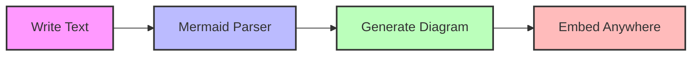

---

## **2. Installation and Setup** {#setup}

### **Option 1: Online Live Editor**
```markdown
1. Go to https://mermaid.live/
2. Start diagramming immediately
3. Export as SVG/PNG
```

### **Option 2: VS Code Extension**
```bash
# Install "Markdown Preview Mermaid Support" extension
# Create .md file with mermaid code blocks
```

### **Option 3: GitHub/Native Markdown**
````markdown
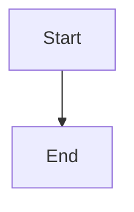
````

### **Option 4: HTML Integration**
```html
<!DOCTYPE html>
<html>
<head>
  <script src="https://cdn.jsdelivr.net/npm/mermaid/dist/mermaid.min.js"></script>
  <script>mermaid.initialize({startOnLoad:true});</script>
</head>
<body>
  <div class="mermaid">
    graph LR
        A[Hello] --> B[World]
  </div>
</body>
</html>
```

---

## **3. Flowcharts** {#flowcharts}

Flowcharts are the most common diagram type - perfect for workflows, algorithms, and processes.

### **Basic Syntax**

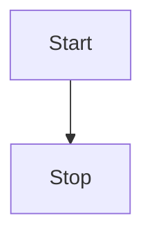

### **Node Shapes**

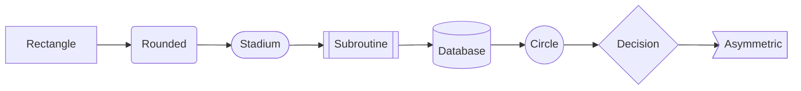

**Code:**
```
graph LR
    A[Rectangle] --> B(Rounded)
    B --> C([Stadium])
    C --> D[[Subroutine]]
    D --> E[(Database)]
    E --> F((Circle))
    F --> G{Decision}
    G --> H>Asymmetric]
```

### **Connections and Arrows**

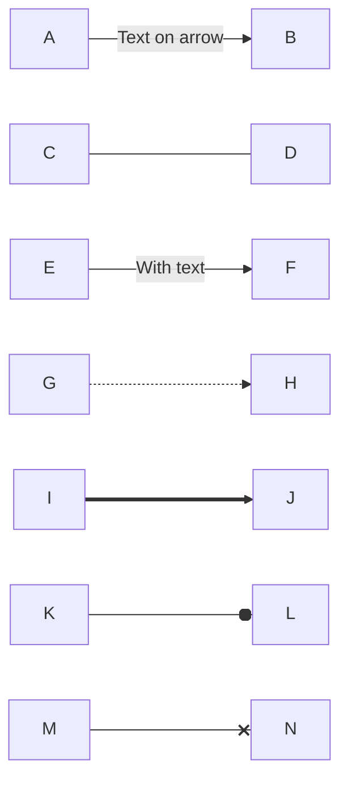

**Code:**
```
graph LR
    A -- Text on arrow --> B
    C --- D
    E -->|With text| F
    G -.-> H
    I ==> J
    K --o L
    M --x N
```

### **Subgraphs**

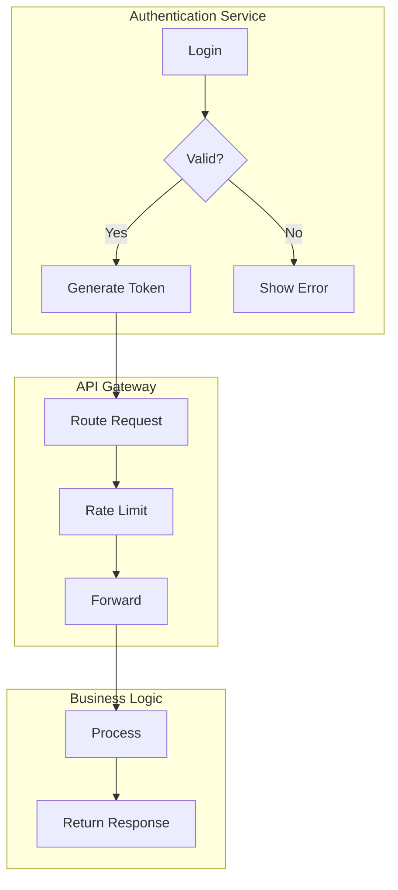

**Code:**
```
graph TB
    subgraph "Authentication Service"
        A[Login] --> B{Valid?}
        B -->|Yes| C[Generate Token]
        B -->|No| D[Show Error]
    end
    
    subgraph "API Gateway"
        C --> E[Route Request]
        E --> F[Rate Limit]
        F --> G[Forward]
    end
    
    subgraph "Business Logic"
        G --> H[Process]
        H --> I[Return Response]
    end
```

### **Styling Flowcharts**

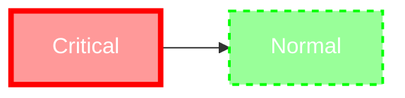

---

## **4. Sequence Diagrams** {#sequence-diagrams}

Perfect for showing interactions between systems or users over time.

### **Basic Sequence**

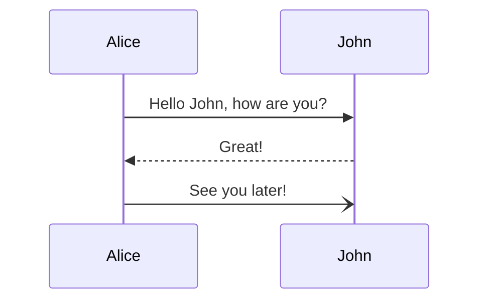

**Code:**
```
sequenceDiagram
    Alice->>John: Hello John, how are you?
    John-->>Alice: Great!
    Alice-)John: See you later!
```

### **Actors and Participants**

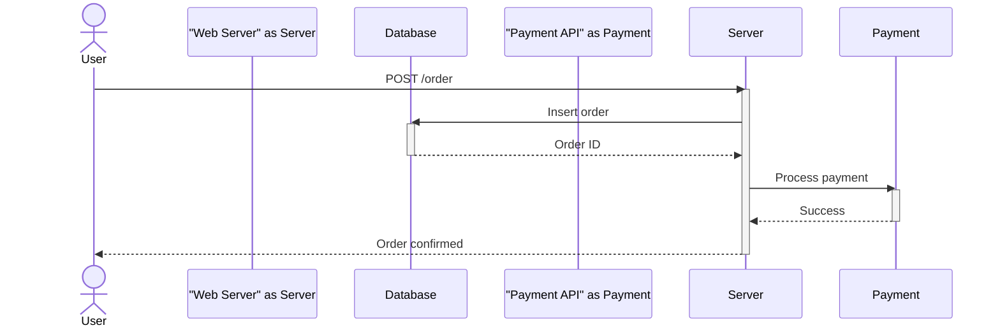

### **Loops and Alternatives**

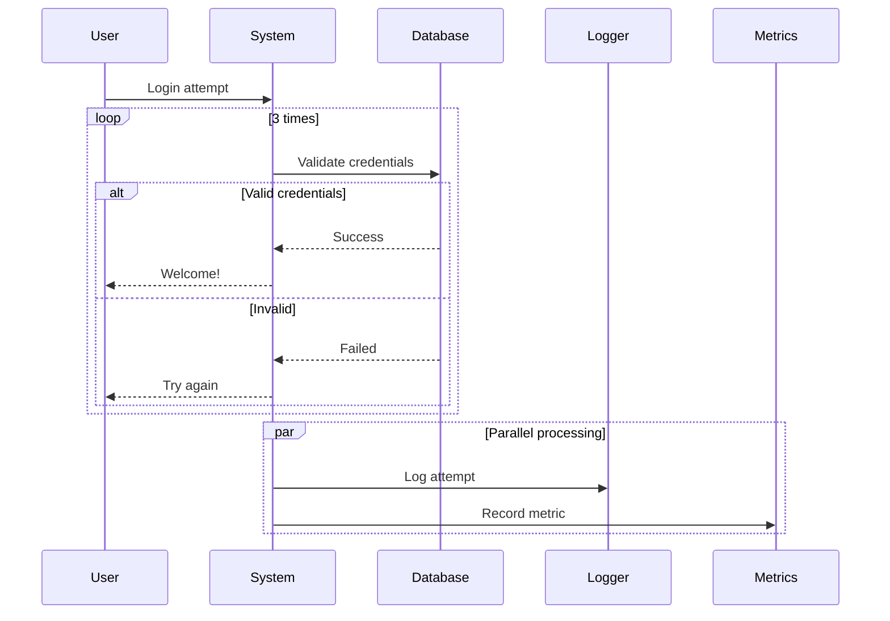

### **Notes and Activation**

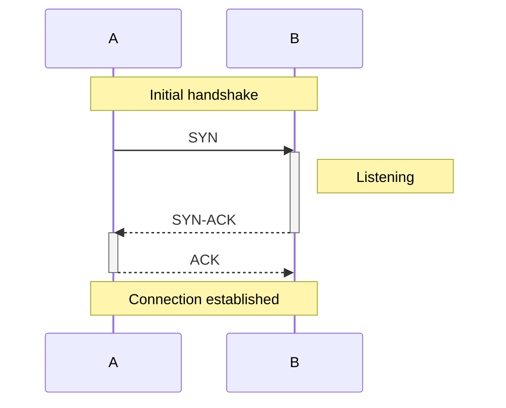

---

## **5. Class Diagrams** {#class-diagrams}

Great for software architecture and object-oriented design.

### **Basic Classes**

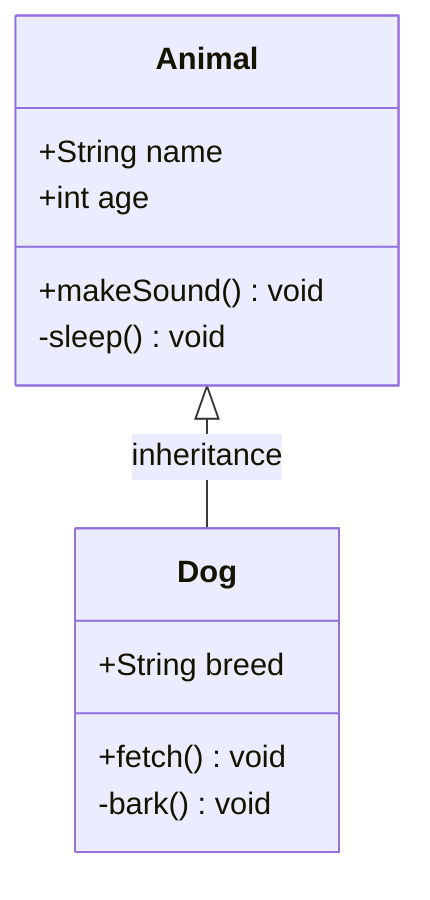

### **Relationships**

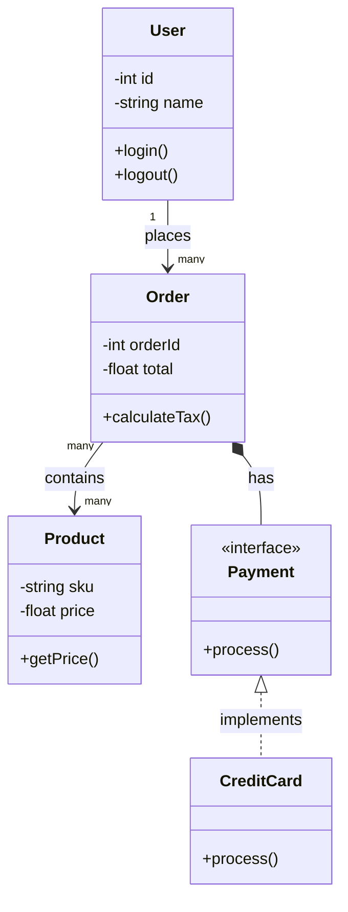

**Code for key relationships:**
```
classDiagram
    -- Inheritance --
    Animal <|-- Dog
    
    -- Composition --
    House *-- Room
    
    -- Aggregation --
    Car o-- Wheel
    
    -- Association --
    User --> Order
    
    -- Dependency --
    Class1 <.. Class2
    
    -- Realization --
    Interface <|.. Implementation
```

---

## **6. State Diagrams** {#state-diagrams}

Perfect for modeling state machines and workflows.

### **Basic State Machine**

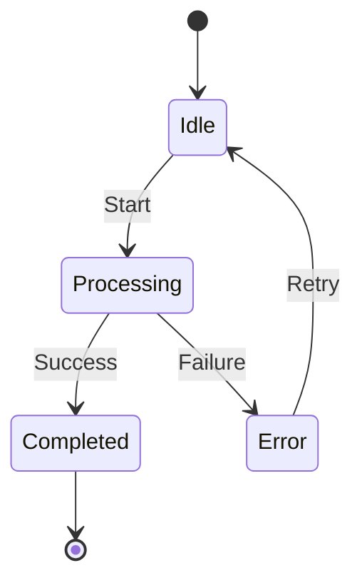

### **Complex States with Descriptions**

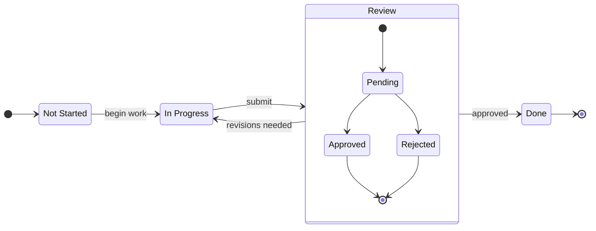

### **Parallel States**

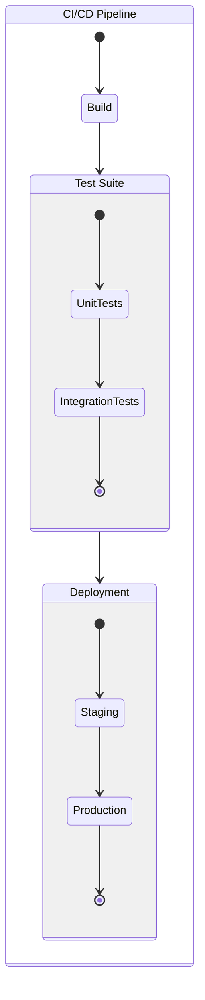

---

## **7. Entity Relationship Diagrams** {#entity-relationship}

Essential for database design.

### **Basic ER Diagram**

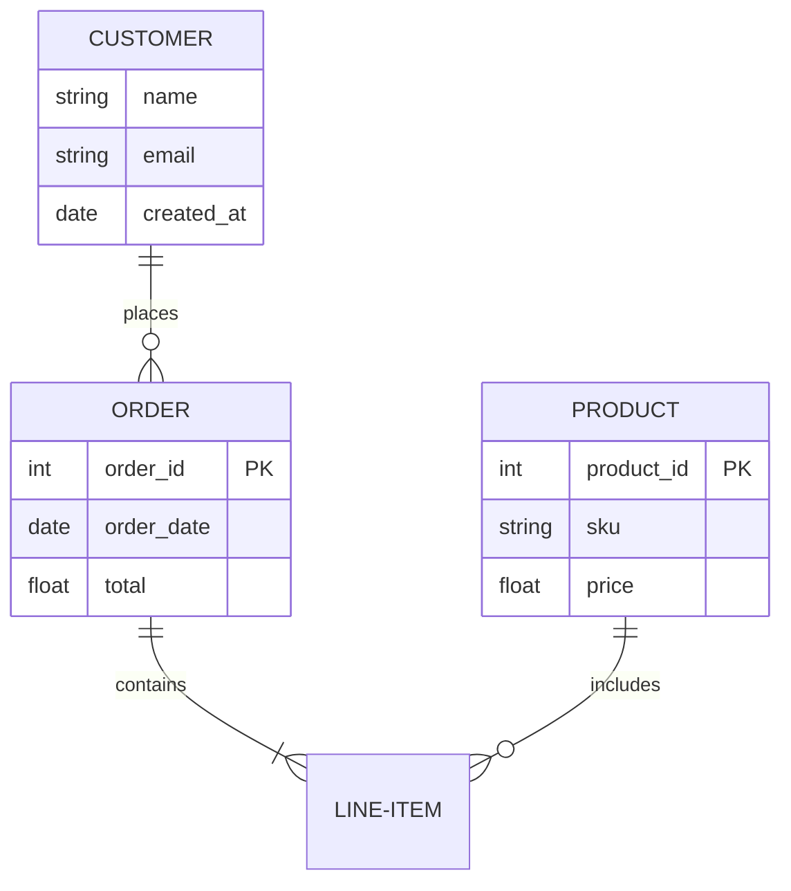

### **Relationships Legend**

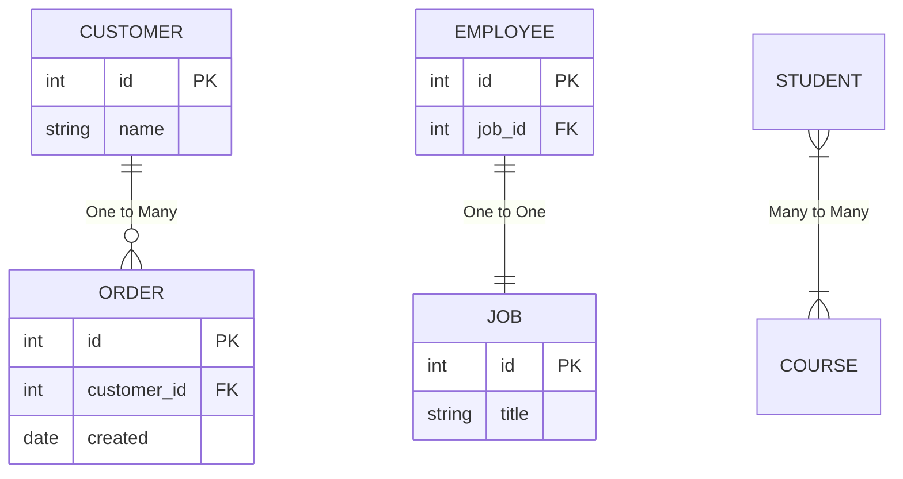

**Relationship Symbols:**
| Symbol | Meaning |
|--------|---------|
| `||` | Exactly one |
| `--` | Relationship |
| `o{` | Zero or more |
| `|{` | One or more |
| `}o` | Zero or one |

---

## **8. User Journey Diagrams** {#user-journey}

Perfect for UX design and customer experience mapping.

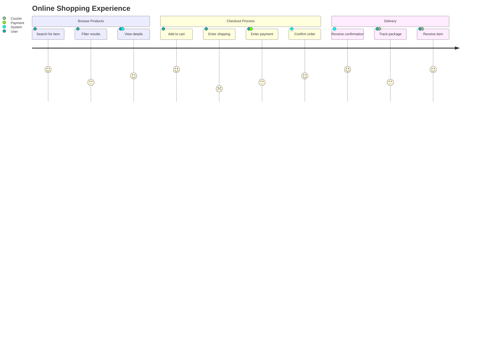

---

## **9. Gantt Charts** {#gantt}

Essential for project management and scheduling.

### **Basic Gantt**

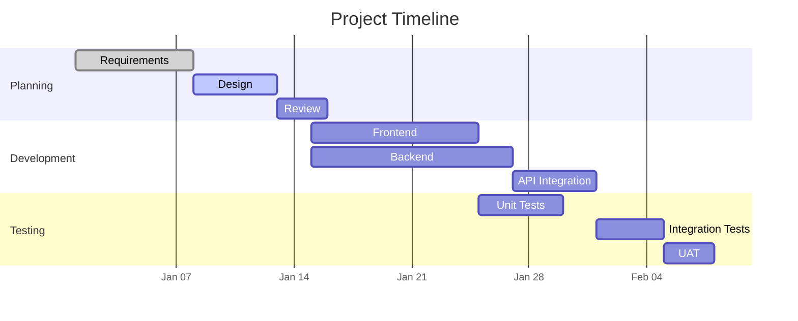

### **Advanced Gantt with Milestones**

```mermaid
gantt
    title Product Launch
    dateFormat  YYYY-MM-DD
    axisFormat %b %d
    
    section Phase 1: MVP
    Core features    :crit, active, mvp1, 2024-01-01, 14d
    MVP Complete     :milestone, mvp_done, 2024-01-15, 1d
    
    section Phase 2: Beta
    Beta features    :beta, after mvp_done, 14d
    User testing     :test, after beta, 7d
    Beta Release     :milestone, beta_rel, after test, 1d
    
    section Phase 3: Launch
    Final features   :final, after beta_rel, 10d
    Marketing        :mkt, after beta_rel, 10d
    Launch Day       :milestone, launch, after final, 1d
```

---

## **10. Pie Charts** {#pie-charts}

Quick and effective for showing proportions.

```mermaid
pie
    title Cloud Provider Market Share
    "AWS" : 32
    "Azure" : 23
    "Google Cloud" : 10
    "Others" : 8
```

### **Styled Pie Chart**

```mermaid
pie showData
    title Technology Stack Usage
    "JavaScript" : 42.7
    "Python" : 31.2
    "Java" : 15.5
    "Go" : 7.8
    "Rust" : 2.8
```

---

## **11. Git Graph** {#git-graph}

Perfect for visualizing Git branching strategies.

```mermaid
gitGraph
    commit id: "Initial"
    commit id: "Add README"
    
    branch develop
    checkout develop
    commit id: "Feature branch"
    
    branch feature/auth
    checkout feature/auth
    commit id: "Add login"
    commit id: "Add JWT"
    
    checkout develop
    merge feature/auth id: "Merge auth"
    
    checkout main
    merge develop id: "Release v1.0"
    commit id: "Hotfix" type: HIGHLIGHT
```

### **Git Flow Strategy**

```mermaid
gitGraph
    commit tag: "v1.0"
    branch develop
    checkout develop
    commit id: "Start develop"
    
    branch feature/user
    checkout feature/user
    commit id: "User model"
    commit id: "User API"
    
    checkout develop
    merge feature/user
    
    branch release/v1.1
    checkout release/v1.1
    commit id: "Bug fixes"
    
    checkout main
    merge release/v1.1 tag: "v1.1"
    
    checkout develop
    merge release/v1.1
```

---

## **12. Mind Maps** {#mind-maps}

Great for brainstorming and idea organization.

```mermaid
mindmap
  root((DevOps))
    Culture
      Collaboration
      Automation
      Measurement
      Sharing
    Practices
      CI/CD
        Continuous Integration
        Continuous Delivery
      Infrastructure as Code
        Terraform
        Ansible
      Monitoring
        Prometheus
        Grafana
    Tools
      Version Control
        Git
        GitHub
      Container
        Docker
        Kubernetes
      Cloud
        AWS
        Azure
```

---

## **13. Timeline Diagrams** {#timeline}

Perfect for historical events and project phases.

```mermaid
timeline
    title Evolution of DevOps
    
    section 2007-2008
        Agile discussions
        : Patrick Debois coins "DevOps"
        : First DevOpsDays in Ghent
    
    section 2009-2012
        : CI/CD tools emerge
        : Jenkins released
        : Puppet, Chef popular
    
    section 2013-2016
        : Container revolution
        : Docker released
        : Kubernetes announced
    
    section 2017-Present
        : GitOps emerges
        : Cloud Native Computing
        : Platform Engineering
```

---

## **14. Advanced Features** {#advanced}

### **Themes and Styling**

```mermaid
%%{init: {'theme': 'dark', 'themeVariables': {
  'primaryColor': '#ff0000',
  'secondaryColor': '#00ff00',
  'tertiaryColor': '#0000ff'
}}}%%
graph TD
    A[Dark Theme] --> B[Custom Colors]
    B --> C[Styled Nodes]
    
    style A fill:#f00,stroke:#333,stroke-width:2px
    style B fill:#0f0,stroke:#333,stroke-width:2px
    style C fill:#00f,stroke:#333,stroke-width:2px,color:#fff
```

### **Clickable Diagrams**

```mermaid
graph LR
    A[GitHub] --> B[Documentation]
    C[Examples] --> B
    
    click A "https://github.com" _blank
    click B "https://mermaid.js.org" _blank
    click C "https://mermaid.js.org/syntax/"
```

### **Mathematical Expressions**

```mermaid
graph LR
    A[Input] --> B{x > 0?}
    B -->|Yes| C[√x]
    B -->|No| D[Error]
    
    style C fill:#bbf,stroke:#f66,stroke-width:2px
```

---

## **15. Best Practices** {#best-practices}

### **Code Organization**

```markdown
## Architecture Diagram
```mermaid
graph TD
    %% Main components
    Client --> Gateway
    
    %% Gateway details
    Gateway --> Auth[Auth Service]
    Gateway --> API[API Service]
    
    %% Services
    Auth --> DB[(Users DB)]
    API --> Cache[(Redis)]
    API --> Queue[(Message Queue)]
    
    %% Styling
    classDef critical fill:#f99
    class Auth,API critical
```
```

### **Naming Conventions**
```mermaid
graph LR
    %% Use descriptive names
    UserService --> Database[(PrimaryDB)]
    
    %% Use prefixes for clarity
    ext_github[GitHub API]
    int_auth[Internal Auth]
    
    %% Avoid abbreviations unless standard
    API[Application Programming Interface]
    DB[Database]
```

### **Complex Diagram Example**

```mermaid
graph TB
    subgraph "Frontend Layer"
        UI[React App]
        Mobile[Mobile App]
    end
    
    subgraph "API Gateway"
        Gateway[Kong/NGINX]
        RateLimit[Rate Limiter]
        Auth[JWT Auth]
    end
    
    subgraph "Microservices"
        direction LR
        Users[User Service]
        Orders[Order Service]
        Products[Product Service]
        Payments[Payment Service]
    end
    
    subgraph "Data Layer"
        PostgreSQL[(Primary DB)]
        Redis[(Cache)]
        Elastic[(Search)]
    end
    
    UI --> Gateway
    Mobile --> Gateway
    
    Gateway --> RateLimit
    RateLimit --> Auth
    
    Auth --> Users
    Users --> PostgreSQL
    
    Gateway --> Orders
    Orders --> PostgreSQL
    Orders --> Redis
    
    Gateway --> Products
    Products --> Elastic
    
    Products -.-> Redis
    
    style Gateway fill:#bbf
    style PostgreSQL fill:#fbb
    style Redis fill:#bfb
```

---

## **16. Real-World Examples** {#real-world}

### **AWS Architecture Diagram**

```mermaid
graph TB
    subgraph "AWS Cloud"
        subgraph "VPC"
            subgraph "Public Subnet"
                ALB[Application LB]
                Bastion[Bastion Host]
            end
            
            subgraph "Private Subnet"
                EC2[Web Servers]
                ECS[Container Service]
            end
            
            subgraph "Data Subnet"
                RDS[(RDS Primary)]
                RDSReplica[(RDS Replica)]
                ElastiCache[(Redis)]
            end
        end
        
        Route53[Route 53]
        CloudFront[CloudFront CDN]
        S3[S3 Bucket]
    end
    
    Internet((Internet)) --> Route53
    Route53 --> CloudFront
    CloudFront --> ALB
    CloudFront --> S3
    
    ALB --> EC2
    ALB --> ECS
    
    EC2 --> RDS
    ECS --> RDS
    EC2 --> ElastiCache
    
    RDS --> RDSReplica
    
    Bastion --> EC2
    Bastion --> RDS
```

### **CI/CD Pipeline**

```mermaid
graph LR
    subgraph "Source"
        GitHub[GitHub Repo]
    end
    
    subgraph "CI"
        Jenkins[Jenkins]
        Build[Build]
        Test[Unit Tests]
        SAST[Security Scan]
        Artifact[Artifact Store]
    end
    
    subgraph "CD"
        DeployDev[Deploy Dev]
        TestDev[Test Dev]
        DeployStaging[Deploy Staging]
        TestStaging[Integration Tests]
        DeployProd[Deploy Prod]
        SmokeTest[Smoke Tests]
    end
    
    GitHub --> Jenkins
    Jenkins --> Build
    Build --> Test
    Test --> SAST
    SAST --> Artifact
    
    Artifact --> DeployDev
    DeployDev --> TestDev
    TestDev --> DeployStaging
    DeployStaging --> TestStaging
    TestStaging --> DeployProd
    DeployProd --> SmokeTest
    
    classDef ci fill:#bbf
    classDef cd fill:#bfb
    
    class Jenkins,Build,Test,SAST,Artifact ci
    class DeployDev,TestDev,DeployStaging,TestStaging,DeployProd,SmokeTest cd
```

### **Kubernetes Architecture**

```mermaid
graph TB
    subgraph "User"
        Kubectl[kubectl]
        UserWeb[Browser]
    end
    
    subgraph "Control Plane"
        API[API Server]
        Scheduler[Scheduler]
        Controller[Controller Manager]
        etcd[(etcd)]
    end
    
    subgraph "Worker Nodes"
        subgraph "Node 1"
            Kubelet1[Kubelet]
            Pod1[Pod]
            Pod2[Pod]
        end
        
        subgraph "Node 2"
            Kubelet2[Kubelet]
            Pod3[Pod]
            Pod4[Pod]
        end
    end
    
    subgraph "Services"
        Service1[LoadBalancer]
        Ingress[Ingress]
        ConfigMap[ConfigMap]
        Secrets[Secrets]
    end
    
    Kubectl --> API
    UserWeb --> Ingress
    
    API --> Scheduler
    API --> Controller
    API --> etcd
    
    Scheduler --> Kubelet1
    Scheduler --> Kubelet2
    
    Controller --> Pod1
    Controller --> Pod2
    
    Ingress --> Service1
    Service1 --> Pod1
    Service1 --> Pod2
    Service1 --> Pod3
    Service1 --> Pod4
    
    Pod1 --> ConfigMap
    Pod2 --> Secrets
```

---

## **Quick Reference Card**

### **Diagram Types & Use Cases**

| Diagram Type | Best For | Complexity |
|--------------|----------|------------|
| **Flowchart** | Processes, workflows | ⭐⭐ |
| **Sequence** | System interactions | ⭐⭐⭐ |
| **Class** | Software design | ⭐⭐⭐ |
| **State** | State machines | ⭐⭐ |
| **ER** | Database design | ⭐⭐ |
| **User Journey** | UX mapping | ⭐ |
| **Gantt** | Project timelines | ⭐⭐ |
| **Pie** | Proportions | ⭐ |
| **Git Graph** | Version control | ⭐⭐ |
| **Mind Map** | Brainstorming | ⭐ |
| **Timeline** | Historical events | ⭐ |

### **Common Syntax Patterns**

```
graph LR    # Left to right
graph TB    # Top to bottom
graph RL    # Right to left
graph BT    # Bottom to top

-->    # Arrow with line
---    # Line
==>    # Thick arrow
-.->   # Dotted arrow
--o    # Arrow with circle
--x    # Arrow with X
```

### **Keyboard Shortcuts (Live Editor)**

| Shortcut | Action |
|----------|--------|
| `Ctrl+Enter` | Render diagram |
| `Ctrl+S` | Save |
| `Ctrl+Z` | Undo |
| `Ctrl+Shift+Z` | Redo |
| `Ctrl+F` | Search |

---

## **Resources**

- **Official Documentation**: https://mermaid.js.org/
- **Live Editor**: https://mermaid.live/
- **GitHub Integration**: https://github.blog/2022-02-14-include-diagrams-markdown-files-mermaid/
- **VS Code Extension**: "Markdown Preview Mermaid Support"
- **Mermaid CLI**: `npm install -g @mermaid-js/mermaid-cli`

---

This tutorial covers everything from basic syntax to advanced real-world examples. Mermaid's power lies in its simplicity - you can start with basic diagrams and gradually incorporate more complex features as needed. The best way to learn is to **practice with real examples** from your own work!