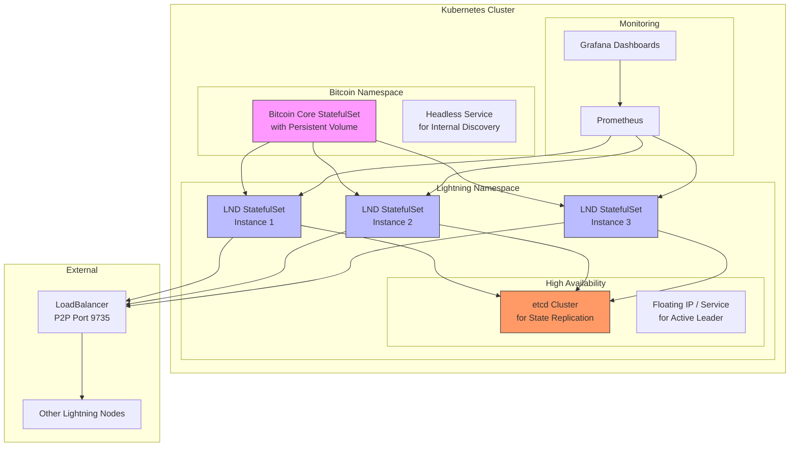

Setting up a Linux laptop as a stateless workstation that synchronizes with a Synology NAS is an advanced but rewarding project. It involves configuring your laptop to boot an operating system image served by the NAS, with all user data and settings stored and synchronized back to it .

Here is a breakdown of the key concepts and a step-by-step guide to achieve this setup.

### 🤔 Understanding the Core Concepts

Before diving into the steps, it's helpful to understand the components involved:

*   **Stateless/Diskless Workstation**: This is a computer that boots and runs its operating system without using a local hard drive for persistent storage. The OS image is downloaded from a server (your Synology NAS) each time the machine starts . All user files and system configurations are stored on the server, making the laptop itself interchangeable .
*   **Synology NAS as the Server**: Your NAS will act as the central server, providing the OS image (via NFS), network settings (via DHCP), and the bootloader (via TFTP).
*   **Synchronization**: In this context, "synchronization" is inherent to the architecture. Because the laptop doesn't store data locally, all files are read from and written directly to the NAS, ensuring your work is always "synchronized" and stored centrally.

### 🛠️ Step-by-Step Configuration Guide

This guide combines methods from enterprise stateless Linux setups  with specific configurations for your Synology hardware.

#### Phase 1: Configuring Your Synology NAS (The Server)

Your NAS needs to be set up to host the operating system and serve it to your laptop.

1.  **Enable and Configure NFS on Synology**: NFS (Network File System) is the protocol that will share the operating system files with your laptop.
    *   Go to **Control Panel > File Services > SMB/AFP/NFS** and check the box to **Enable NFS** service .
    *   Click **Apply** to save the setting.

2.  **Create and Export a Shared Folder for the OS**:
    *   Create a new shared folder (e.g., `linux-os`) via **Control Panel > Shared Folder**.
    *   Select the folder and click **Edit**.
    *   Go to the **NFS Permissions** tab and click **Create**.
    *   In the **Hostname or IP** field, you can specify the IP address of your laptop or your entire local network (e.g., `192.168.1.0/24`). Using the network is more flexible for future laptops.
    *   Check **Privilege** to `Read/Write` so the laptop can write data.
    *   Enable **Squash: No mapping** (or `no_root_squash`). This is often necessary for the root user on the client (laptop) to have proper permissions on the mounted filesystem .
    *   Leave other options at their defaults and save the rule.

#### Phase 2: Preparing the Operating System Image for the Laptop

This is the most complex step. You'll need another Linux machine (desktop or VM) to create the initial OS image.

1.  **Create a Root Filesystem**: On your helper Linux machine, you need to create a minimal Linux installation in a directory. This will become the operating system for your laptop. Tools like `debootstrap` (for Debian/Ubuntu) or `dnf --installroot` (for Fedora) can be used. For example, on a Debian-based system, you might run:
    ```bash
    # Create a directory for the client's root filesystem
    sudo mkdir -p /mnt/client-root
    # Install a base Debian system into that directory
    sudo debootstrap stable /mnt/client-root/
    ```
2.  **Customize the Image**: Use `chroot` to enter the new filesystem and make necessary configurations, such as setting up the network, installing drivers, and creating a user.
    ```bash
    sudo chroot /mnt/client-root/
    # Inside the chroot, set a password, install packages, etc.
    passwd
    apt update && apt install -y network-manager
    exit
    ```
3.  **Transfer the Image to Your NAS**: Once your client root filesystem is ready, copy the entire contents of `/mnt/client-root/` to the `linux-os` shared folder you created on your NAS. You can use `rsync` for this.
    ```bash
    sudo rsync -avz /mnt/client-root/ /path/to/mounted/nas/linux-os/
    ```

#### Phase 3: Setting Up Network Booting Services (Also on the NAS)

Your Synology NAS must also provide the services that allow the laptop to find and boot the OS image over the network. **Note:** This requires accessing your Synology via SSH and using the command line, as these services aren't typically configured through the DSM web interface.

1.  **Set up DHCP (Dynamic Host Configuration Protocol)**: The NAS needs to tell your laptop where to find the boot files.
    *   Install a DHCP server on your NAS. The exact method depends on your NAS's Linux distribution (usually a version of DSM). You might need to use `ipkg` or `synopkg` to install a package like `dhcpd` or `dnsmasq`.
    *   Configure the DHCP server to point to the NAS's own IP address for the TFTP server and to provide the bootloader filename. A simplified `dnsmasq` configuration might look like this:
        ```
        interface=eth0 # Your NAS's network interface
        dhcp-range=192.168.1.100,192.168.1.200,12h # IP range for clients
        dhcp-boot=pxelinux.0,<your-nas-ip> # Boot file and TFTP server address
        enable-tftp
        tftp-root=/volume1/tftp # A folder on your NAS for TFTP files
        ```
2.  **Set up TFTP (Trivial File Transfer Protocol)**: This service provides the initial bootloader to the laptop.
    *   Ensure a TFTP server (like `tftp-hpa`) is installed and running on your NAS. `dnsmasq` can also act as a TFTP server, as shown above.
    *   Create a TFTP root directory (e.g., `/volume1/tftp`).
    *   Place the necessary bootloader files (like `pxelinux.0`, kernel, and initrd) in this directory. These files often come from the `syslinux` package and from the kernel you intend to boot.

#### Phase 4: Booting the Laptop and Final Synchronization

1.  **Configure the Laptop to Network Boot**:
    *   Enter your laptop's BIOS/UEFI settings.
    *   Enable **Network Boot** or **PXE Boot** and move it to the top of the boot priority order.
    *   Save the settings and restart.

2.  **The Boot Process**:
    *   The laptop will get an IP address from your NAS's DHCP server.
    *   It will then download the bootloader via TFTP.
    *   The bootloader will instruct the laptop to mount its root filesystem from your NAS via NFS (e.g., `nfs://<nas-ip>/volume1/linux-os`).
    *   The laptop will then boot into the operating system.

Once the laptop is up and running, all file reads and writes will happen directly on the NFS share hosted by your Synology NAS. Any changes you make—installing new software, saving documents, changing settings—are immediately and persistently stored on the NAS. If you boot another stateless laptop from the same image, you'll have an identical environment. If you shut down and later boot a new laptop, it will have all your latest files and settings, as they were always stored centrally.

### 💡 Alternative Approaches and Important Considerations

*   **Official Synology Tools**: For a simpler approach to file synchronization (not full stateless booting), consider **Synology Drive Client**. It runs on your Linux laptop and syncs specific folders with your NAS, similar to Dropbox. This is much easier to set up and is ideal for keeping documents synchronized across multiple devices .
*   **Syncthing**: This is a popular open-source alternative for folder synchronization. It can run on your Linux laptop and also on your Synology NAS (installable via the Package Center), providing peer-to-peer syncing of your data .
*   **Backup vs. Synchronization**: Be mindful of the difference. While this stateless setup ensures your data is always on the NAS, it doesn't inherently protect you from accidental deletions or file corruption. If you delete a file on your laptop, it's deleted from the NAS immediately. Consider using the NAS's backup tools like **Hyper Backup** to create versioned backups of your data to an external drive or cloud service .

### 🏁 Conclusion and Next Steps

Creating a stateless Linux laptop is a project that offers a deep understanding of system administration and network booting. It provides a powerful, centralized, and interchangeable computing environment.

Here are your recommended next steps:
*   **Start with the NAS**: Begin by enabling NFS and creating a shared folder on your Synology.
*   **Build an OS Image**: On a separate Linux machine, create a basic root filesystem and test copying it to the NAS.
*   **Explore Tools**: Familiarize yourself with the concepts of `dnsmasq`, PXE, and NFS.

If this seems too complex for your immediate needs, starting with **Synology Drive Client**  for file synchronization is a fantastic way to centralize your data while keeping your laptop's local operating system intact.

Do you have a specific Linux distribution in mind for the laptop? Knowing that could help tailor the OS image creation steps.

---

Fedora Sway Atomic is an official Fedora project that combines the **Sway tiling window manager** with the **rpm-ostree** technology to create an atomic, immutable desktop system . It was previously known as Fedora Sericea before being rebranded under the Fedora Atomic Desktops umbrella .

## Core Architecture

Fedora Sway Atomic is built on several key technologies:

- **Sway WM**: A highly customizable, keyboard-first Wayland window manager 
- **rpm-ostree**: A hybrid image/package system that combines libostree and libdnf to provide atomic, safe upgrades with local RPM package layering 
- **Flatpak**: Applications are containerized and installed via Flatpak, providing thousands of open-source and proprietary options 
- **Podman**: A daemonless container engine for development and running OCI containers 

## Key Features

### Immutable/Atomic Design
Unlike traditional Linux installations where the root filesystem is writable, Fedora Sway Atomic maintains a read-only operating system core. Updates are applied atomically—they either succeed completely or fail without leaving the system in a partially updated state. You can also roll back to previous system states if an update causes issues .

### Included Applications
The variant comes with carefully selected lightweight applications that complement its keyboard-driven workflow :

| Category | Applications |
|----------|--------------|
| **Internet** | Firefox, NetworkManager Applet, nmcli |
| **Terminal** | foot (fast, lightweight Wayland terminal) |
| **Utilities** | swaylock (screen locker), waybar (status bar), rofi (launcher), dunst (notifications), kanshi (display configuration) |
| **File Management** | Thunar file manager |
| **Media** | imv (image viewer), light (brightness control) |

## Installation Considerations

### Known Limitations 
- **Dual booting**: Not fully supported out-of-the-box; manual configuration required with caution
- **Manual partitioning**: Limited to specific mount points only (/boot, /, /var, and /var subdirectories like /var/home)
- **LUKS keyboard layout**: The LUKS unlock screen defaults to en-US regardless of installation selection (workaround available via `rpm-ostree initramfs-etc --track=/etc/vconsole.conf`)

### Installation Methods
You can install Fedora Sway Atomic using:
- Fedora Media Writer (should list Sway Atomic as an option)
- Manual download from the Fedora Sway Atomic website
- Standard installation process similar to other Fedora variants 

## Release Updates

### Fedora 43 (October 2025) 
- Sway 1.11 included
- Zstd compressed initrds for faster boot
- 2GB boot partition by default
- WireGuard tools added
- plocate removed

### Fedora 40 (April 2024) 
- Sway 1.9 included
- Rebranding to "Fedora Atomic Desktops" family
- Formerly known as Sericea

## Comparison with Other Atomic Desktops

Fedora Sway Atomic is one of four official Atomic Desktop variants :
- **Silverblue**: GNOME desktop
- **Kinoite**: KDE Plasma desktop  
- **Sway Atomic**: Sway tiling window manager (keyboard-focused)
- **Budgie Atomic**: Budgie desktop

## Use Cases

Fedora Sway Atomic is particularly well-suited for:
- Users who prefer keyboard-driven workflows
- Those wanting an immutable system with atomic updates
- Developers using containerized workflows (Podman integration)
- Users who appreciate minimalist, tiling window managers
- Anyone wanting to experiment with immutable Linux architectures

## Getting Started

If you're interested in trying Fedora Sway Atomic:
1. Download the installation image from the official Fedora website
2. Test it in a virtual machine first if uncertain about compatibility
3. Be aware of the dual-boot and manual partitioning limitations
4. Expect to use Flatpak for most applications rather than traditional package installation

Would you like more details about any specific aspect of Fedora Sway Atomic, such as its workflow, package management approach, or how it compares to traditional Fedora Sway Spin?

---

## WorkFlow

Navigating the workflow of Fedora Sway Atomic is a bit different from traditional Linux distributions. Its power lies in a clear separation between the **immutable operating system**, your **applications**, and your **user configuration**. Here’s a detailed look at how to interact with each layer.

### 🧱 The Core Workflow: Three Layers

Your daily workflow will involve three distinct areas, each managed with its own set of tools.

| Layer | Purpose | Key Management Tool | Reboot Required? |
| :--- | :--- | :--- | :--- |
| **1. Operating System (OS)** | The read-only base system, including core libraries and the Sway compositor itself. | `rpm-ostree`  | Yes, for most changes . |
| **2. Applications** | Your GUI apps, like web browsers, editors, and utilities. | `flatpak`  | No. |
| **3. Development & CLI Tools** | Command-line tools, language servers, and development dependencies. | `toolbox` (or `distrobox`)  | No. |

---

### 🧩 Layer 1: Managing the Immutable OS with `rpm-ostree`

This is where you interact with the core system. Because the root filesystem is read-only, you don't use `dnf`. Instead, you use `rpm-ostree` to manage the system image .

- **Updating the System**: To update your entire OS to the latest version, you would use:
    ```bash
    rpm-ostree update
    ```
    After the update is downloaded and composed, you simply reboot to start using the new version .

- **Installing System Packages (Layering)**: For software that isn't available as a Flatpak or suitable for a toolbox (like drivers or firmware), you can layer it directly onto your system . This creates a new, custom image layer.
    ```bash
    # Example: Installing Vim on the host system (though toolbox is often better for this)
    rpm-ostree install vim
    ```
    After running this command, you **must reboot** for the change to take effect . You can see your current deployments and layered packages with `rpm-ostree status` .

- **The Power of Rollback**: If an update or a layered package causes issues, you can trivially roll back to your previous working setup. The system keeps the last two or three deployments, and you can select the old one from the boot menu .

### 📦 Layer 2: Installing Applications with Flatpak

Flatpak is the primary and recommended way to install GUI applications . It keeps apps containerized and separate from the host system.

- **Enabling Flathub**: The default Fedora repository has a limited selection. You'll almost certainly want to enable **Flathub**, the main repository for Flatpak apps .
    ```bash
    flatpak remote-add --if-not-exists flathub https://flathub.org/repo/flathub.flatpakrepo
    ```

- **Installing an App**: Once Flathub is set up, you can install applications. For example, to install Firefox:
    ```bash
    flatpak install flathub org.mozilla.firefox
    ```
    After installation, the app will appear in your application launcher (which you can open with `Win+D`) . You don't need to reboot.

### 🛠️ Layer 3: Development & CLI Tools with Toolbox

Toolboxes are mutable containerized environments based on the standard Fedora Workstation image . They are perfect for development work because they give you full access to `dnf` without compromising the stability of your host OS.

- **Creating and Entering a Toolbox**: You can create a new toolbox and enter it with simple commands. Inside, you have full `dnf` access to install anything you need.
    ```bash
    # Create a new toolbox (e.g., 'fedora-toolbox-41')
    toolbox create

    # Enter the toolbox
    toolbox enter
    ```

- **Installing Tools Inside**: Once inside the toolbox, you can use `sudo dnf install` for compilers, debuggers, language servers, or any other tool without affecting your host system .

### 🖥️ The Sway Experience: First Steps

When you first log in, the keyboard-driven nature of Sway is immediately apparent. Here are the essential shortcuts to get you started :

| Shortcut | Action |
| :--- | :--- |
| **`Win+Enter`** | Open a terminal (the default terminal is **foot**) . |
| **`Win+D`** | Open the application launcher (**rofi**) . |
| **`Win+Shift+Q`** | Close the active window . |
| **`Win+<arrow keys>`** | Change focus to another window . |
| **`Win+Shift+<arrow keys>`** | Move the active window . |
| **`Win+<number>`** | Switch to a different workspace . |
| **`Win+Shift+<number>`** | Move the active window to a different workspace . |
| **`Win+Shift+C`** | Reload the Sway configuration file (after making changes) . |

> A quick tip: The default terminal, **foot**, uses `Ctrl+Shift+C` and `Ctrl+Shift+V` for copy and paste, which is a common point of confusion for new users .

### ⚙️ Personalizing Your Environment

Your user customizations live in your home directory, which is writable. This is where you'll configure Sway and your tools.

- **Sway Configuration**: The system-wide configuration is located at `/etc/sway/config` . To make your own customizations without editing system files, you can create a personal config directory:
    ```bash
    mkdir -p ~/.config/sway/config.d
    ```
    You can then place configuration files (e.g., `~/.config/sway/config.d/keyboard.conf`) here. After making changes, reload Sway with `Win+Shift+C` .
    - **Example: Setting your keyboard layout** (e.g., to Japanese) :
        ```
        # In ~/.config/sway/config.d/keyboard.conf
        input * {
            xkb_layout "jp"
        }
        ```
    - **Example: Auto-starting a program** (like the Fcitx5 input method) :
        ```
        # In ~/.config/sway/config.d/fcitx5.conf
        exec fcitx5 -r -d
        ```

- **Terminal Customization**: You can override the default foot terminal settings by copying the system configuration to your home directory and editing it .
    ```bash
    cp /etc/xdg/foot/foot.ini ~/.config/foot/foot.ini
    # Then edit ~/.config/foot/foot.ini, for example to change the font size
    ```

This layered approach—immutable OS, Flatpak apps, and mutable toolboxes—creates a robust and reliable system that is also incredibly flexible for development work . It might take a little getting used to, but it provides a clean and stable foundation for a keyboard-focused workflow.

What kind of development work are you planning to do on this setup? Knowing your primary tools might help with more specific tips.

---

## Project

Running Bitcoin Core and Lightning Network nodes on Kubernetes is an excellent way to achieve scalability and robust infrastructure management. Based on real-world deployments and community discussions, I've outlined a comprehensive architecture and practical steps to get you started.

### 🏗️ Recommended Kubernetes Architecture

A secure and resilient setup involves more than just deploying the nodes. Here is a recommended architecture that addresses key operational concerns like security and high availability (HA).

*   **Bitcoin Core (Base Layer)**: This is your full blockchain node. It's a **StatefulSet** with a **Persistent Volume** (500GB+ recommended) for the blockchain data. It must be reachable by your Lightning nodes via a **Headless Service** .
*   **Lightning Node (LND or Core Lightning)**: This is your "layer 2" node. It's also a **StatefulSet** with its own **Persistent Volume** (5-10GB) for channel state and wallet data . It connects to Bitcoin Core internally.
*   **High Availability (HA) Pattern**: For production, consider running a cluster of 3 Lightning nodes that share state via a database like `etcd`. This creates an active-passive cluster where if the leader fails, another takes over with no downtime .
*   **Sidecar Pattern (for CLN)**: If using **Core Lightning** with tools like an LSP (Lightning Service Provider), you may need a sidecar container in the same pod to share the `lightning-rpc` socket .
*   **Ingress/Egress**: Expose the P2P port (usually `9735`) via a **LoadBalancer** or **NodePort** Service. The gRPC/REST API (e.g., port `10009` for LND) should be kept internal or exposed with strong authentication .

The following diagram illustrates how these components fit together in a Kubernetes cluster:



### 🚀 Implementation Steps

Here is a step-by-step guide to moving from the diagram to a running system.

#### 1. Containerize Your Nodes
First, you need Docker images for the nodes. You can use existing well-maintained images:
*   For **Bitcoin Core**: Images from SatoshiPortal or `mocacinno` are built with security in mind (e.g., using `suse/bci` base images to minimize vulnerabilities) .
*   For **LND**: The Helm chart from `fold` uses images from BTCPay Server's DockerHub repository .
*   For **Core Lightning**: Images are available from the same sources, often bundled with Bitcoin Core for simplicity, though separation is preferred .

A key security insight is to use minimal base images. As one developer noted, moving from a standard Ubuntu base to a minimal Suse BCI image eliminated all scanned vulnerabilities and drastically reduced the attack surface .

#### 2. Deploy Bitcoin Core via Helm or YAML
You can write your own YAML or use community resources.
*   **Helm Chart**: While a dedicated, maintained Bitcoin Core Helm chart is rare, you can use the `lnd` chart's dependency on Bitcoin Core as a reference . Alternatively, treat Bitcoin Core as a "backend" and configure your Lightning node to point to its service DNS name.
*   **Manual YAML**: Create a `StatefulSet` to ensure stable network identities and persistent storage. The `bitcoin.conf` should be managed via a ConfigMap.

#### 3. Deploy the Lightning Node
This step depends on your chosen implementation (LND or Core Lightning).

*   **For LND**: Use the available Helm chart. You'll need to configure it to connect to your Bitcoin Core service.
    ```bash
    # Add the Helm repository
    helm repo add fold https://fold-llc.github.io/charts/
    
    # Install LND, pointing it to your Bitcoin Core instance
    helm install my-lnd fold/lnd \
      --set autoUnlock=true \
      --set autoUnlockPassword="YOUR_WALLET_PASSWORD" \
      --set configurationFile.bitcoind.rpchost="bitcoind-service.bitcoin.svc.cluster.local:8332" \
      --set persistence.size=10Gi
    ```
    *After the pod starts, you must exec in to create the wallet initially .*

*   **For Core Lightning**: If you need to run companion processes (like `lspd`), you might use a **multi-container pod**. This allows the main `lightningd` container to share the `lightning-rpc` socket via an `emptyDir` volume with a sidecar container that runs the LSP daemon .

#### 4. Configure Persistent Storage
This is the most critical part for Lightning nodes. Losing the database can mean losing funds.
*   Use `PersistentVolumeClaims` (PVCs) with a `ReadWriteOnce` access mode.
*   For production, avoid using network storage that can introduce latency or inconsistencies unless it's specifically designed for it (like Rook/Ceph). Local SSDs are often preferred .

### ⚠️ Critical Security and Production Considerations

Running financial software in Kubernetes requires special attention to security.

*   **Wallet Unlocking (LND)** : The Helm chart allows setting `autoUnlock=true` with a password. This password will be stored in a Kubernetes Secret, which is a risk. In production, consider using more sophisticated secret management tools (Hashicorp Vault, External Secrets) or manual unlocking procedures .
*   **Avoid "One Process Per Container" Violations**: The Kubernetes best practice is one process per container. However, with Core Lightning, you might be tempted to run `lightningd` and `lspd` in the same container because they need to share a Unix socket. This is risky because `lspd` then has full access to the node's funds. The ideal solution is to use a **sidecar container** that shares the socket file via a volume, keeping the processes isolated but still able to communicate .
*   **Attack Surface**: Ensure your gRPC/RPC ports are not exposed to the public internet. Only the P2P port (`9735`) should be public. The gRPC port should be accessible only within the cluster or via a VPN .
*   **High Availability (HA) vs. Disaster Recovery**: A hot standby cluster (using `etcd` replication) protects against node failure. However, you still need backups. For LND, you can use the `lncli exportchanbackup` command regularly and store those backups securely off-cluster .

### 🧰 Helpful Tools and Resources
*   **Cyphernode**: A complete toolkit that provides a modular, microservices architecture for Bitcoin and Lightning, designed to be run in Docker (and potentially orchestrated by Kubernetes). It abstracts many of the complexities we've discussed .
*   **Galoy's Architecture**: Galoy (a Bitcoin banking platform) runs LND on Kubernetes and shares their architecture insights, including the use of Redis for distributed locking and MongoDB for transaction history .
*   **Lightning MCP**: If you are building AI agents that need to interact with your Lightning node, this project provides a bridge, with examples of connecting to LND and Core Lightning .

### 🏁 Summary and Next Steps

Deploying Bitcoin and Lightning nodes on Kubernetes is entirely feasible and offers great benefits in terms of management and scalability. The key is to start simple and gradually add complexity.

*   **Start with a testnet deployment** to understand the lifecycle (wallet creation, unlocking, connections) .
*   **Gradually introduce production features** like persistent volumes with backups, then perhaps a high-availability etcd backend.
*   **Always prioritize security** by minimizing container images, isolating processes with sidecars, and carefully managing secrets.

Would you like a deeper dive into a specific area, such as configuring the `etcd` backend for LND high availability or writing a custom Dockerfile for a minimized Core Lightning image?

---

## Configuring the etcd backend for LND high availability

